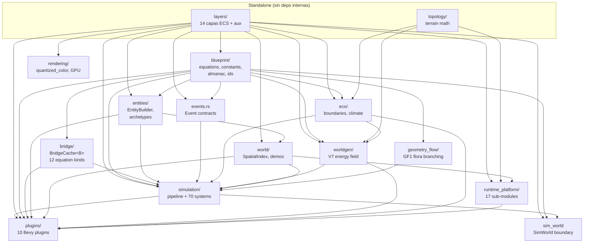
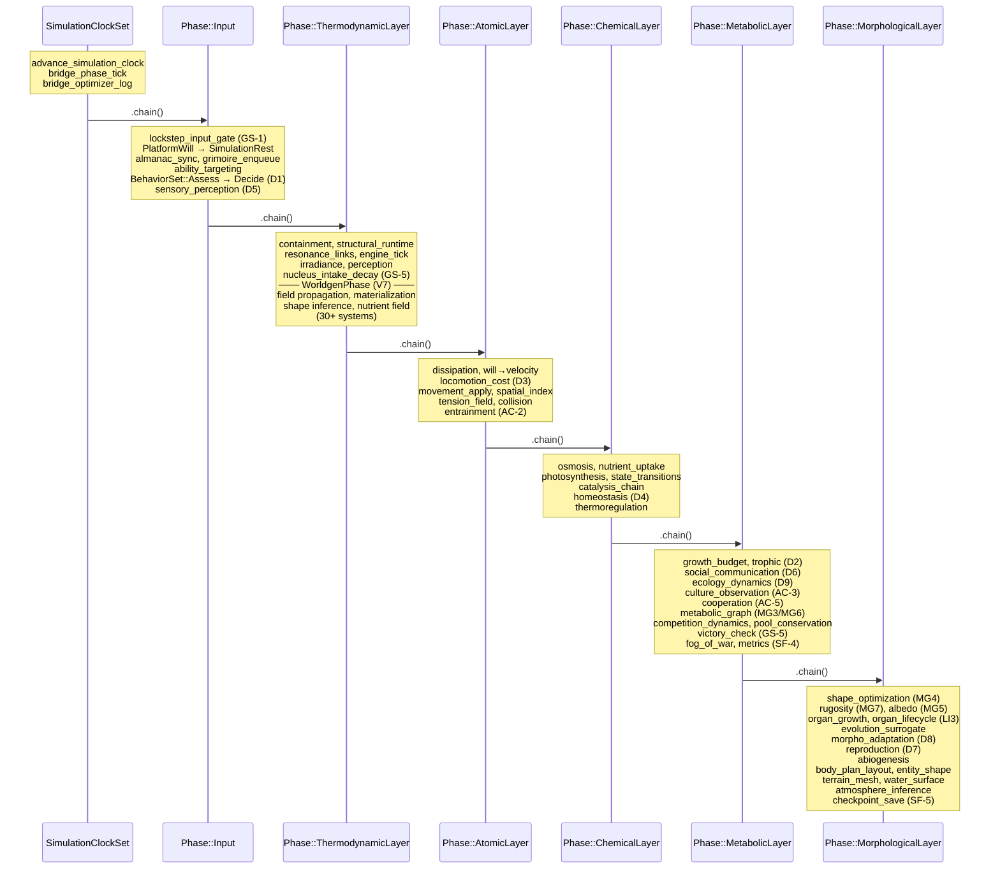
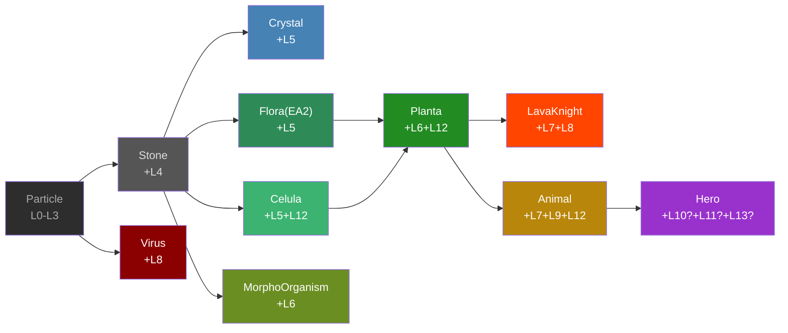
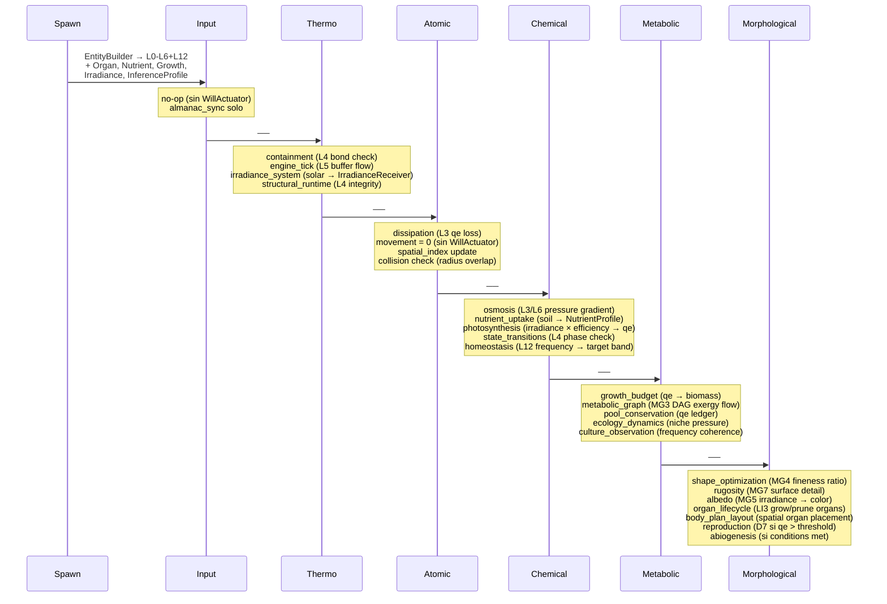
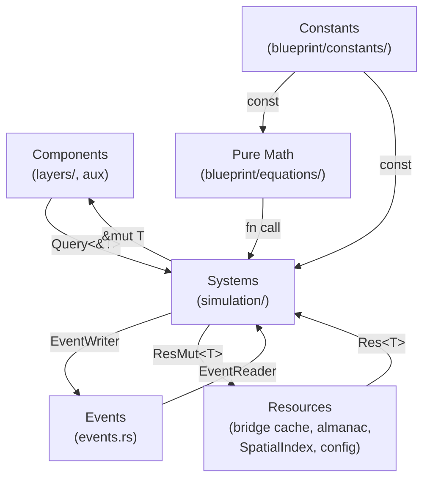

# Arquitectura de Resonance (`src/`)

Referencia canónica. 16 módulos top-level, 14 capas ECS, 6 fases de pipeline.
Código = Rust 2024 / Bevy 0.15. Todo es energía (qe).

---

## 1. Mapa de Módulos



> Flechas = "A es dependencia de B" (A → B significa B importa A).

---

## 2. Estructura Interna por Módulo

### 2.1 `layers/` — 14 Capas + Auxiliares

**Core (L0-L13):** BaseEnergy, SpatialVolume, OscillatorySignature, FlowVector, MatterCoherence, AlchemicalEngine, AmbientPressure, WillActuator, AlchemicalInjector, MobaIdentity, ResonanceLink, TensionField, Homeostasis, StructuralLink.

**Aux:** NutrientProfile, GrowthBudget, OrganManifest, TrophicConsumer, InferenceProfile, IrradianceReceiver, BehavioralAgent, VisionProvider, MetabolicGraph, EpigeneticState, SenescenceProfile, SymbiosisLink, NicheProfile, LanguageCapacity, PoolParentLink.

**Exports:** Components + SystemParam adapters (`PhysicsOps`, `EnergyOps`, `InterferenceOps`). Zero deps.

### 2.2 `blueprint/` — Math pura + constantes

| Subdirectorio | Rol |
|---|---|
| `equations/` | 50+ dominios: `core_physics`, `energy_competition`, `organ_inference`, `emergence/`, `field_color`, `growth_engine`, `metabolic_graph`, `morphogenesis_shape`, ... |
| `constants/` | 70+ shards por capa/dominio (e.g. `layer03_osmosis`, `behavior_d1`, `cooperation_ac5`) |
| `almanac/` | ElementDef, hot-reload RON, `AlchemicalAlmanac` Resource |
| `ids/` | Strong IDs: `WorldEntityId`, `AgentId`, `PoolId`, `OrganId`, ... |
| `abilities/` | `AbilityDef` — spell definitions |
| `recipes/` | Crafting recipes |
| `morphogenesis/` | Matrioska composition types |
| `validator/` | `FormulaValidator`, checksum |
| `checkpoint.rs` | Serialization contracts |

### 2.3 `bridge/` — Cache Optimizer

```
bridge/
├── cache.rs          → BridgeCache<B> generic, LRU/ring eviction
├── config.rs         → BridgeKind enum (12 kinds), CachePolicy, band definitions
├── decorator.rs      → bridge_compute(), hash_inputs(), warmup
├── normalize.rs      → scalar/vec2/direction quantization (8/16/32 sectors)
├── context_fill.rs   → BridgePhase lifecycle (Cold→Warming→Active)
├── metrics.rs        → per-layer hit-rate, summary, logs
├── impls/            → BridgedPhysicsOps, BridgedInterferenceOps
├── presets/          → RON hot-reload (combat, physics presets)
├── macros.rs         → Macro helpers
└── constants.rs      → Quantization epsilons
```

### 2.4 `simulation/` — Pipeline + ~100 systems

| Subdirectorio | Modulos |
|---|---|
| `thermodynamic/` | containment, osmosis, physics, pre_physics, locomotion, sensory, homeostasis_thermo, structural_runtime |
| `metabolic/` | photosynthesis, trophic, social_communication, growth_budget, nutrient_uptake, metabolic_stress, morphogenesis, competition_dynamics, pool_distribution, pool_conservation, scale_composition, ecology_dynamics, atmosphere_inference |
| `lifecycle/` | inference_growth, organ_lifecycle, allometric_growth, competitive_exclusion, env_scenario, evolution_surrogate, morpho_adaptation, body_plan_layout_inference, entity_shape_inference |
| `emergence/` | culture, coalitions, timescales |
| Cross-cutting | pipeline, bootstrap, behavior, abiogenesis, cooperation, netcode, game_loop, checkpoint_system, observability, fog_of_war, pathfinding, reactions, reproduction, states |

### 2.5 `entities/` — Builder + Archetypes

```
entities/
├── builder.rs              → EntityBuilder fluent API (14 layers)
├── composition.rs          → Composition queries
├── lifecycle_observers.rs  → OnAdd/OnRemove observers
├── constants.rs            → Spawn tuning
└── archetypes/
    ├── catalog.rs          → spawn_celula, spawn_virus, spawn_planta_demo, spawn_animal_demo
    ├── heroes.rs           → spawn_hero (LavaKnight, etc.)
    ├── flora.rs            → spawn_flora (EA2)
    ├── competition.rs      → spawn_competitor, spawn_energy_pool
    ├── morphogenesis.rs    → spawn_morpho_organism
    └── world_entities.rs   → spawn_stone, spawn_particle, spawn_biome, spawn_projectile
```

### 2.6 `plugins/` — Bevy Plugin Wiring

| Plugin | Phase/Schedule | Wires |
|---|---|---|
| `LayersPlugin` | — | Registers all 14 layers + aux as Reflect |
| `SimulationPlugin` | FixedUpdate | Pipeline, bootstrap, events, states |
| `InputPlugin` | Phase::Input | Almanac, grimoire, ability targeting, behavior, sensory |
| `ThermodynamicPlugin` | Phase::ThermodynamicLayer | Containment, structural, links, engine, irradiance, V7 worldgen |
| `AtomicPlugin` | Phase::AtomicLayer | Dissipation, will, locomotion, movement, spatial, tension, collision |
| `ChemicalPlugin` | Phase::ChemicalLayer | Osmosis, nutrients, photosynthesis, catalysis, homeostasis |
| `MetabolicPlugin` | Phase::MetabolicLayer | Growth, trophic, social, ecology, culture, cooperation, fog, victory |
| `MorphologicalPlugin` | Phase::MorphologicalLayer | Shape, albedo, organs, evolution, reproduction, abiogenesis, terrain mesh |
| `WorldgenPlugin` | Phase::ThermodynamicLayer | V7 field grid, propagation, materialization (30+ systems) |
| `DebugPlugin` | Update | Gizmos, inspector, metrics overlay |

### 2.7 Otros Módulos

| Modulo | Rol | Deps |
|---|---|---|
| `events.rs` | 15+ Event types (cast, death, catalysis, worldgen, terrain mutation...) | layers, blueprint |
| `worldgen/` | V7: field_grid, nucleus, propagation, materialization, shape_inference, nutrient_field, `systems/` (startup, prephysics, visual, phenology, terrain, performance) | layers, blueprint, topology, eco |
| `eco/` | Boundary detection, zone classification, climate, context lookup | layers, blueprint, topology |
| `topology/` | Terrain: noise(FBM), slope(Horn), drainage(D8), erosion, mutations, mesher | standalone |
| `geometry_flow/` | GF1: stateless branching, primitives, deformation, deformation_cache | blueprint |
| `world/` | SpatialIndex, demos (14 demo maps), fog_of_war grid, perception, grimoire presets | layers, blueprint, entities |
| `rendering/` | `quantized_color/`, `gpu_cell_field_snapshot/` (optional feature) | layers, worldgen |
| `runtime_platform/` | 17 sub-modules: camera_3d, click_to_move, compat_2d3d, collision_3d, HUD, fog_overlay, input_capture, render_bridge_3d, scenario_isolation, simulation_tick, spatial_index_backend, ... | layers, simulation, world, topology |
| `sim_world.rs` | `SimWorld` boundary: `new()` / `tick()` / `snapshot()`. Determinism (INV-4), conservation (INV-7), clock (INV-8) | simulation, plugins, layers, blueprint |
| `batch/` | **Simulador batch masivo** — `SimWorldFlat` sin Bevy, `WorldBatch` × N mundos, `GeneticHarness`. Reutiliza `blueprint/equations/` y `blueprint/constants/` al 100%. [Blueprint](blueprint_batch_simulator.md) | blueprint (solo) |

---

## 3. Pipeline — Un Tick de `FixedUpdate`



**Run conditions:** `GameState::Playing + PlayState::Active` para todas las fases excepto `ThermodynamicLayer` (que incluye worldgen warmup).

**Visual derivation:** Pipeline separado en `Update` — visual sync, phenology, shape/color inference, growth morphology.

---

## 4. Composicion de Capas por Arquetipo (Species Matrix)

| Arquetipo | L0 | L1 | L2 | L3 | L4 | L5 | L6 | L7 | L8 | L9 | L10 | L11 | L12 | L13 | Aux notables |
|---|:---:|:---:|:---:|:---:|:---:|:---:|:---:|:---:|:---:|:---:|:---:|:---:|:---:|:---:|---|
| **Particle** | x | x | x | x | - | - | - | - | - | - | - | - | - | - | minimal |
| **Stone** | x | x | x | x | x | - | - | - | - | - | - | - | - | - | MatterCoherence(Solid) |
| **Dummy** | x | x | x | x | x | - | - | - | - | - | - | - | - | - | label |
| **Projectile** | x | x | x | x | - | - | - | - | x | - | - | - | - | - | SpellMarker, Contact |
| **Virus** | x | x | x | x | x | - | - | - | x | - | - | - | - | - | Trophic(Carnivore) |
| **Crystal** | x | x | x | x | x | x | - | - | - | - | - | - | - | - | Locked valves |
| **Flora(EA2)** | x | x | x | x | x | x | - | - | - | - | - | - | - | - | Nutrient, Growth, Inference |
| **Celula** | x | x | x | x | x | x | - | - | - | - | - | - | x | - | Nutrient, Growth, Organ, Trophic(Detritivore) |
| **Biome** | x | x | x | x | x | - | x | - | - | - | - | - | - | - | Terrain pressure |
| **Competitor** | x | - | - | - | - | - | - | - | - | - | - | - | - | - | PoolLink, EnergyPool |
| **Planta** | x | x | x | x | x | x | x | - | - | - | - | - | x | - | Nutrient, Growth, Organ, Metabolic, Irradiance |
| **MorphoOrganism** | x | x | x | x | x | - | x | - | - | - | - | - | - | - | Organ, MetabolicGraph, Albedo, Shape |
| **LavaKnight** | x | x | x | x | x | x | x | x | x | - | - | - | - | - | autonomous |
| **Animal** | x | x | x | x | x | x | - | x | - | x | - | - | x | - | Behavior, Trophic(Herbivore), Nav, Inference |
| **Hero** | x | x | x | x | x | x | - | x | - | x | opt | opt | opt | - | Grimoire, Vision, Nav, Player |

> `opt` = componente opcional (buffs/debuffs, links).

---

## 5. Escala de Especies — Composicion Emergente



Cada flecha indica adicion de capas. El grafo NO es herencia — es composicion ECS incremental.

---

## 6. Flora Flow — Una Planta en el Pipeline



---

## 7. Data Flow — Ciclo ECS



**Invariante:** Systems no inlinean math — llaman a `blueprint::equations::*`. Constants no se hardcodean — viven en `blueprint::constants::*`.

---

## 8. Referencia Rapida

**Ejecutar:**
```bash
cargo run                                    # mapa default
RESONANCE_MAP=demo_celula cargo run          # demo celula
RESONANCE_MAP=proving_grounds cargo run      # stress test
RESONANCE_MAP=four_flowers cargo run         # V7 grid 32x32
```

**Tests:** `cargo test` (~920+ tests). Integration tests en `tests/`.

**Eventos:** `simulation/bootstrap.rs` registra 15+ Event types. `PathRequestEvent` aparte en `Compat2d3dPlugin`.

**Mapas:** `assets/maps/{nombre}.ron` via `RESONANCE_MAP` env var.

**SimWorld boundary:** `src/sim_world.rs` — `new(config)` / `tick(cmds)` / `snapshot()`. INV-4 determinism, INV-7 conservation, INV-8 clock.
