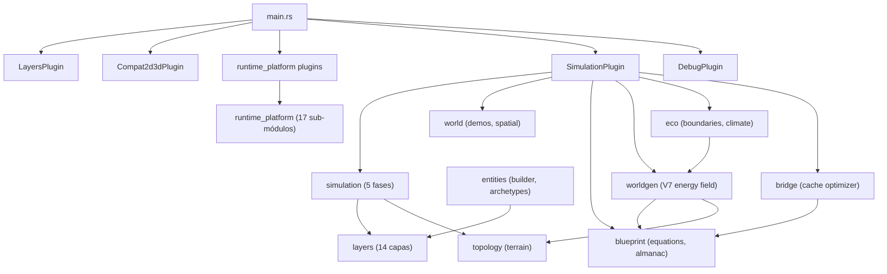

# Arquitectura de Módulos (`src/`)

Este directorio documenta contratos, comportamiento e implementación de cada módulo de `src/`.
La referencia base del modelo físico está en `DESIGNING.md` (axioma energético, 14 capas).
Blueprints detallados en `docs/design/`.

## Convenciones

- Todo blueprint sigue el contrato editorial de `00_contratos_glosario.md` (8 secciones).
- El foco es runtime real: qué lee/escribe cada módulo, en qué fase corre y qué invariantes protege.
- Si hay trade-off, se explicita como costo vs valor.
- Código usa identificadores en inglés. Documentación puede usar español narrativo.

## Índice

### Core (estable, implementado)

- [Glosario y contrato editorial](./00_contratos_glosario.md)
- [Runtime entrypoints](./blueprint_runtime_entrypoints.md) — `main.rs`, `lib.rs`, `events.rs`
- [Plugins y wiring](./blueprint_plugins.md) — LayersPlugin, SimulationPlugin, DebugPlugin
- [Capas ECS (14 layers)](./blueprint_layers.md) — L0 BaseEnergy → L13 StructuralLink
- [Pipeline de simulación](./blueprint_simulation.md) — cadena `FixedUpdate`: `SimulationClockSet` + `Phase::Input` + 5 capas (`Thermodynamic` → `Morphological`)
- [Entidades y arquetipos](./blueprint_entities.md) — EntityBuilder, spawn functions
- [Mundo y recursos espaciales](./blueprint_world.md) — SpatialIndex, demos, Scoreboard
- [Núcleo matemático](./blueprint_blueprint_math.md) — `equations/`, almanac, `constants/`
- [Runtime platform](./blueprint_v6.md) — 17 sub-módulos en `runtime_platform/mod.rs` (cámara, input, colisión 3D, HUD, fog overlay, …)
- [Geometry flow (GF1)](./blueprint_geometry_flow.md) — motor stateless spine/malla flora-flujo; sprint `docs/sprints/GEOMETRY_FLOW/`

### Subsistemas (implementados)

- [Worldgen V7](./blueprint_v7.md) — Campo de energía procedural, núcleos, materialización
- [Eco-boundaries](./blueprint_eco_boundaries.md) — Clasificación de zonas, clima, contexto diferido
- [Bridge optimizer](./blueprint_layer_bridge_optimizer.md) — Cache cuantizado por ecuación (11 tipos)
- [Topología](./blueprint_topology.md) — Terreno: heightmap, drenaje, erosión, clasificador
- [Inferencia campo → muestra / partes (EPI)](./blueprint_energy_field_inference.md) — `CellFieldSnapshotCache`, `field_visual_sample`, GF1 pintado; GPU opcional (`gpu_cell_field_snapshot`)
- [Sensory LOD](./blueprint_sensory_lod.md) — atención sensorial, distancia de percepción, LOD por entidad

### Contratos de datos (implementados, enlazados a sprints)

- [Almanaque canónico (EAC)](./blueprint_blueprint_math.md#9-element-almanac-contract-eac) — `find_stable_band*`, `hz_identity_weight`, coherencia RON ↔ `blueprint/constants`; sprint `docs/sprints/ELEMENT_ALMANAC_CANON/`
- [Ecosistema autopoietico (EA)](./blueprint_ecosystem_autopoiesis.md) — abiogénesis, reproducción, competencia, estrés metabólico, fenología visual; sprint `docs/sprints/ECOSYSTEM_AUTOPOIESIS/`

### Motor de Inferencia (MG-1–MG-7 implementados; MG-8 pendiente)

- [Morfogénesis inferida](./blueprint_morphogenesis_inference.md) — MetabolicGraph (DAG de exergía), Carnot/entropía, shape optimization, albedo inference; blueprint teórico `docs/design/MORPHOGENESIS.md`

### Patrones Gamedev (especificados, pendientes)

- [Patrones Gamedev MOBA](./blueprint_gamedev_patterns.md) — Abilities, cámara, pathfinding, fog of war

### Tracks en sprints (mayormente diseño / no cableados al índice anterior)

- Ecosystem Mario64 — taxonomía por rangos, biomas, render estilo N64: **propuesta**, sin sprint ni código todavía (sin `EntityCategory` inferida global).

## Mapa global



## Módulos post-migración M1-M5

```
src/
├── blueprint/          → Ecuaciones puras, constantes, almanac, abilities, recipes
├── bridge/             → Cache optimizer (BridgeCache<B>, 11 tipos de ecuación)
├── eco/                → Eco-boundaries, zonas, clima, contexto diferido
├── entities/           → EntityBuilder + arquetipos (spawn en `archetypes.rs`)
├── events.rs           → Contratos `Event` (cast, path, catálisis, muerte, worldgen, …)
├── geometry_flow/      → GF1: rama/malla stateless (flora-tubo)
├── layers/             → 14 capas ECS ortogonales + auxiliares (nutrient, irradiance, vision_fog, …)
├── plugins/            → SimulationPlugin, LayersPlugin, DebugPlugin
├── rendering/          → `quantized_color` (+ QuantizedColorPlugin en `main.rs`); `gpu_cell_field_snapshot` opcional (`--features gpu_cell_field_snapshot`)
├── runtime_platform/   → 18 `pub mod` (tick, input, compat 2D/3D, bridge 3D, HUD, fog_overlay, …)
├── simulation/         → Pipeline por fases + pathfinding, fotosíntesis, crecimiento, fog sim, …
├── topology/           → Terreno: noise(FBM), slope(Horn), drainage(D8), erosión
├── world/              → SpatialIndex, demos (`demo_level`, nubes, fog grid), presets
└── worldgen/           → V7: field_grid, nucleus, propagation, materialization, visual, cell_field_snapshot, field_visual_sample
    └── systems/        → startup, propagation, materialization, terrain, visual, phenology_visual, prephysics, perf, …
```

**Eventos registrados:** `init_simulation_bootstrap` (`simulation/bootstrap.rs`) registra **15** tipos `Event` (incluye `TerrainMutationEvent` de `topology`). `PathRequestEvent` se registra aparte en `Compat2d3dPlugin` (`runtime_platform/compat_2d3d/mod.rs`) cuando el perfil habilita input 3D.

**Mapas demo:** `RESONANCE_MAP` → `assets/maps/{nombre}.ron` (`worldgen/map_config.rs`); no hay `spawn_demo_arena` / `spawn_proving_grounds` como funciones en `world/` (ver `blueprint_world.md`).
