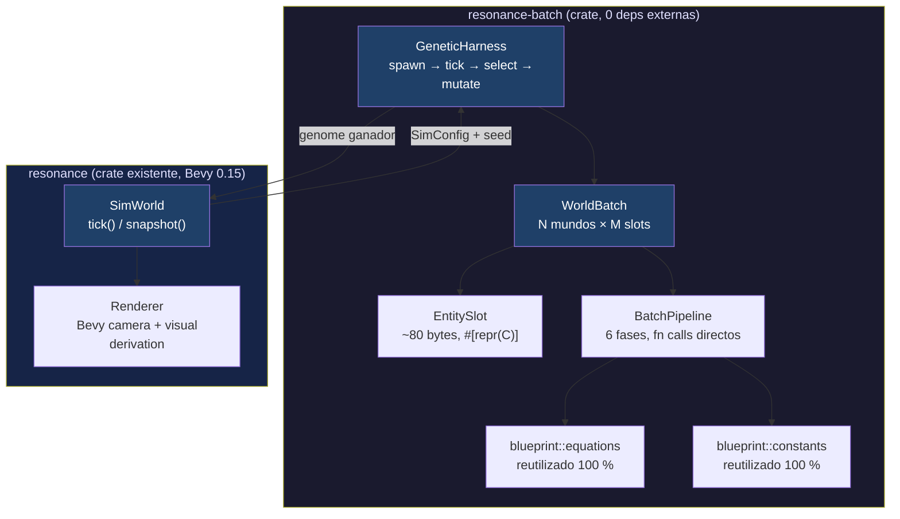
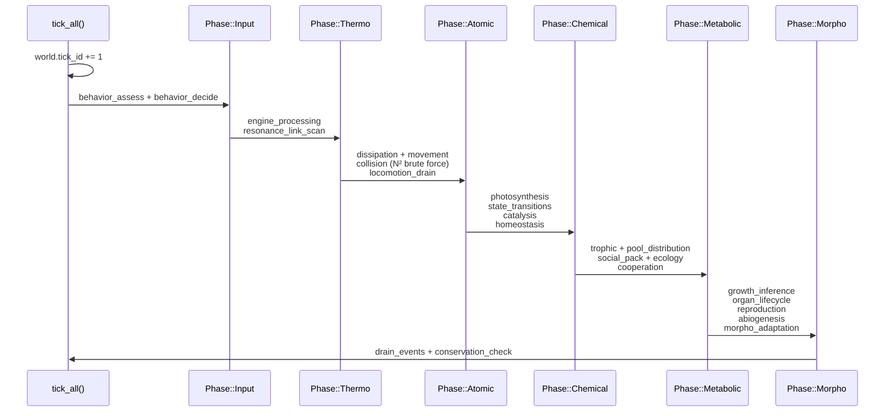
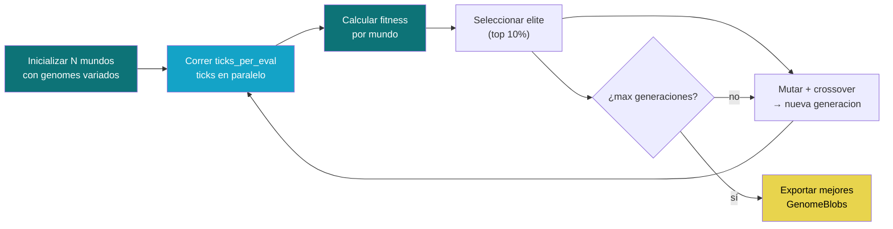
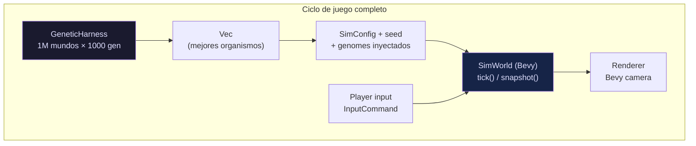

# Blueprint: Simulador Batch (`resonance-batch`)

Motor de simulacion masiva sin Bevy. Corre millones de mundos en paralelo sobre
las mismas ecuaciones de `blueprint/equations/` y `blueprint/constants/`.
Se acopla al `SimWorld` existente: un mundo individual usa Bevy+ECS para
rendering/input; el batch usa arrays planos para throughput.

Diseño: `docs/design/BATCH_SIMULATOR.md` (pendiente).

## 1. Arquitectura general



## 2. Tipos core

### 2.1 EntitySlot — unidad atomica de entidad

```rust
/// Entidad como struct plano. Sin heap. Sin Option. Sin Vec.
/// Capas que no aplican a esta entidad llevan valor neutro (0.0 / false).
#[derive(Clone, Copy, Debug)]
#[repr(C, align(64))]
pub struct EntitySlot {
    // ── identity ───────────────────────────
    pub alive:           bool,       //  1   slot activo
    pub archetype:       u8,         //  1   0=inert 1=flora 2=fauna 3=cell 4=virus
    pub entity_id:       u32,        //  4   strong ID (monotónico por mundo)

    // ── L0  BaseEnergy ─────────────────────
    pub qe:              f32,        //  4

    // ── L1  SpatialVolume ──────────────────
    pub radius:          f32,        //  4

    // ── L2  OscillatorySignature ───────────
    pub frequency_hz:    f32,        //  4
    pub phase:           f32,        //  4

    // ── L3  FlowVector ─────────────────────
    pub velocity:        [f32; 2],   //  8
    pub dissipation:     f32,        //  4

    // ── L4  MatterCoherence ────────────────
    pub matter_state:    u8,         //  1   0=Solid 1=Liquid 2=Gas 3=Plasma
    pub bond_energy:     f32,        //  4
    pub conductivity:    f32,        //  4

    // ── L5  AlchemicalEngine ───────────────
    pub engine_buffer:   f32,        //  4
    pub engine_max:      f32,        //  4
    pub input_valve:     f32,        //  4
    pub output_valve:    f32,        //  4

    // ── L6  AmbientPressure ────────────────
    pub pressure_dqe:    f32,        //  4
    pub viscosity:       f32,        //  4

    // ── L7  WillActuator ───────────────────
    pub will_intent:     [f32; 2],   //  8
    pub channeling:      bool,       //  1

    // ── L9  MobaIdentity ───────────────────
    pub faction:         u8,         //  1

    // ── L12 Homeostasis ────────────────────
    pub adapt_rate_hz:   f32,        //  4
    pub stability_band:  f32,        //  4

    // ── Posición (sim-plane) ───────────────
    pub position:        [f32; 2],   //  8

    // ── Genome (InferenceProfile) ──────────
    pub growth_bias:     f32,        //  4
    pub mobility_bias:   f32,        //  4
    pub branching_bias:  f32,        //  4
    pub resilience:      f32,        //  4

    // ── Trophic state ──────────────────────
    pub trophic_class:   u8,         //  1   TrophicClass as u8
    pub satiation:       f32,        //  4

    // ── Epigenetic mask ────────────────────
    pub expression_mask: [f32; 4],   // 16

    // ── Padding to 64-byte alignment ───────
    pub _pad:            [u8; 3],    //  3
}
// sizeof(EntitySlot) = 160 bytes (2.5 cache lines, aligned)
```

**Invariantes:**
- `qe >= 0.0` siempre. Si `qe < QE_MIN_EXISTENCE` → `alive = false`.
- `alive = false` → slot ignorado por todos los systems.
- Sin heap allocation. `Copy` + `repr(C)` obligatorios.
- Campos de capas L8, L10, L11, L13 omitidos: son interacciones entre entidades,
  se resuelven con pares (colision buffer), no con campos por-entidad.

### 2.2 SimWorldFlat — un mundo completo

```rust
pub const MAX_ENTITIES: usize = 64;

/// Mundo completo en stack. Sin Bevy. Sin alloc.
#[derive(Clone)]
#[repr(C)]
pub struct SimWorldFlat {
    pub tick_id:      u64,
    pub seed:         u64,
    pub dt:           f32,                         // 1.0 / tick_rate_hz
    pub entity_count: u8,
    pub alive_mask:   u64,                         // bitfield: slot i alive iff bit i set
    pub next_id:      u32,                         // monotonic ID generator
    pub entities:     [EntitySlot; MAX_ENTITIES],

    // ── Per-world resources (compact) ──────
    pub total_qe:         f32,                     // conservation ledger
    pub nutrient_grid:    [f32; GRID_CELLS],       // flat nutrient field
    pub irradiance_grid:  [f32; GRID_CELLS],       // flat light field
}
```

**Tamaño:** `32 + 64×160 + 4 + 2×GRID_CELLS×4` bytes.
Con `GRID_CELLS = 256` (16×16): `32 + 10240 + 4 + 2048 = ~12.3 KB`.
1M mundos = **12.3 GB** (cabe en workstation 32GB con swap, 64GB holgado).

### 2.3 WorldBatch — N mundos contiguos

```rust
/// Batch de mundos para procesamiento masivo.
/// Ownership: el GeneticHarness posee el WorldBatch.
pub struct WorldBatch {
    pub worlds:     Vec<SimWorldFlat>,
    pub generation: u32,
    pub config:     BatchConfig,
}

pub struct BatchConfig {
    pub world_count:     usize,
    pub ticks_per_eval:  u32,       // ticks antes de evaluar fitness
    pub tick_rate_hz:    f32,
    pub map_template:    MapTemplate,
    pub mutation_rate:   f32,       // probabilidad de mutar un bias
    pub mutation_sigma:  f32,       // desv. estandar de la mutacion gaussiana
    pub elite_fraction:  f32,       // fraccion top que sobrevive (e.g. 0.1)
    pub crossover_rate:  f32,       // probabilidad de crossover vs clonacion
}
```

### 2.4 GenomeBlob — DNA serializable

```rust
/// Genoma minimo: InferenceProfile + archetype + trophic.
/// 20 bytes. Copy. Deterministic hash.
#[derive(Clone, Copy, Debug, PartialEq)]
#[repr(C)]
pub struct GenomeBlob {
    pub archetype:     u8,
    pub trophic_class: u8,
    pub growth_bias:   f32,
    pub mobility_bias: f32,
    pub branching_bias: f32,
    pub resilience:    f32,
}

impl GenomeBlob {
    /// Inyecta genome en un EntitySlot.
    pub fn apply(&self, slot: &mut EntitySlot) { ... }

    /// Extrae genome de un EntitySlot.
    pub fn from_slot(slot: &EntitySlot) -> Self { ... }

    /// Mutacion gaussiana determinista.
    /// `rng_state`: hash(seed, generation, genome_index).
    pub fn mutate(&self, rng_state: u64, sigma: f32) -> Self { ... }

    /// Crossover uniforme entre dos genomes.
    pub fn crossover(&self, other: &Self, rng_state: u64) -> Self { ... }

    /// Fitness hash para determinism check.
    pub fn hash(&self) -> u64 { ... }
}
```

### 2.5 Inventario de tipos

| Tipo | Archivo | Rol |
|------|---------|-----|
| `EntitySlot` | `arena.rs` | Entidad plana, 160 bytes, `repr(C)` |
| `SimWorldFlat` | `arena.rs` | Mundo completo, 64 slots + grids |
| `WorldBatch` | `batch.rs` | N mundos contiguos para batch |
| `BatchConfig` | `batch.rs` | Config del experimento evolutivo |
| `GenomeBlob` | `genome.rs` | DNA serializable, 20 bytes |
| `FitnessReport` | `harness.rs` | Resultado de evaluacion por mundo |
| `BatchPipeline` | `pipeline.rs` | 6 fases como fn calls |
| `GeneticHarness` | `harness.rs` | Loop: spawn → tick → select → mutate |
| `EventBuffer<T>` | `events.rs` | Ring buffer por mundo, sin Bevy |
| `ScratchPad` | `scratch.rs` | Buffers temporales reutilizables por tick |

## 3. Pipeline batch



### 3.1 Tick de un mundo individual

```rust
impl SimWorldFlat {
    /// Un tick atomico. Sin Bevy. Sin alloc. Sin I/O.
    pub fn tick(&mut self, scratch: &mut ScratchPad) {
        self.tick_id += 1;

        // Phase::Input
        batch_systems::behavior_assess(self);
        batch_systems::behavior_decide(self);

        // Phase::ThermodynamicLayer
        batch_systems::engine_processing(self);
        batch_systems::resonance_link_scan(self, scratch);
        batch_systems::irradiance_update(self);

        // Phase::AtomicLayer
        batch_systems::dissipation(self);
        batch_systems::will_to_velocity(self);
        batch_systems::velocity_cap(self);
        batch_systems::movement_integrate(self);
        batch_systems::locomotion_drain(self);
        batch_systems::collision(self, scratch);
        batch_systems::entrainment(self, scratch);

        // Phase::ChemicalLayer
        batch_systems::nutrient_uptake(self);
        batch_systems::photosynthesis(self);
        batch_systems::state_transitions(self);
        batch_systems::homeostasis(self);

        // Phase::MetabolicLayer
        batch_systems::trophic_forage(self);
        batch_systems::trophic_predation(self, scratch);
        batch_systems::pool_distribution(self);
        batch_systems::social_pack(self, scratch);
        batch_systems::cooperation_eval(self, scratch);
        batch_systems::culture_transmission(self, scratch);

        // Phase::MorphologicalLayer
        batch_systems::growth_inference(self);
        batch_systems::organ_lifecycle(self);
        batch_systems::morpho_adaptation(self);
        batch_systems::reproduction(self);
        batch_systems::abiogenesis(self);
        batch_systems::senescence(self);

        // Post-tick
        self.reap_dead();
        self.update_total_qe();

        #[cfg(debug_assertions)]
        self.assert_conservation();
    }
}
```

### 3.2 Batch tick — todos los mundos

```rust
impl WorldBatch {
    /// Avanza todos los mundos un tick. Paraleliza con rayon.
    pub fn tick_all(&mut self) {
        self.worlds.par_iter_mut().for_each(|world| {
            // ScratchPad thread-local para zero alloc cross-world
            SCRATCH.with(|s| {
                let mut scratch = s.borrow_mut();
                world.tick(&mut scratch);
            });
        });
    }

    /// Corre N ticks para evaluacion de fitness.
    pub fn run_evaluation(&mut self, ticks: u32) {
        for _ in 0..ticks {
            self.tick_all();
        }
    }
}

thread_local! {
    static SCRATCH: RefCell<ScratchPad> = RefCell::new(ScratchPad::new());
}
```

### 3.3 Tiers de complejidad por system

| Tier | Patron | Systems | Notas |
|------|--------|---------|-------|
| **T1: SIMD-friendly** | 1 campo, sin interaccion | dissipation, movement_integrate, velocity_cap, engine_processing, locomotion_drain, homeostasis, pool_distribution, senescence | Auto-vectorizable, inner loop sobre `entities[0..64]` |
| **T2: Per-world** | N² pares o spatial scan | collision, entrainment, trophic_predation, social_pack, cooperation_eval, resonance_link_scan, culture_transmission | Usa `ScratchPad` para buffers de pares |
| **T3: Lifecycle** | Spawn/despawn/mutate | reproduction, abiogenesis, organ_lifecycle, growth_inference, morpho_adaptation | Modifica `alive_mask`, escribe slots nuevos |

## 4. ScratchPad — zero alloc en hot loop

```rust
/// Buffers pre-allocados reutilizables por tick.
/// Un ScratchPad por thread (thread_local).
pub struct ScratchPad {
    /// Collision pairs: max C(64,2) = 2016 pares.
    pub pairs:        [(u8, u8); 2048],
    pub pairs_len:    usize,

    /// Spatial neighbor results.
    pub neighbors:    [u8; MAX_ENTITIES],
    pub neighbors_len: usize,

    /// Event buffer per tick (reused).
    pub deaths:       [u8; MAX_ENTITIES],
    pub deaths_len:   usize,

    /// Culture meme candidates.
    pub meme_candidates: [(u8, u32, f32); 64],  // (source_idx, meme_hash, affinity)
    pub meme_len:     usize,
}

impl ScratchPad {
    pub fn clear(&mut self) {
        self.pairs_len = 0;
        self.neighbors_len = 0;
        self.deaths_len = 0;
        self.meme_len = 0;
    }
}
```

**Invariante:** `ScratchPad::clear()` al inicio de cada tick. Nunca `Vec`. Nunca `Box`.

## 5. Genetic harness — evolucion real



### 5.1 Fitness por mundo

```rust
/// Evaluacion de un mundo despues de N ticks.
pub struct FitnessReport {
    pub world_index:       usize,
    pub survivors:         u8,         // entidades alive al final
    pub total_qe:          f32,        // energia total conservada
    pub reproductions:     u16,        // eventos de reproduccion
    pub max_trophic_level: u8,         // cadena trofica mas larga
    pub species_count:     u8,         // bandas de frecuencia distintas
    pub cultural_memes:    u8,         // memes unicos en circulacion
    pub coalition_count:   u8,         // coaliciones estables
    pub institution_alive: bool,       // alguna institucion sobrevivio
    pub composite_fitness: f32,        // score ponderado final
}

impl FitnessReport {
    /// fitness = w₁·survivors + w₂·reproductions + w₃·species_count
    ///         + w₄·trophic_depth + w₅·cultural_memes + w₆·coalitions
    /// Pesos en `batch::constants::FITNESS_WEIGHTS`.
    pub fn compute(world: &SimWorldFlat, config: &BatchConfig) -> Self { ... }
}
```

### 5.2 Seleccion y reproduccion

```rust
impl GeneticHarness {
    /// Un paso generacional completo.
    pub fn step(&mut self) {
        // 1. Evaluar
        self.batch.run_evaluation(self.config.ticks_per_eval);

        // 2. Fitness
        let mut reports: Vec<FitnessReport> = self.batch.worlds.iter()
            .enumerate()
            .map(|(i, w)| FitnessReport::compute(w, &self.config))
            .collect();

        // 3. Seleccionar elite (top elite_fraction)
        reports.sort_unstable_by(|a, b|
            b.composite_fitness.partial_cmp(&a.composite_fitness).unwrap()
        );
        let elite_n = (self.config.world_count as f32
                       * self.config.elite_fraction) as usize;
        let elite = &reports[..elite_n.max(1)];

        // 4. Extraer genomes ganadores
        let elite_genomes: Vec<Vec<GenomeBlob>> = elite.iter()
            .map(|r| self.extract_genomes(r.world_index))
            .collect();

        // 5. Repoblar mundos con mutacion + crossover
        self.repopulate(&elite_genomes);

        self.batch.generation += 1;
    }
}
```

### 5.3 Mutacion determinista

```rust
impl GenomeBlob {
    pub fn mutate(&self, rng_state: u64, sigma: f32) -> Self {
        let mut g = *self;
        // PCG-like deterministic RNG from seed
        let mut s = rng_state;
        for bias in [&mut g.growth_bias, &mut g.mobility_bias,
                     &mut g.branching_bias, &mut g.resilience] {
            s = equations::determinism::next_u64(s);
            if (s & 0xFF) as f32 / 255.0 < 0.5 {  // 50% chance per gene
                let gaussian = equations::determinism::gaussian_f32(s, sigma);
                *bias = (*bias + gaussian).clamp(0.0, 1.0);
            }
        }
        g
    }
}
```

**Invariante:** Toda aleatoriedad derivada de `seed × generation × index`.
`next_u64` y `gaussian_f32` viven en `blueprint/equations/determinism.rs`.

## 6. Acoplamiento con SimWorld existente



### 6.1 Contrato de integracion

```rust
/// Convierte un GenomeBlob en componentes Bevy para spawn en SimWorld.
pub fn genome_to_bevy_components(genome: &GenomeBlob) -> impl Bundle {
    (
        BaseEnergy::new(constants::DEFAULT_BASE_ENERGY),
        SpatialVolume::new(constants::DEFAULT_RADIUS),
        OscillatorySignature::new(
            constants::frequency_for_archetype(genome.archetype),
            0.0,
        ),
        InferenceProfile::new(
            genome.growth_bias,
            genome.mobility_bias,
            genome.branching_bias,
            genome.resilience,
        ),
        // ... demas capas segun archetype
    )
}

/// Convierte componentes Bevy en GenomeBlob para exportar al batch.
pub fn bevy_to_genome(
    profile: &InferenceProfile,
    identity: &MobaIdentity,
    trophic: Option<&TrophicConsumer>,
) -> GenomeBlob { ... }
```

### 6.2 Flujo completo

1. **Pre-juego:** `GeneticHarness` corre 1M mundos × 1000 generaciones (~minutos en 64 cores).
2. **Export:** Los N mejores `GenomeBlob` se serializan a `assets/evolved/{seed}.bin`.
3. **Inicio de partida:** `SimWorld::new()` carga genomes y los spawna via `EntityBuilder`.
4. **Gameplay:** Player juega en Bevy con criaturas pre-evolucionadas.
5. **Post-partida (opcional):** Genomes del mundo jugado se re-inyectan al harness.

**Ecuaciones compartidas:** Ambos pipelines (batch y Bevy) llaman las mismas funciones
de `blueprint/equations/`. La math es identica — solo cambia como se itera.

## 7. Estructura de archivos

```
src/
├── batch/                          ← NEW: crate o modulo
│   ├── mod.rs                      ← re-exports
│   ├── arena.rs                    ← EntitySlot, SimWorldFlat
│   ├── batch.rs                    ← WorldBatch, BatchConfig
│   ├── pipeline.rs                 ← tick(), tick_all()
│   ├── systems/                    ← batch_systems (1 archivo por fase)
│   │   ├── mod.rs
│   │   ├── input.rs                ← behavior_assess, behavior_decide
│   │   ├── thermodynamic.rs        ← engine, irradiance, resonance_link
│   │   ├── atomic.rs               ← dissipation, movement, collision
│   │   ├── chemical.rs             ← photosynthesis, catalysis, homeostasis
│   │   ├── metabolic.rs            ← trophic, social, ecology, cooperation
│   │   └── morphological.rs        ← growth, reproduction, abiogenesis
│   ├── genome.rs                   ← GenomeBlob, mutate, crossover
│   ├── harness.rs                  ← GeneticHarness, FitnessReport
│   ├── scratch.rs                  ← ScratchPad (thread-local buffers)
│   ├── events.rs                   ← EventBuffer<T> (ring buffer)
│   ├── constants.rs                ← FITNESS_WEIGHTS, MAX_ENTITIES, GRID_CELLS
│   └── bridge.rs                   ← genome_to_bevy_components, bevy_to_genome
│
├── blueprint/
│   ├── equations/                  ← SIN CAMBIOS — reutilizado 100 %
│   │   ├── determinism.rs          ← + next_u64(), gaussian_f32() (nuevas)
│   │   └── ...
│   └── constants/                  ← SIN CAMBIOS — reutilizado 100 %
│       └── ...
│
├── sim_world.rs                    ← SIN CAMBIOS — contrato existente
└── ...
```

## 8. Constantes batch

| Constante | Valor default | Archivo | Rol |
|-----------|--------------|---------|-----|
| `MAX_ENTITIES` | 64 | `batch/constants.rs` | Slots por mundo (potencia de 2, cabe en u64 bitmask) |
| `GRID_CELLS` | 256 (16×16) | `batch/constants.rs` | Celdas de nutrient/irradiance grid |
| `GRID_SIDE` | 16 | `batch/constants.rs` | Lado del grid cuadrado |
| `DEFAULT_TICKS_PER_EVAL` | 10_000 | `batch/constants.rs` | ~8 min sim a 20Hz |
| `DEFAULT_ELITE_FRACTION` | 0.10 | `batch/constants.rs` | Top 10% sobrevive |
| `DEFAULT_MUTATION_RATE` | 0.5 | `batch/constants.rs` | 50% prob por gen |
| `DEFAULT_MUTATION_SIGMA` | 0.05 | `batch/constants.rs` | Desv. estandar gaussiana |
| `DEFAULT_CROSSOVER_RATE` | 0.3 | `batch/constants.rs` | 30% crossover, 70% clonacion mutada |
| `FITNESS_WEIGHTS` | `[1.0, 0.5, 2.0, 1.5, 1.0, 0.8]` | `batch/constants.rs` | Pesos: survivors, reproductions, species, trophic, memes, coalitions |
| `QE_MIN_EXISTENCE` | (re-export de blueprint) | `blueprint/constants` | Umbral de muerte |

## 9. Ecuaciones nuevas

Funciones nuevas en `blueprint/equations/` (math pura, sin Bevy):

| Funcion | Archivo | Firma | Rol |
|---------|---------|-------|-----|
| `next_u64` | `determinism.rs` | `fn(state: u64) -> u64` | PCG-step determinista |
| `gaussian_f32` | `determinism.rs` | `fn(state: u64, sigma: f32) -> f32` | Box-Muller sobre next_u64 |
| `composite_fitness` | `batch_fitness.rs` (nuevo) | `fn(survivors: u8, repro: u16, species: u8, trophic: u8, memes: u8, coalitions: u8, weights: &[f32; 6]) -> f32` | Fitness ponderada |
| `tournament_select` | `batch_fitness.rs` | `fn(fitnesses: &[f32], k: usize, rng: u64) -> usize` | Seleccion por torneo |
| `crossover_uniform` | `batch_fitness.rs` | `fn(a: &GenomeBlob, b: &GenomeBlob, rng: u64) -> GenomeBlob` | Crossover uniforme |

## 10. Performance estimada

| Escenario | Mundos | Entidades/mundo | Memoria | Throughput estimado (64 cores) |
|-----------|--------|-----------------|---------|-------------------------------|
| Prototype | 10K | 16 | 120 MB | ~5,000 ticks/sec |
| Medio | 100K | 32 | 1.2 GB | ~500 ticks/sec |
| Full | 1M | 64 | 12.3 GB | ~50 ticks/sec |
| Extreme | 10M | 64 | 123 GB | ~5 ticks/sec (necesita cluster) |

**Bottleneck predicho:** Tier 2 systems (collision N², trophic_predation spatial scan).
Con 64 entidades, N² = 2016 pares × 1M mundos = 2×10⁹ pares/tick.
A 4 GHz × 64 cores × 0.5 IPC = ~128×10⁹ ops/sec → ~64 ticks/sec para collision solo.

## 11. Invariantes

- **INV-B1 Determinismo:** `same seed + same config → identical WorldBatch state` (bit-exact).
  Toda aleatoriedad derivada de `seed × generation × index`. Ningun `std::time`, ningun `rand`.
- **INV-B2 Conservacion:** `total_qe_after ≤ total_qe_before + ε` por mundo por tick.
  Misma math de `blueprint/equations/conservation.rs`.
- **INV-B3 Zero alloc:** Ningun `Vec::push`, `Box::new`, `String` en el hot loop.
  `ScratchPad` + `EntitySlot` fixed-size cubren todo.
- **INV-B4 Aislamiento:** Mundos no comparten estado mutable. `par_iter_mut` es safe.
- **INV-B5 Compatibilidad:** `GenomeBlob` → componentes Bevy es lossless (ida y vuelta).
  `genome_to_bevy_components(bevy_to_genome(profile, id, trophic))` preserva todos los biases.
- **INV-B6 Ecuaciones compartidas:** Batch y Bevy llaman las mismas funciones de
  `blueprint/equations/`. Si una ecuacion cambia, ambos pipelines reflejan el cambio.
- **INV-B7 Phase ordering:** El orden de systems en `SimWorldFlat::tick()` replica
  exactamente el orden de `Phase::*` del pipeline Bevy. Cambiar uno → cambiar el otro.

## 12. Dependencias

### Externas (nuevas)
- `rayon` — paralelismo data-parallel sobre `WorldBatch.worlds` (unica dep nueva)

### Internas (reutilizadas)
- `crate::blueprint::equations` — toda la math pura (100%)
- `crate::blueprint::constants` — todo el tuning (100%)

### Internas (nuevas)
- `crate::batch` — modulo completo descrito en esta blueprint

### NO depende de
- `bevy` — zero imports de Bevy en `batch/`
- `crate::layers` — los tipos de capas se reemplazan por campos de `EntitySlot`
- `crate::simulation` — los systems se reimplementan como `fn(&mut SimWorldFlat)`
- `crate::events` — los eventos se reemplazan por `ScratchPad` buffers

## 13. Plan de implementacion por fases

| Fase | Entregable | Pre-requisito | Validacion |
|------|-----------|---------------|------------|
| **F0** | `EntitySlot` + `SimWorldFlat` + `tick()` con 3 systems (dissipation, movement, collision) | Ninguno | 1M mundos × 100 ticks sin panic, conservation check |
| **F1** | 35 systems Tier 1 (SIMD-friendly) | F0 | Todos los unit tests de equations pasan (ya existen) |
| **F2** | 45 systems Tier 2 (per-world interaction) | F1 | Integration tests: trophic chain sobrevive 1000 ticks |
| **F3** | 17 systems Tier 3 (lifecycle) | F2 | Reproduccion + abiogenesis + muerte funcionan |
| **F4** | `GeneticHarness` + `FitnessReport` | F3 | 10K mundos × 100 generaciones produce fitness creciente |
| **F5** | `GenomeBlob` bridge (batch ↔ Bevy) | F4 | Round-trip test: genome → Bevy → genome = identical |
| **F6** | `rayon` parallelism + performance tuning | F5 | Benchmark: 1M mundos × 1 tick < 20ms |
