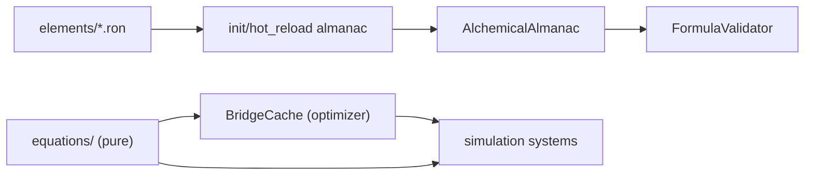

# Blueprint: Núcleo Matemático y Compilación (`blueprint`)

Módulos cubiertos: `src/blueprint/*`.
Referencia: `DESIGNING.md` (ecuaciones por capa), `CLAUDE.md` (regla: math en `blueprint/equations/`).

## 1) Propósito y frontera

- Definir ecuaciones puras, constantes, identidad elemental y validación de fórmulas/hechizos.
- Cargar y mantener almanac de elementos (assets data-driven, hot-reload).
- No ejecuta pipeline temporal; provee funciones y recursos usados por `simulation`.
- **Regla absoluta:** NUNCA inline formulas en sistemas. Todo va en `blueprint/equations/` (módulos por dominio).

## 2) Superficie pública (contrato)

### Módulos

```
blueprint/
├── equations/          → ALL pure math (`mod.rs` + dominios: core_physics, field_body, …)
├── constants/          → tuning (`mod.rs` + shards por dominio; submódulo `morphogenesis` para MG)
├── element_id.rs       → ElementId (deterministic hash)
├── almanac/            → AlchemicalAlmanac, ElementDef, hot-reload, find_stable_band* (EAC2)
├── almanac_contract.rs → EAC1: coherencia Flora/abiogénesis, símbolos únicos en tests de assets
├── abilities.rs        → AbilityDef, AbilitySlot schema
├── morphogenesis.rs    → API morfogénesis inferida (consume `constants::morphogenesis`)
├── recipes.rs          → EffectRecipe, TransmuteDir
├── spell_compiler.rs   → compile_and_enable_ability()
└── validator.rs        → FormulaValidator, checksum_ability()
```

### Ecuaciones core (`equations/`)

| Función | Firma | Capas involucradas |
|---------|-------|--------------------|
| `sphere_volume` | `(radius) → f32` | L1 |
| `density` | `(qe, radius) → f32` | L0 × L1 |
| `interference` | `(f_a, φ_a, f_b, φ_b, t) → f32` | L2 × L2 |
| `effective_dissipation` | `(base_rate, speed) → f32` | L3 |
| `drag_force` | `(viscosity, density, velocity) → Vec2` | L3 × L6 |
| `equivalent_temperature` | `(density) → f32` | L0 × L1 |
| `state_from_temperature` | `(temp, eb) → MatterState` | L4 |
| `motor_intake` | `(valve, dt, available_qe, headroom) → f32` | L5 |
| `collision_transfer` | `(qe_a, qe_b, cond, interference) → f32` | L0 × L4 |
| `catalysis_result` | `(projected_qe, interference, crit) → f32` | L8 × L9 |
| `will_force` | `(intent, base_power, efficiency) → Vec2` | L7 × L5 |

**Color / almanaque (EAC3–EAC4, consumo worldgen y simulación):** `field_linear_rgb_from_hz_purity`, `compound_field_linear_rgba`, `field_linear_rgb_sanitize_finite`; mezcla opcional Hz→matiz vía `ElementDef::hz_identity_weight` en RON (default = solo color RON). Ver `docs/sprints/ELEMENT_ALMANAC_CANON/README.md` (sprints EAC eliminados; contrato en §9 de este doc).

### Constantes core (`constants/`)

| Constante | Valor | Propósito |
|-----------|-------|----------|
| FRICTION_COEF | 0.01 | Escala arrastre por velocidad² |
| GAME_BOLTZMANN | 1.0 | Densidad → temperatura |
| CONSTRUCTIVE_THRESHOLD | 0.5 | I > esto → curación |
| DESTRUCTIVE_THRESHOLD | -0.5 | I < esto → daño |
| CRITICAL_THRESHOLD | 0.9 | \|I\| > esto → crítico |
| RESONANCE_LOCK_FACTOR | 0.1 | Velocidad de lock de frecuencia |
| BOND_WEAKENING_FACTOR | 0.05 | Tasa de debilitación de bonds |
| BASE_MOTOR_POWER | 2000.0 | Fuerza base del actuador |
| MAX_GLOBAL_VELOCITY | 50.0 | Cap de seguridad |
| QE_MIN_EXISTENCE | 0.01 | Mínimo para existir |

### Almanac (elementos)

11 elementos definidos por banda de frecuencia:

| Elemento | Frecuencia | Visibilidad |
|----------|-----------|-------------|
| Umbra | ~20 Hz | 0.1 (invisible) |
| Ceniza | ~40 Hz | 0.15 |
| Terra | ~75 Hz | 0.3 |
| Lodo | ~150 Hz | 0.4 |
| Aqua | ~250 Hz | 0.5 |
| Vapor | ~350 Hz | 0.6 |
| Ignis | ~450 Hz | 0.7 |
| Rayo | ~550 Hz | 0.75 |
| Ventus | ~700 Hz | 0.8 |
| Eter | ~850 Hz | 0.9 |
| Lux | ~1000 Hz | 1.0 (máxima) |

## 3) Invariantes y precondiciones

- Identidad elemental debe ser estable entre runs (determinismo).
- Fórmulas y abilities deben validar rangos/consistencia antes de habilitarse.
- Hot reload no debe dejar estado inválido parcial en almanac.
- **Toda fórmula nueva va en `equations/`** (shard del dominio adecuado). Targeting range, fog signal, cooldown estimate — todo.
- Constantes algorítmicas (arrays de noise) pueden quedarse in-file; constantes de tuning van en `constants/` (shard por dominio).

## 4) Comportamiento runtime



- El dominio matemático opera como dependencia de lectura para la simulación.
- Bridge optimizer (src/bridge/) envuelve ecuaciones con cache cuantizado sin cambiar la interfaz.

## 5) Implementación y trade-offs

- **Valor**: lógica matemática reusable y testeable fuera de ECS. `cargo test --lib` cubre la crate principal (orden de magnitud **~920** tests a mediados de 2026; el workspace suma más con `tests/` y features).
- **Costo**: requiere disciplina para no mezclar IO/runtime en ecuaciones puras.
- **Trade-off**: más estructura inicial para ganar verificabilidad y menor deuda.
- **Bridge integration**: BridgedPhysicsOps envuelve PhysicsOps con cache transparente. Misma interfaz, ~80% menos compute.

## 6) Fallas y observabilidad

- Si faltan assets, el almanac puede quedar vacío (degradación silenciosa).
- Error de validación puede bloquear abilities esperadas.
- Mitigación: logs de carga/validación y checks de contenido mínimo.

## 7) Checklist de atomicidad

- Responsabilidad principal: sí (contrato matemático y catálogo).
- Acoplamiento: bajo con ECS, alto valor transversal.
- Split futuro: separar "compilación de spells" en submódulo más estricto si crece DSL.

## 8) Referencias cruzadas

- `DESIGNING.md` — Ecuaciones por capa, árbol de dependencia
- `CLAUDE.md` — Regla: math en `blueprint/equations/`; systems llaman funciones puras, sin fórmulas inline.
- `docs/design/GAMEDEV_IMPLEMENTATION.md` — Ecuaciones nuevas para MOBA (can_cast, fog signal, etc.)
- `.cursor/skills/bevy-ecs-resonance/SKILL.md` — Core equations reference table

## 9) Element almanac contract (EAC)

- **EAC1 (`almanac_contract.rs`):** validaciones puras de coherencia entre RON y constantes de gameplay (p. ej. banda Flora vs `abiogenesis_*` en `constants/`); tests de assets cargan `assets/elements`.
- **EAC2 (`almanac/`):** `find_stable_band` / `find_stable_band_id` — barrido sobre definiciones, `contains` en banda, desempate documentado (anchura → `ElementId`); rechaza Hz no finitos.
- **EAC3–EAC4 (`equations/` + RON):** RGB lineal desde Hz/pureza y compuestos; `hz_identity_weight` controla híbrido RON vs arco espectral.
- **Consumidores típicos:** `worldgen/visual_derivation`, `worldgen/field_visual_sample`, `simulation/pre_physics`, `simulation/photosynthesis`, `rendering/quantized_color`, `worldgen/cell_field_snapshot` (tests/fixtures).

Blueprint relacionado: [inferencia campo / EPI](./blueprint_energy_field_inference.md) usa estas puras para muestreo por celda sin duplicar reglas de banda.
