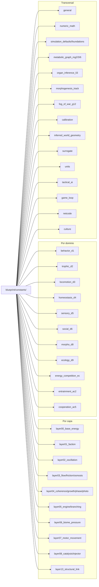

# Blueprint: Nucleo Matematico (`blueprint/`)

Ecuaciones puras, constantes de tuning, almanac de elementos y validacion de formulas.
Sin dependencias de Bevy — 100% testeable fuera del ECS.
**Regla absoluta:** NUNCA inline formulas en sistemas. Todo va en `blueprint/equations/`.

## Arbol de dominios de ecuaciones

```mermaid
flowchart TD
    EQ["blueprint/equations/"]

    subgraph "Fisica core"
        CP["core_physics"]
        HM["homeostasis"]
        LO["locomotion"]
        FL["flux"]
        SP["spatial"]
    end

    subgraph "Biologia"
        TR["trophic"]
        EC["ecology"]
        ED["ecology_dynamics"]
        LC["lifecycle"]
        OI["organ_inference"]
        AB["abiogenesis<br/>+ axiomatic"]
        MG["metabolic_graph"]
        MS["morphogenesis_shape"]
        MR["morpho_adaptation"]
        PO["population"]
    end

    subgraph "Comportamiento"
        BH["behavior"]
        SE["sensory"]
        SC["social_communication"]
        CW["combat_will"]
        CU["culture"]
    end

    subgraph "Emergencia (16 sub)"
        EM["emergence/"]
        EM_AS["associations"]
        EM_EN["entrainment"]
        EM_OM["other_model"]
        EM_CU["culture"]
        EM_IN["infrastructure"]
        EM_SY["symbiosis"]
        EM_EP["epigenetics"]
        EM_SN["senescence"]
        EM_CO["coalitions"]
        EM_NI["niche"]
        EM_TS["timescale"]
        EM_MS["multiscale"]
        EM_TE["tectonics"]
        EM_GL["geological_lod"]
        EM_IT["institutions"]
        EM_LA["language"]
        EM_SM["self_model"]
    end

    subgraph "Worldgen y visual"
        FC["field_color"]
        GF["geometry_flow"]
        GD["geometry_deformation"]
        FB["field_body"]
        QC["quantized_color"]
        PH["phenology"]
        ES["entity_shape"]
        IWG["inferred_world_geometry/"]
    end

    subgraph "Energy competition"
        ECC["energy_competition/"]
    end

    subgraph "Gameplay"
        TA["tactical_ai"]
        GL["game_loop"]
        NC["netcode"]
        SG["signal_propagation"]
    end

    subgraph "Reliability"
        SQ["simulation_quality"]
        CA["calibration"]
        DE["determinism"]
        MRB["morph_robustness"]
        OB["observability"]
        SN2["sensitivity"]
        SE2["surrogate_error"]
        CO["conservation"]
    end

    EQ --> CP & HM & LO & FL & SP
    EQ --> TR & EC & ED & LC & OI & AB & MG & MS & MR & PO
    EQ --> BH & SE & SC & CW & CU
    EQ --> EM
    EM --> EM_AS & EM_EN & EM_OM & EM_CU & EM_IN & EM_SY & EM_EP & EM_SN & EM_CO & EM_NI & EM_TS & EM_MS & EM_TE & EM_GL & EM_IT & EM_LA & EM_SM
    EQ --> FC & GF & GD & FB & QC & PH & ES & IWG
    EQ --> ECC
    EQ --> TA & GL & NC & SG
    EQ --> SQ & CA & DE & MRB & OB & SN2 & SE2 & CO
```

## Arbol de constantes

## Ecuaciones core (ejemplos)

| Funcion | Capas | Dominio |
|---------|-------|---------|
| `density(qe, radius)` | L0 x L1 | core_physics |
| `interference(f_a, phi_a, f_b, phi_b, t)` | L2 x L2 | core_physics |
| `drag_force(viscosity, density, velocity)` | L3 x L6 | core_physics |
| `motor_intake(valve, dt, available, headroom)` | L5 | core_physics |
| `catalysis_result(projected_qe, interference, crit)` | L8 x L9 | combat_will |
| `carnot_efficiency(t_hot, t_cold)` | MG1 | morphogenesis |
| `entropy_production(heat, temp)` | MG1 | morphogenesis |
| `exergy_balance(inputs, outputs)` | MG1 | metabolic_graph |
| `shape_cost(fineness, volume)` | MG4 | morphogenesis_shape |
| `inferred_albedo(irradiance, absorptivity)` | MG5 | morphogenesis |
| `inferred_surface_rugosity(segments)` | MG7 | morphogenesis |
| `trophic_transfer(predator_qe, prey_qe)` | D2 | trophic |
| `locomotion_cost(mass, speed, terrain)` | D3 | locomotion |
| `homeostasis_adaptation(current, target, rate)` | D4 | homeostasis |
| `sensory_signal(qe, visibility, distance)` | D5 | sensory |
| `cooperation_benefit(group_size, synergy)` | AC-5 | cooperation |
| `kuramoto_phase_update(omega, K, phases)` | AC-2 | entrainment |

## Almanac (11 elementos)

| Elemento | Frecuencia | Visibilidad |
|----------|-----------|-------------|
| Umbra | ~20 Hz | 0.1 |
| Ceniza | ~40 Hz | 0.15 |
| Terra | ~75 Hz | 0.3 |
| Lodo | ~150 Hz | 0.4 |
| Aqua | ~250 Hz | 0.5 |
| Vapor | ~350 Hz | 0.6 |
| Ignis | ~450 Hz | 0.7 |
| Rayo | ~550 Hz | 0.75 |
| Ventus | ~700 Hz | 0.8 |
| Eter | ~850 Hz | 0.9 |
| Lux | ~1000 Hz | 1.0 |

## Dependencias

- Sin dependencia a Bevy en ecuaciones puras (solo `bevy::math` para Vec2/Vec3)
- `crate::layers` — tipos (MatterState, etc.) para pattern matching
- Assets: `assets/elements/*.ron` para almanac hot-reload

## Invariantes

- Toda funcion en `equations/` es **pura**: sin side effects, sin IO, sin ECS
- Constantes de tuning en `constants/`, constantes algoritmicas (arrays noise) in-file
- ElementId determinista entre runs (FNV hash)
- Hot-reload de almanac no deja estado parcial invalido
