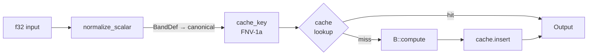
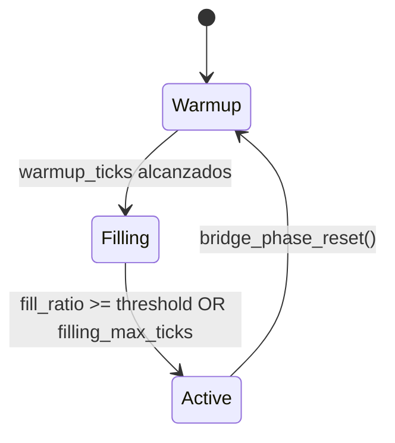

# Blueprint: Bridge Optimizer

**Modulo:** `src/bridge/`
**Rol:** Cache de cuantizacion estable por ecuacion — reduce computo en hot path sin alterar resultados (descartable)
**Diseno:** `docs/design/BRIDGE_OPTIMIZER.md`

---

## 1. Idea central

El bridge **cuantiza** entradas continuas a valores canonicos por banda, genera una cache key determinista, y cachea el resultado. Si la cache se borra, el pipeline sigue correcto — solo pierde velocidad.

```
f32 raw → BandDef (half-open) → canonical f32 → FNV-1a key → cache lookup
```

---

## 2. Tipos clave

| Tipo | Archivo | Rol |
|------|---------|-----|
| `BridgeKind` (trait) | `config.rs` | Marcador phantom — aislamiento compile-time |
| `BridgeConfig<B>` | `config.rs` | Resource: bands, hysteresis, capacity, policy, rigidity |
| `BridgeCache<B>` | `cache.rs` | Resource: LRU cache por tipo (Small ≤256 / Large FxHashMap) |
| `Bridgeable` (trait) | `decorator.rs` | normalize → cache_key → compute → into/from cached |
| `BandDef` | `config.rs` | {min, max, canonical, stable} — rango half-open contiguo |
| `CachePolicy` | `config.rs` | Lru / Lfu / ContextFill |
| `BridgePhase` | `context_fill.rs` | Warmup → Filling → Active |
| `BridgeMetrics<B>` | `metrics.rs` | Hits/misses/evictions por ventana |
| `CachedValue` | `cache.rs` | Scalar(f32) / State(MatterState) / Vector(Vec2) — 12 bytes |

---

## 3. Equation kinds (13 core + emergence)

| Bridge marker | Ecuacion |
|---------------|----------|
| `DensityBridge` | density(qe, radius) |
| `TemperatureBridge` | temperature_equivalent(qe, mass, eb) |
| `PhaseTransitionBridge` | phase_transition(temp) → MatterState |
| `InterferenceBridge` | interference(freq_a, freq_b, phase, t) |
| `DissipationBridge` | dissipation_loss(qe, viscosity) |
| `DragBridge` | drag(velocity, viscosity, density) |
| `EngineBridge` | engine_throughput(buffer, valves) |
| `WillBridge` | will_force(intent, channeling) |
| `CatalysisBridge` | catalysis(reagents, proximity) |
| `CollisionTransferBridge` | collision_transfer(qe_a, qe_b, overlap) |
| `OsmosisBridge` | osmosis_flux(conc_a, conc_b, permeability) |
| `EvolutionSurrogateBridge` | surrogate de evoluciones lentas |
| `CompetitionNormBridge` | competition_norm(extractors, pool) |

Emergence tiers agregan 16 bridges mas (AssociativeMemory, OtherModel, MemeSpread, ...).

---

## 4. Pipeline de cuantizacion



**Histéresis:** si el tick previo devolvio banda `h`, el valor se mantiene en `h` mientras este dentro de `[min-margin, max+margin]`. Evita oscilacion en fronteras de banda.

---

## 5. Fases del optimizer



| Fase | Eviccion | Decorador | Efecto |
|------|----------|-----------|--------|
| **Warmup** | off | `bridge_warmup_record` — compute exacto, guarda en key normalizada | Llena la cache con valores exactos |
| **Filling** | off | `bridge_compute` — normaliza + lookup/compute | No evicta, solo updates |
| **Active** | on (LRU) | `bridge_compute` — hot path normal | Evicta LRU al insertar |

---

## 6. Vec2 quantization

Direccion: `atan2 → sector (8/16/32)` → unitario canonico de LUT.
Magnitud: bandas escalares sin histeresis.
Cache key: `(sector << 16) | magnitude_band`.

---

## 7. Presets (RON)

`BridgeConfigAsset` carga desde `assets/bridge/*.ron`. Hot-reload en runtime via `bridge_config_hot_reload_system`. `Rigidity` (Rigid/Moderate/Flexible/Transparent) controla ancho de bandas pre-configurado.

---

## 8. Invariantes

1. **Descartable:** borrar cualquier `BridgeCache<B>` no cambia resultados, solo rendimiento
2. **Aislamiento:** `BridgeConfig<DensityBridge>` y `BridgeCache<DensityBridge>` son Resources independientes de otros bridges
3. **Determinismo:** misma entrada + misma config → misma cache key → mismo resultado
4. **Contigueidad:** `validate_bands` rechaza gaps/overlaps entre bandas
