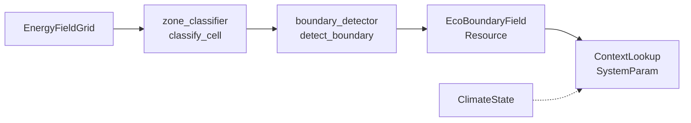
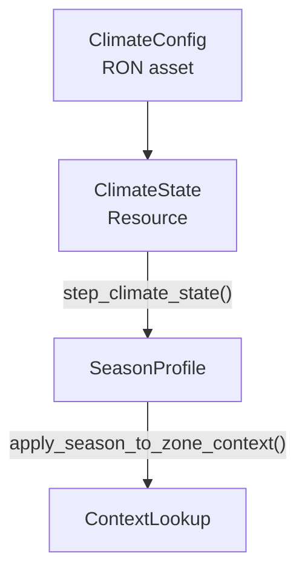

# Blueprint: Eco-Boundaries

**Modulo:** `src/eco/`
**Rol:** Clasificacion emergente de zonas y contexto ambiental derivado del `EnergyFieldGrid`
**Diseno:** `docs/design/ECO_BOUNDARIES.md`

---

## 1. Idea central

No es una capa ECS — es un **derivado cacheado** del campo energetico. Cada celda del grid se clasifica en una `ZoneClass`; las fronteras entre zonas adyacentes se interpolan. Los sistemas de simulacion consumen `ContextLookup` para obtener presion, viscosidad, temperatura base y modificadores.

---

## 2. ZoneClass

```rust
enum ZoneClass {
    HighAtmosphere, // baja densidad, alta disipacion
    Surface,        // default habitable
    Subaquatic,     // densidad > threshold
    Subterranean,   // profundidad geologica
    Volcanic,       // frecuencia dominante Ignis
    Frozen,         // temperatura < SOLID_TRANSITION
    Void,           // qe < QE_MIN_EXISTENCE
}
```

Clasificacion: `zone_classifier::classify_cell(cell, cell_size)` — funcion pura sobre datos de celda.

---

## 3. Pipeline



---

## 4. Tipos clave

| Tipo | Archivo | Rol |
|------|---------|-----|
| `EcoBoundaryField` | `boundary_field.rs` | Resource: markers[], zone_contexts{}, cell_zone_ids[] |
| `BoundaryMarker` | `contracts.rs` | Interior{zone_id} / Boundary{zone_a, zone_b, gradient, transition} |
| `ContextResponse` | `contracts.rs` | pressure, viscosity, temp_base, dissipation_mod, reactivity_mod, zone (<=32B) |
| `ZoneContext` | `contracts.rs` | Valores base cacheados por zone_id |
| `ContextLookup<'w>` | `context_lookup.rs` | SystemParam: Res<EnergyFieldGrid> + Option<Res<EcoBoundaryField>> + climate |
| `TransitionType` | `contracts.rs` | PhaseBoundary / DensityGradient / ElementFrontier / ThermalShock |

---

## 5. ContextLookup — acceso O(1)

```rust
#[derive(SystemParam)]
pub struct ContextLookup<'w> {
    grid:             Res<'w, EnergyFieldGrid>,
    boundaries:       Option<Res<'w, EcoBoundaryField>>,
    climate:          Option<Res<'w, ClimateState>>,
    playfield_margin: Option<Res<'w, EcoPlayfieldMargin>>,
}
```

- **Interior:** `zone_contexts[zone_id]` — O(1) HashMap lookup
- **Boundary:** `lerp(ctx_a, ctx_b, gradient_factor)` — interpolacion lineal
- **Sin EcoBoundaryField:** degrada a baseline legado (multiplicadores = 1.0)
- **Fuera del grid o margen:** `void_context_response()` (todo cero)

---

## 6. Climate



| Tipo | Rol |
|------|-----|
| `Season` | Enum estacional |
| `SeasonProfile` | temperature_offset, precipitation_factor, wind_intensity |
| `ClimateConfig` | Hot-reload RON con perfiles por estacion |
| `ClimateState` | Resource con perfil efectivo interpolado |

---

## 7. Invariantes

1. `EcoBoundaryField` se recomputa solo si `grid.generation` cambio y cooldown expiro
2. `eco_field_aligned_with_grid()` valida dimensiones — mismatch degrada a baseline, no panic
3. `ContextResponse` es Copy + <=32 bytes (hot path friendly)
4. `EcoPlayfieldMargin` marca N celdas perimetrales como Void logico
