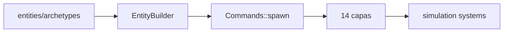

# Blueprint: Entidades y Arquetipos (`entities`)

Módulos cubiertos: `src/entities/*`.
Referencia: `DESIGNING.md` (tipos A/B, complejidad por niveles), `.cursor/skills/bevy-ecs-resonance/SKILL.md`.

## 1) Propósito y frontera

- Encapsular la construcción de entidades ECS desde presets coherentes.
- Mantener composición declarativa para héroes, proyectiles, biomas y efectos.
- No ejecuta dinámica temporal; solo define estado inicial.

## 2) Superficie pública (contrato)

### EntityBuilder (API fluent)

```rust
EntityBuilder::new()
    .named("FireMage")
    .at(Vec2::new(10.0, 5.0))
    .energy(500.0)           // L0
    .volume(0.8)             // L1
    .wave(element_id)        // L2
    .flow(Vec2::ZERO, 0.01)  // L3
    .matter(Solid, 2000.0, 0.6)  // L4
    .motor(1500.0, 8.0, 80.0, 750.0)  // L5
    .will_default()          // L7
    .identity(Red, vec![Hero], 1.5)  // L9
    .sim_world_layout(&layout)
    .spawn(commands)
```

### Spawners de arquetipo

| Función | Capas | Tipo |
|---------|-------|------|
| `spawn_hero(HeroClass)` | L0-L9 + opcionales L11,L12,L13 | A |
| `spawn_projectile()` | L0,L1,L2,L3,L8 | B (L8) |
| `spawn_biome(BiomeType)` | L0,L1,L2,L3,L4,L6 | B (L6) |
| `spawn_crystal()` | L0,L1,L2,L3,L4,L5 | A |
| `spawn_stone()` | L0,L1,L2,L3,L4 | A |
| `spawn_particle()` | L0,L1,L2,L3 | A |
| `spawn_lava_knight()` | L0-L8 | A+B |
| `spawn_effect()` | L0,L3,L10 | B (L10) |

### HeroClass enum (6 clases)

| Clase | Elemento | Características |
|-------|----------|----------------|
| FireMage | Ignis (450 Hz) | Alta energía, bajo radio |
| EarthWarrior | Terra (75 Hz) | Alta cohesión, alta bond_energy |
| PlantAssassin | Umbra (20 Hz) | Baja energía, alta velocidad, invisible natural |
| LightHealer | Lux (1000 Hz) | Buffer grande, alta visibilidad |
| WindShooter | Ventus (700 Hz) | Largo rango, alta disipación |
| WaterTank | Aqua (250 Hz) | Máxima cohesión, alta viscosidad |

### BiomeType enum (6 tipos)

| Tipo | delta_qe | viscosity | Comportamiento |
|------|----------|-----------|---------------|
| Plain | 0.0 | 1.0 | Neutral |
| Volcano | -5.0 | 2.0 | Drena energía, terreno pesado |
| LeyLine | +10.0 | 0.5 | Inyecta energía, terreno liviano |
| Swamp | -2.0 | 3.0 | Drena poco, mucha viscosidad |
| Tundra | -3.0 | 1.5 | Drena medio, frío |
| Desert | -1.0 | 1.2 | Drena poco, seco |

### Configs de composición

- `PhysicsConfig` — radio, disipación
- `InjectorConfig` — qe proyectado, frecuencia forzada, radio
- `EngineConfig` — buffer, valves
- `MatterConfig` — estado, bond_energy, conductividad
- `PressureConfig` — delta_qe, viscosidad
- `EffectConfig` — target, campo modificado, magnitud

## 3) Invariantes y precondiciones

- Configs deben respetar invariantes numéricas de componentes en `layers` (qe >= 0, radius >= 0.01).
- `spawn_projectile` define correctamente flags de colisión/despawn.
- `spawn_effect` crea entidad Tipo B (L10) con su propia qe — la duración emerge de disipación.
- Derivaciones que dependen de sistemas (ej. frecuencia final) corren luego en `simulation`.

## 4) Comportamiento runtime



- El módulo define semilla de estado; la simulación refina ese estado en tiempo.
- Demos (demo_level, demo_arena, proving_grounds) usan las funciones de spawn con presets.

## 5) Implementación y trade-offs

- **Valor**: factories explícitas, menos boilerplate al spawnear. EntityBuilder soporta las 14 capas.
- **Costo**: presets hardcodeados acoplan tuning de gameplay al código.
- **Trade-off**: velocidad de iteración vs data-driven completo (futuro: RON assets para héroes).
- **Futuro (G6):** marker components con `#[require]` (AlchemicalBase, WaveEntity, Champion) complementarán EntityBuilder.

## 6) Fallas y observabilidad

- Falla común: preset inválido que viola invariantes de capa.
- Riesgo: defaults silenciosos que ocultan error de diseño de arquetipo.
- Mitigación: centralizar validaciones en configs y tests de spawn. `new()` constructors con clamping.

## 7) Checklist de atomicidad

- Responsabilidad principal: sí (composición/spawn).
- Acoplamiento: moderado con `layers`, bajo con runtime.
- Split futuro: separar presets demo de presets productivos. Data-driven hero definitions (RON).

## 8) Referencias cruzadas

- `DESIGNING.md` — Tipos A/B, complejidad por niveles
- `.cursor/skills/bevy-ecs-resonance/SKILL.md` — Entity archetypes table
- `docs/sprints/GAMEDEV_PATTERNS/README.md` — G6 `#[require]` (sprint doc eliminado)
- `docs/sprints/DEMO_PROVING_GROUNDS.md` — Demo que ejercita 14 capas
