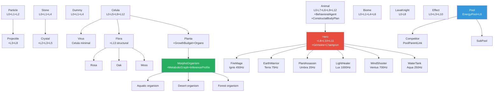

# Blueprint: Entidades y Arquetipos (`entities/`)

Encapsula la construccion de entidades ECS desde presets coherentes.
Composicion declarativa via `EntityBuilder` + funciones `spawn_*` por arquetipo.
Solo define estado inicial — la dinamica temporal vive en `simulation/`.

## Jerarquia de arquetipos



## Funciones spawn por modulo

| Modulo | Funcion | Entidad | Capas principales |
|--------|---------|---------|-------------------|
| **catalog.rs** | `spawn_celula` | Celula | L0-L5, L9, L12 |
| | `spawn_virus` | Virus | L0-L4, L9 |
| | `spawn_planta` | Planta | L0-L5, L9, L12, L13 |
| | `spawn_animal` | Animal | L0-L7, L6, L9, L12 + constructal body plan |
| **flora.rs** | `spawn_rosa` | Rosa | Flora + GF1 shape |
| | `spawn_oak` | Oak | Flora + high bond_energy |
| | `spawn_moss` | Moss | Flora + low energy |
| **morphogenesis.rs** | `spawn_aquatic_organism` | Aquatic | MorphoOrganism + Aqua band |
| | `spawn_desert_organism` | Desert | MorphoOrganism + Ignis band |
| | `spawn_forest_organism` | Forest | MorphoOrganism + Terra band |
| **heroes.rs** | `spawn_hero(HeroClass)` | Hero | L0-L9 + L11, L12 |
| **world_entities.rs** | `spawn_effect` | Effect | L0, L3, L10 |
| | `spawn_dummy` | Dummy | L0, L1, L4 |
| | `spawn_projectile` | Projectile | L0-L3, L8 |
| | `spawn_crystal` | Crystal | L0-L5 |
| | `spawn_biome` | Biome | L0, L1, L4, L6 |
| | `spawn_particle` | Particle | L0, L1, L2 |
| | `spawn_stone` | Stone | L0, L1, L4 |
| | `spawn_lava_knight` | LavaKnight | L0-L8 |
| **competition.rs** | `spawn_pool` | Pool | EnergyPool, L6 |
| | `spawn_competitor` | Competitor | PoolParentLink |
| | `spawn_sub_pool` | SubPool | nested pool |

## HeroClass (6 clases)

| Clase | Elemento | Frecuencia | Perfil |
|-------|----------|-----------|--------|
| FireMage | Ignis | 450 Hz | Alta energia, bajo radio |
| EarthWarrior | Terra | 75 Hz | Alta cohesion, alta bond_energy |
| PlantAssassin | Umbra | 20 Hz | Baja energia, alta velocidad |
| LightHealer | Lux | 1000 Hz | Buffer grande, alta visibilidad |
| WindShooter | Ventus | 700 Hz | Largo rango, alta disipacion |
| WaterTank | Aqua | 250 Hz | Maxima cohesion, alta viscosidad |

## EntityBuilder (API fluent)

```rust
EntityBuilder::new()
    .named("FireMage")
    .at(Vec2::new(10.0, 5.0))
    .energy(500.0)           // L0
    .volume(0.8)             // L1
    .wave(element_id)        // L2
    .flow(Vec2::ZERO, 0.01)  // L3
    .matter(Solid, 2000.0)   // L4
    .motor(1500.0, 8.0)      // L5
    .will_default()          // L7
    .identity(Red, vec![Hero], 1.5)  // L9
    .spawn(commands)
```

## Dependencias

- `crate::layers` — todos los componentes de las 14 capas
- `crate::blueprint::constants` — valores por defecto de arquetipos
- `bevy::prelude` — Commands, Entity, Transform

## Invariantes

- Configs respetan invariantes numericas de `layers/` (qe >= 0, radius >= 0.01)
- `spawn_projectile` define flags de colision/despawn
- `spawn_effect` crea entidad Tipo B (L10) — duracion emerge de disipacion
- Derivaciones que dependen de sistemas corren luego en `simulation/`
