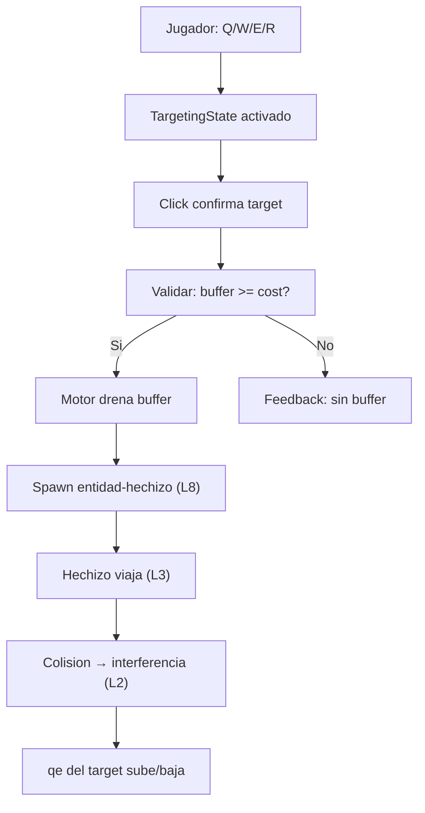
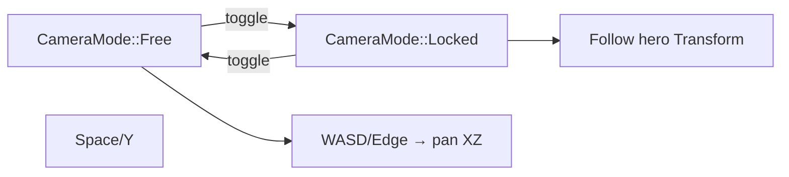
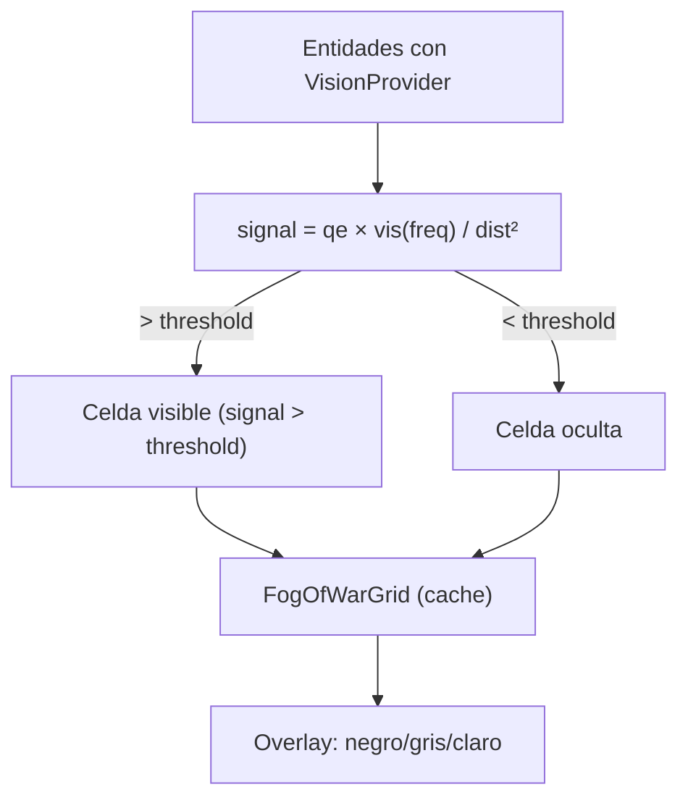

# Blueprint: Patrones Gamedev MOBA (`simulation` + `runtime_platform`)

Modulos cubiertos: `src/simulation/*` (abilities, targeting, pathfinding), `src/runtime_platform/*` (camera, HUD, minimap, fog).
Referencia conceptual: `DESIGNING.md` (filosofia de capas), `GAMEDEV_IMPLEMENTATION.md` (mapeo MOBA → energia).
Contrato editorial: `docs/arquitectura/00_contratos_glosario.md`.

## 1) Proposito y frontera

- Implementar las interfaces estandar de un MOBA (QWER abilities, targeting, cooldowns, camera libre, minimap, fog of war) sobre el modelo de 14 capas energeticas de Resonance.
- **Frontera critica:** las interfaces son estandar (Dota/LoL), pero el backend es energia. Ningun patron introduce stats, timers, o modifiers que no emerjan de las capas.
- NO resuelve: networking (lightyear), matchmaking, items/shop, hero selection UI, replay system.

### Subsistemas

| Subsistema | Sprints | Modulos afectados |
|-----------|---------|-------------------|
| Infraestructura ECS | G1, G2, G6, G7, G8, G9 | `layers/`, `simulation/pipeline.rs`, `plugins/` |
| Ability System | G3 | `simulation/`, `blueprint/abilities.rs`, `events.rs` |
| Camera + Minimap | G4, G10 | `runtime_platform/camera_controller_3d/`, nuevo `runtime_platform/hud/` |
| Navigation | G5 | `simulation/`, `runtime_platform/click_to_move/` |
| Visibility | G12 | `simulation/`, `world/perception.rs` |
| Identity | G11 | `blueprint/ids.rs`, `entities/archetypes.rs` |

## 2) Superficie publica (contrato)

### Tipos nuevos exportados

```
TargetingMode          — NoTarget, PointTarget, UnitTarget, DirectionTarget, AreaTarget
TargetingState         — Resource: tracking de targeting activo
AbilityTarget          — None, Point(Vec3), Entity(Entity), Direction(Vec3)
CameraMode             — Free, Locked { target }
MobaCameraConfig       — Resource: speed, zoom, margins, pitch
NavAgent               — Component: speed, radius
NavPath                — Component: waypoints[], current_index
FogOfWarGrid           — Resource: grid de visibilidad por equipo
VisionProvider         — Component: radius basado en percepcion energetica
GameState              — States: Loading, Playing, Paused, PostGame
PlayState              — SubStates: Warmup, Active
ChampionId             — Component: newtype u32
AlchemicalBase         — Marker con #[require] → Transform, BaseEnergy, SpatialVolume
WaveEntity             — Marker con #[require] → AlchemicalBase, OscillatorySignature, FlowVector
Champion               — Marker con #[require] → WaveEntity, ..., MobaIdentity
```

### Eventos nuevos

```
AbilitySelectionEvent  — jugador presiona QWER
AbilityCastEvent       — cast validado, motor drenado
PathRequestEvent       — solicitud de pathfinding
```

### Sistemas nuevos (por Phase)

```text
Especificación MOBA (orientativa; alinear con código en simulation/ y runtime_platform/).

Phase::Input (+ InputChannelSet::PlatformWill donde aplica):
  selección QWER / targeting / cámara (según plugins HUD y capture)

Phase::ThermodynamicLayer:
  pathfinding (full3d): cadena en compat_2d3d — PathRequest → NavPath → proyección a Will

Phase::MetabolicLayer (implementado):
  fog_of_war_provider_system, fog_visibility_mask_system → máscaras / grid

Update / render:
  MinimapPlugin, AbilityHudPlugin, QuantizedColorPlugin — UI/visual, no FixedUpdate
```

Ver `blueprint_simulation.md` para el enum `Phase` real y el orden `.chain()`.

## 3) Invariantes y precondiciones

### Invariantes energeticos (CRITICOS)

1. **No timers para cooldowns.** La disponibilidad de un ability se computa como `engine.buffer >= slot.cost_qe`. El tiempo de recarga es `deficit / engine.input_valve` — derivado, nunca almacenado.

2. **No duration timers para buffs.** Los efectos son entidades ResonanceLink (L10) con `qe` propia. Duracion = `qe / dissipation_rate`. Mueren por las mismas reglas que cualquier entidad.

3. **No stats derivados almacenados.** `damage`, `heal_power`, `cooldown_reduction` se computan en punto de uso desde capas L0-L9.

4. **Fog of War por percepcion energetica.** `signal = source.qe × visibility(source.freq) / dist²`. El grid es cache, no fuente de verdad.

### Invariantes de pipeline

5. **Toda habilidad pasa por el motor (L5).** Validar `buffer >= cost` → drenar buffer → spawar entidad-hechizo. No hay bypass.

6. **Pathfinding alimenta WillActuator, no Transform.** La ruta se convierte en `movement_intent` (L7). El movimiento fisico sigue siendo `will_force → FlowVector → Transform` via ecuaciones puras.

7. **GameState gatea sistemas.** Ningun sistema de gameplay corre fuera de `GameState::Playing`. Worldgen corre en `PlayState::Warmup`.

### Precondiciones de ejecucion

8. `equations.rs` contiene todas las formulas nuevas (targeting range, fog signal, pathfinding cost).
9. `SpatialIndex` actualizado antes de sistemas que hacen queries de vecindad.
10. NavMesh generado despues de worldgen (dependencia de startup).

## 4) Comportamiento runtime

### Flujo de habilidades (G3)



### Flujo de camara (G4)



### Flujo de percepcion (G12)



### Orden relativo

```
GameState::Loading → worldgen systems
GameState::Playing + PlayState::Warmup → propagation systems
GameState::Playing + PlayState::Active → gameplay (G3-G12)
GameState::Paused → nada corre en FixedUpdate
```

## 5) Implementacion y trade-offs

### Cooldowns emergentes vs timer

- **Valor:** el cooldown emerge de la economia de energia. Biomas, buffs, y composicion de equipo modifican cooldowns sin codigo adicional. Un mago con mejor `input_valve` castea mas rapido — no porque tenga "cooldown reduction", sino porque su motor es mas eficiente.
- **Costo:** el jugador ve una barra que se llena (buffer / cost) en vez de un timer circular. El feeling puede ser ligeramente diferente. Mitigation: el HUD puede mostrar `estimated_cooldown_secs` derivado.
- **Limite conocido:** si dos abilities tienen costos muy diferentes, el motor prioriza la mas barata naturalmente. No hay cooldowns independientes por ability. Esto es un FEATURE, no un bug — fuerza decision-making.

### NavMesh vs FlowVector

- **Valor:** pathfinding + ecuaciones de arrastre = heroes que navegan obstaculos Y se mueven mas lento en terreno viscoso, sin codigo extra.
- **Costo:** dependencia de crate externo (`oxidized_navigation`). Compatibilidad con Bevy 0.15 debe verificarse.
- **Trade-off:** flowfields para creeps son mas eficientes pero menos precisos. Usar NavMesh para heroes (precision) y flowfields para creeps (escala).

### Fog of War energetico vs grid plano

- **Valor:** stealth EMERGE del elemento (Umbra 20 Hz = invisible natural). No hace falta stat de "stealth". Un ward de Lux (1000 Hz) ve todo porque su frecuencia emite maxima visibilidad.
- **Costo:** signal calculation por par (perceiver, target) es O(n×k). Mitigacion: SpatialIndex limita k, FogOfWarGrid cachea resultados por celda.
- **Trade-off:** el grid pierde la nuance de percepcion por elemento. Mejora futura: per-element fog layers.

### SparseSet vs entidades-efecto

- **Valor:** SparseSet O(1) para markers binarios. ResonanceLink entidad para efectos con duracion energetica.
- **Costo:** dos modelos coexisten. El contributor debe saber cuando usar cada uno.
- **Regla simple:** ¿tiene duracion? → entidad. ¿Es on/off? → SparseSet.

## 6) Fallas y observabilidad

### Modos de falla esperados

| Falla | Causa | Deteccion | Mitigacion |
|-------|-------|-----------|------------|
| Ability castea sin buffer | Bypass de validacion de motor | Assert `engine.buffer >= cost` | Guard en sistema de cast |
| Cooldown instantaneo | `input_valve` demasiado alta | Log de `intake_rate` | Clamp en constants.rs |
| NavMesh invalido | Terreno cambiado despues de worldgen | Log de path failures | Recalcular NavMesh on terrain change |
| Fog leak | Reference count negativo en grid | Assert `cells[i] >= 0` | Unit tests de ref counting |
| Entidad-efecto immortal | `dissipation_rate = 0` | Grep por disipacion 0 en efectos | Clamp minimo en constructor |
| Camera out of bounds | Pan sin clamp | Visual: camara ve vacio | Bounds check en pan system |

### Senales de observabilidad

- `DebugPlugin`: overlay de motor buffer fill, targeting range circles, NavPath gizmos, FoW grid overlay
- Events: `AbilityCastEvent` frequency, `PathRequestEvent` count per frame
- Metrics: average motor fill %, abilities cast per minute, path recalcs per second

## 7) Checklist de atomicidad

### Por subsistema

| Subsistema | Responsabilidad unica | Acoplamiento | Split futuro |
|-----------|----------------------|-------------|-------------|
| Ability System (G3) | Validar + ejecutar casts | Alto (L5, L7, L8, L9, events) | Si: separar targeting de casting |
| Camera (G4) | Mover viewport | Bajo (solo Transform + config) | No |
| Pathfinding (G5) | Ruta → intent | Medio (L3, L7, NavMesh) | Si: separar path calc de follow |
| FoW (G12) | Visibilidad | Medio (L0, L2, grid) | Si: separar grid update de render |
| Minimap (G10) | Reflejo 2D | Bajo (lee Transform, MobaIdentity) | No |
| States (G2) | Control de schedule | Bajo (solo Bevy states) | No |

### Pregunta critica

**¿G3 deberia dividirse?** Si. El ability system toca 5+ capas y 3+ concerns (targeting, validation, execution). Recomendacion: dividir en G3a (cooldown validation via motor), G3b (targeting UI/state), G3c (HUD display).

## 8) Referencias cruzadas

### Blueprints
- `DESIGNING.md` — Axioma energetico, arbol de dependencia, 5 tests para capas nuevas
- `docs/design/GAMEDEV_PATTERNS.md` — Catalogo de patrones y anti-patrones
- `docs/design/GAMEDEV_IMPLEMENTATION.md` — Mapeo MOBA → energia (este documento de alto nivel)

### Sprints
- `docs/sprints/GAMEDEV_PATTERNS/` — 12 sprints de implementacion (G1-G12)
- `docs/sprints/CODE_QUALITY/` — Calidad de codigo (Q1-Q7)

### Codigo
- `src/blueprint/equations.rs` — Ecuaciones puras (agregar: targeting range, fog signal, cooldown estimate)
- `src/blueprint/abilities.rs` — AbilitySlot, AbilityOutput, Grimoire
- `src/layers/engine.rs` — AlchemicalEngine (L5: buffer, valves = mana/cooldown)
- `src/layers/link.rs` — ResonanceLink (L10: efectos como entidades)
- `src/simulation/pipeline.rs` — Phase ordering
- `src/runtime_platform/camera_controller_3d/` — Camera controller actual
- `src/world/perception.rs` — Percepcion actual (sparse)

### Skills
- `.cursor/skills/bevy-ecs-resonance/SKILL.md` — ECS patterns para IA
- `.cursor/rules/ecs-strict-dod.mdc` — DOD enforcer
- `.cursor/rules/architect.mdc` — Arquitectura y decision tree
