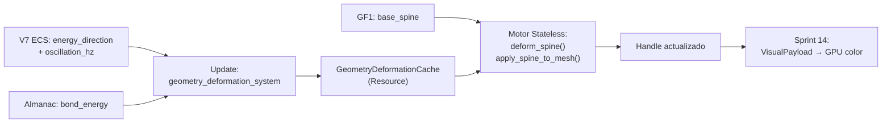

# Blueprint: Motor de Deformación Termodinámica (`geometry_deformation`)

Referencia de contrato del módulo stateless de deformación de geometría por tensores de energía.
Template base: [`00_contratos_glosario.md`](00_contratos_glosario.md).
Blueprint fuente: [`GEOMETRY_DEFORMATION_ENGINE.md`](../design/GEOMETRY_DEFORMATION_ENGINE.md).

## 1) Propósito y frontera

- **Qué resuelve:** Deformación procedural de spines y meshes de entidades (flora, estructuras) basada
  en tensores de energía (fototropismo, gravitropismo, resistencia). Stateless, determinista, caché por
  rangos de oscilación de onda.
- **Qué no resuelve:** No genera el spine base (eso es GF1). No colorea el mesh (eso es Sprint 14).
  No propaga energía ni modifica `EnergyFieldGrid`. No genera geometría de terreno (eso es `TerrainMesher`).

## 2) Superficie pública (contrato)

### Tipos exportados

```rust
/// Payload CPU → Motor Stateless por entidad.
#[derive(Clone, Debug)]
pub struct DeformationPayload {
    pub base_spine: Vec<SpineNode>,    // Spine crudo de GF1
    pub bond_energy: f32,              // Resistencia del material (Almanac)
    pub energy_direction: Vec3,        // Dirección del tensor dominante
    pub energy_magnitude: f32,         // (energia_absorbida / bond_energy).clamp(0,1)
    pub gravity_scale: f32,            // 1.0 = gravedad real; 0.0 = sin gravedad
    pub oscillation_hz: f32,           // Frecuencia de onda (OscillatorySignature)
}

/// Rango de caché de deformación para una entidad.
pub struct DeformationRange {
    pub fingerprint: u64,
    pub tensor_min: Vec3,
    pub tensor_max: Vec3,
    pub deformed_spine: Vec<SpineNode>,
    pub range_width_factor: f32,  // Estrecho = material rígido = bond_energy alto
}

/// Resource: caché de deformación indexada por celda (parallel array a EnergyFieldGrid).
#[derive(Resource, Default)]
pub struct GeometryDeformationCache {
    pub ranges: Vec<Option<DeformationRange>>,
}
```

### Funciones puras (sin ECS)

```rust
/// Deforma el spine según los tensores del payload. O(S) donde S = segmentos.
pub fn deform_spine(payload: &DeformationPayload) -> Vec<SpineNode>;

/// Aplica spine deformado a vértices del mesh base. O(V) donde V = vértices.
pub fn apply_spine_to_mesh(base_mesh: &Mesh, deformed_spine: &[SpineNode]) -> Vec<[f32; 3]>;

/// Calcula fingerprint del payload para gestión de caché.
pub fn deformation_fingerprint(payload: &DeformationPayload) -> u64;

/// Delta de orientación por segmento. Branchless.
pub fn deformation_delta(tangent: Vec3, t_energy: Vec3, t_gravity: Vec3, bond_energy: f32) -> Vec3;

/// Calcular tensor de tropismo desde distancia + dirección a fuente de energía.
pub fn calculate_tropism_vector(
    absorbed_energy: f32, bond_energy: f32,
    energy_direction: Vec3, gravity_scale: f32
) -> (Vec3, Vec3); // (t_energy, t_gravity)
```

### Sistemas ECS (`Update`)

```rust
/// Construye DeformationPayload por entidad y lo pasa al motor.
/// Lee: BaseEnergy, OscillatorySignature, Materialized, AlchemicalAlmanac, EnergyFieldGrid.
/// Escribe: Handle<Mesh> actualizado vía Assets<Mesh>.
pub fn geometry_deformation_system(...);

/// Ajusta el tamaño del GeometryDeformationCache al tamaño del grid.
pub fn sync_deformation_cache_len_system(...);
```

## 3) Invariantes y precondiciones

- `bond_energy > 0` siempre — nunca puede ser cero (división por cero en plasticidad).
- `energy_magnitude ∈ [0, 1]` — clampado antes de entrar al motor.
- `gravity_scale ∈ [0, ∞)` — default 1.0. Puede ser 0 (entorno sin gravedad).
- `deform_spine` con spine vacío retorna spine vacío sin panic.
- `deformation_fingerprint` es estable: mismo payload → mismo u64, bit a bit.
- `deformed_spine.len() == base_spine.len()` siempre.

## 4) Comportamiento runtime

- **Fase Update:** `geometry_deformation_system` corre después de `visual_derivation_system` (Sprint 08)
  y `factor_precision_system` (Sprint 14).
- **Caché check:** Si `deformation_fingerprint(payload)` está en `GeometryDeformationCache` y el tensor
  actual cae dentro de `[tensor_min, tensor_max]` → CACHE HIT, skip de `deform_spine`.
- **Cache miss:** Recalcula y hace **slide de rango**: `tensor_min = tensor_actual * (1 - width_factor)`,
  `tensor_max = tensor_actual * (1 + width_factor)`. El rango migra hacia el nuevo equilibrio.
- **Degradación de rango:** `range_width_factor` decrece lentamente con el tick (`* 0.9999` por frame)
  simulando endurecimiento del material (el árbol viejo tiene menos varianza de forma).
- **Determinismo:** total. Sin RNG dentro del motor.



## 5) Implementación y trade-offs

- **Valor:** La forma de cada entidad emerge de parámetros inyectables. Una rosa, un girasol, un árbol
  viejo y un brote nuevo se distinguen **solo por sus valores en el Almanac y por los tensores del contexto**.
  No hay assets manuales para cada especie.
- **Costo:** Requiere que el mesh base (GF1) tenga vértices bien distribuidos para que la curvatura
  parabólica sea fluida. Un cilindro de 4 segmentos se verá facetado.
- **Trade-off: Caché granular vs exacta.** Los rangos de caché son aproximados (banda de tolerancia).
  Esto introduce micro-variación visual entre frames (el spine puede ser ligeramente distinto si el tensor
  cambió un 5% dentro del rango). Es perceptualmente invisible y es la ventaja de rendimiento masiva.
- **Trade-off: Deformación afín vs generación procedural.** Este motor dobla, escala y orienta lo que
  GF1 generó. NO puede hacer crecer ramas nuevas si el mesh base no las tiene como vértices colapsados.
  Para generación topológica activa (L-systems) se requiere GF3 (fuera de scope).
- **Límite conocido:** En modo 2D/sprites, la deformación de mesh 3D no aplica.
  Los tensores de fototropismo pueden usarse para rotar sprites 2D (hack viable, no elegante).

### Demarcación con sistemas existentes

| Sistema existente | Sprint GF2 (nuevo) | Relación |
|-------------------|--------------------|----------|
| `GF1 build_flow_spine` | Toma el spine base | GF2 es la **segunda etapa** del spine: deformación post-generación |
| `GeometryDeformationCache` | Nueva / NO `MaterializationCellCache` | `MatCache` = forma de celda (arquetipo). `DeformationCache` = postura de entidad |
| `WorldgenPerfSettings` LOD bands | Lee `oscillation_hz` de la entidad (distinto) | Ortogonales: el LOD del grid ≠ la frecuencia de deformación de la entidad |
| Sprint 14 (Color Cuantizado) | Colorea el mesh ya deformado | GF2 deforma, Sprint 14 pinta. Mismo mesh, dos pasadas |
| `TerrainField` (Topología) | `slope` modula `gravity_scale` efectiva (opcional) | GF2 puede leer `slope` para simular gravedad efectiva en pendiente |

## 6) Fallas y observabilidad

- **bond_energy = 0:** Panic potencial en división. Guard: `bond_energy.max(f32::EPSILON)`.
- **Spine degenerado (longitud 0 o 1):** `deform_spine` retorna el spine original sin modificar.
- **Cache corrupta (fingerprint collision):** El miss automático recalcula, es self-healing.
- **Señales:**
  - `GeometryDeformationDiagnostics { hits: u64, misses: u64, avg_range_width: f32 }`.
  - Ratio `hits / (hits + misses) > 0.90` en estado estacionario confirma que el caché funciona.

## 7) Checklist de atomicidad

- ¿Una responsabilidad principal? **Sí** — deformación de spines por tensores físicos.
- ¿Se divide naturalmente? En 3 sub-módulos:
  1. `tensors.rs` — funciones puras de `deformation_delta`, `calculate_tropism_vector`.
  2. `cache.rs` — `GeometryDeformationCache`, lógica de hit/miss/slide.
  3. `deformation.rs` — `deform_spine`, `apply_spine_to_mesh`, `deformation_fingerprint`.

## 8) Referencias cruzadas

- [`GEOMETRY_DEFORMATION_ENGINE.md`](../design/GEOMETRY_DEFORMATION_ENGINE.md)
- [`GEOMETRY_FLOW/README.md`](../sprints/GEOMETRY_FLOW/README.md) — GF1 spine base (doc de sprint eliminado)
- [`blueprint_quantized_color.md`](blueprint_quantized_color.md) — colorea el mesh resultante
- [`blueprint_v7.md`](blueprint_v7.md) — campo energético fuente
- [`TOPOLOGY.md`](../design/TOPOLOGY.md) — `TerrainField` (gravedad efectiva)
- [`.cursor/rules/ecs-strict-dod.mdc`](../../.cursor/rules/ecs-strict-dod.mdc) — reglas DoD
