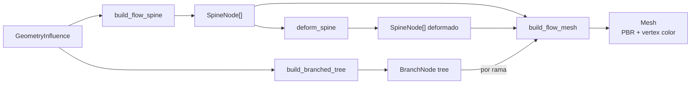

# Blueprint: Geometry Flow (GF1 Flora-Tube Engine)

**Modulo:** `src/geometry_flow/`
**Rol:** Motor de geometria **stateless** para ejes tipo flora/flujo — spine + tubo triangular + branching + deformacion
**Diseno:** `docs/design/V7.md` seccion GF

---

## 1. Idea central

El llamador inyecta un `GeometryInfluence` (todo el contexto "de mundo" ya resuelto) y recibe un `Mesh` listo para PBR con vertex color. El motor no lee ECS ni `EnergyFieldGrid` — boundary puro.

---

## 2. Pipeline



---

## 3. GeometryInfluence (boundary contract)

```rust
pub struct GeometryInfluence {
    pub detail: f32,                      // LOD [0,1]
    pub energy_direction: Vec3,           // direccion del empuje
    pub energy_strength: f32,             // magnitud del empuje
    pub resistance: f32,                  // resistencia del medio
    pub least_resistance_direction: Vec3, // fallback si empuje < resistencia
    pub length_budget: f32,               // longitud total del spine
    pub max_segments: u32,                // techo de segmentos
    pub radius_base: f32,                 // radio del tubo
    pub start_position: Vec3,             // origen
    pub qe_norm: f32,                     // [0,1] para color
    pub tint_rgb: [f32; 3],              // RGB lineal base
    pub branch_role: BranchRole,          // Root/Stem/Leaf/Flower
}
```

---

## 4. Spine generation

`build_flow_spine()` genera la polilinea del eje central:

1. Inicializa posicion y tangente desde `energy_direction`
2. Por cada segmento: evalua `flow_push_along_tangent` vs `resistance`
3. Si empuje >= resistencia -> segmento recto
4. Si no -> mezcla tangente con `least_resistance_direction` (blend = `FLOW_BREAK_STEER_BLEND`)
5. Avanza `pos += tangent * step_length`

`build_flow_spine_painted(influence, paint_fn)` permite muestreo de campo por nodo (color variable a lo largo del eje).

---

## 5. Mesh generation

`build_flow_mesh(spine, influence)` construye un tubo triangular:

- Anillos perpendiculares al spine (4-12 vertices segun `detail`)
- Normals radiales, UVs (u = angulo, v = progresion)
- Vertex color via `vertex_flow_color(qe_norm, tint_rgb, s_along, azimuth_t)`
- Output: `Mesh` con POSITION, NORMAL, UV_0, COLOR, indices U32

---

## 6. Branching (GF1 recursivo)

| Tipo | Rol |
|------|-----|
| `BranchNode` | Nodo del arbol: spine + influence + children[] |
| `BranchRole` | Root / Stem / Leaf / Flower — modula color y atenuacion |

`build_branched_tree(influence, growth_budget)`:
- Profundidad maxima: `BRANCH_MAX_DEPTH`
- Ramas totales maximas: `MAX_TOTAL_BRANCHES`
- Atenuacion por nivel: radius, energy, qe, detail decaen con `BRANCH_*_DECAY`
- Angulo de apertura: `BRANCH_ANGLE_SPREAD`

---

## 7. Deformacion (GF2B post-GF1)

`deform_spine(payload)` aplica curvatura termodinamica al spine ya generado:

```rust
pub struct DeformationPayload {
    pub base_spine: Vec<SpineNode>,
    pub t_energy: Vec3,      // tensor energia
    pub t_gravity: Vec3,     // tensor gravedad
    pub bond_energy: f32,    // rigidez (Capa 4)
    pub gravity_scale: f32,
}
```

Peso cuadratico: nodo base (weight=0) fijo, punta (weight=1) maximo desplazamiento.
`delta = deformation_delta(tangent, t_energy, t_gravity, bond_energy)`.
`new_pos = base_pos + delta * weight^2`.

---

## 8. Mesh merging (compound bodies)

`merge_meshes(meshes: &[Mesh]) -> Mesh` — canonical public function for combining multiple GF1 tubes into a single mesh.

- Concatenates POSITION, NORMAL, UV_0, COLOR vertex buffers
- Remaps indices with base offset per sub-mesh
- Missing attributes synthesized with defaults (normal=[0,1,0], uv=[0,0], color=[1,1,1,1])
- Used by `entity_shape_inference_system` for compound body mesh (torso + organs from BodyPlanLayout)
- Also used by `worldgen/organ_inference.rs` and `worldgen/inference/organ.rs` (delegate to this canonical version)

---

## 9. Invariantes

1. **Stateless:** misma `GeometryInfluence` -> mismo spine y mesh (determinista)
2. **Sin ECS:** el motor no accede a World ni Resources
3. **LOD monotono:** mas `detail` nunca reduce triangulos
4. **Ecuaciones en blueprint:** toda la math vive en `blueprint/equations/` (branch_attenuation, deformation_delta, vertex_flow_color, etc.)
5. **merge_meshes determinista:** mismo input meshes → mismo output mesh (vertex order preserved)
