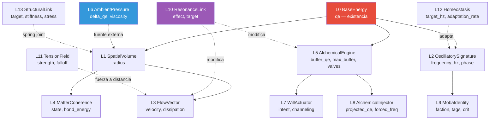
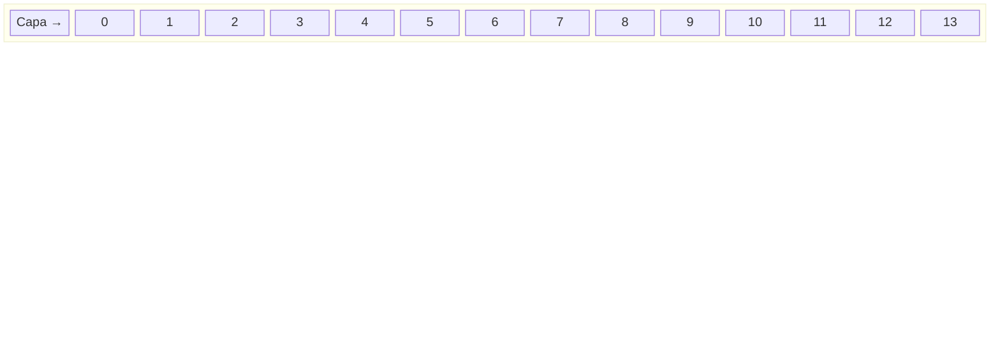

# Blueprint: Capas ECS (`layers/`)

Modela estado fisico/alquimico por componentes atomicos ECS.
Las 14 capas son **ortogonales**: cada una responde UNA pregunta sobre la energia.
No ejecuta pipeline — la ejecucion vive en `simulation/` y `plugins/`.

## Diagrama de dependencia

## Tipos de capa

| Tipo | Significado | Capas |
|------|-------------|-------|
| **A** | Propiedad de la entidad | L0-L5, L7-L8, L11-L13 |
| **B** | La entidad ES la capa (ciclo de vida propio) | L6, L10 |
| **Meta** | No contiene energia; modifica ecuaciones | L9 |

## Matriz de composicion por arquetipo

| Arquetipo | L0 | L1 | L2 | L3 | L4 | L5 | L6 | L7 | L8 | L9 | L10 | L11 | L12 | L13 |
|-----------|:--:|:--:|:--:|:--:|:--:|:--:|:--:|:--:|:--:|:--:|:---:|:---:|:---:|:---:|
| Particle  | x  | x  | x  |    |    |    |    |    |    |    |     |     |     |     |
| Stone     | x  | x  |    |    | x  |    |    |    |    |    |     |     |     |     |
| Celula    | x  | x  | x  | x  | x  | x  |    |    |    | x  |     |     | x   |     |
| Flora     | x  | x  | x  |    | x  | x  |    |    |    | x  |     |     | x   | x   |
| Animal    | x  | x  | x  | x  | x  | x  | x  | x  |    | x  |     |     | x   |     |
| Hero      | x  | x  | x  | x  | x  | x  |    | x  | x  | x  | x   | x   | x   |     |
| Projectile| x  | x  | x  | x  |    |    |    |    | x  | x  |     |     |     |     |
| Terrain   | x  | x  |    |    | x  |    | x  |    |    |    |     |     |     |     |
| Link/Buff |    |    |    |    |    |    |    |    |    |    | x   |     |     |     |
| Pool      | x  | x  | x  |    |    |    | x  |    |    | x  |     |     |     |     |

## Componentes auxiliares (24+)

Viven en `layers/` junto a las 14 capas. No son ortogonales — complementan arquetipos especificos.

| Componente | Archivo | Rol |
|------------|---------|-----|
| `MobileEntity` | markers.rs | Marker: entidad con movimiento |
| `WaveEntity` | markers.rs | Marker: entidad onda |
| `Champion` | markers.rs | Marker: heroe jugable |
| `GrowthBudget` | growth.rs | Presupuesto de crecimiento (qe/tick) |
| `HasInferredShape` | has_inferred_shape.rs | Flag: forma inferida por GF1 |
| `BehavioralAgent` | behavior.rs | D1: agente con IA autonoma |
| `BehaviorIntent` | behavior.rs | D1: decision actual del agente |
| `VisionFogAnchor` | vision_fog.rs | Ancla de vision para fog of war |
| `IrradianceReceiver` | irradiance.rs | Receptor de irradiancia solar |
| `EnergyPool` | energy_pool.rs | Pool de energia compartida |
| `TrophicConsumer` | trophic.rs | D2: consumidor trofico |
| `MetabolicGraph` | metabolic_graph.rs | MG2: DAG de exergia |
| `EntropyLedger` | entropy_ledger.rs | MG6: registro de entropia |
| `OrganManifest` | organ.rs | LI3: lista de organos |
| `LifecycleStage` | organ.rs | LI3: fase del ciclo de vida |
| `Grimoire` | will.rs | Libro de habilidades (max 6 slots) |
| `NavAgent` | markers.rs | Pathfinding agent marker |
| `PackMembership` | social_communication.rs | D6: membresía de manada |
| `EpigeneticState` | epigenetics.rs | ET: estado epigenetico |
| `NicheProfile` | niche.rs | ET: perfil de nicho ecologico |
| `BodyPlanLayout` | body_plan_layout.rs | IWG: layout de plan corporal |
| `MorphogenesisSurface` | morphogenesis_surface.rs | MG7: superficie de rugosidad |
| `InferredAlbedo` | inferred_albedo.rs | MG5: albedo inferido |
| `MacroStepTarget` | macro_step.rs | Macro-step temporal target |

## Invariantes

- `BaseEnergy.qe >= 0`. Si `qe < QE_MIN_EXISTENCE` la entidad muere.
- `SpatialVolume.radius >= 0.01`.
- `OscillatorySignature.frequency_hz >= 0`, `phase` normalizada `[0, 2pi)`.
- `AlchemicalEngine.current_buffer <= max_buffer`.
- Max **4 campos** por componente. Mas campos = dividir en capas.
- `#[derive(Component, Reflect, Debug, Clone)]` en todo componente.
- Setters con **change detection guard**: verificar igualdad antes de mutar.

## Dependencias

- `bevy::prelude` (ECS Component, Reflect)
- `crate::blueprint::equations` (valores derivados: densidad, temperatura)
- Sin dependencia a `simulation/` ni `plugins/`

## Overlays temporales (L10)

- `ResonanceFlowOverlay` — modifica `FlowVector` del target
- `ResonanceMotorOverlay` — modifica `AlchemicalEngine` del target
- `ResonanceThermalOverlay` — modifica conductividad termica
