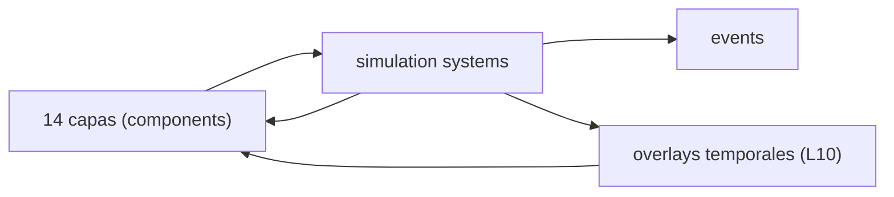

# Blueprint: Capas ECS (`layers`)

Módulos cubiertos: `src/layers/*`.
Referencia conceptual: `DESIGNING.md` (filosofía de capas, árbol de dependencia, tipos A/B).

## 1) Propósito y frontera

- Modelar estado físico/alquímico por componentes atómicos ECS.
- Las 14 capas son **ortogonales**: cada una responde UNA pregunta sobre la energía.
- No ejecuta pipeline por sí solo; la ejecución vive en `simulation`/`plugins`.

## 2) Superficie pública (contrato)

### 14 Capas Ortogonales

| # | Componente | Archivo | Pregunta que responde | Tipo |
|---|-----------|---------|----------------------|------|
| 0 | `BaseEnergy` | energy.rs | ¿Cuánta energía hay? | A |
| 1 | `SpatialVolume` | volume.rs | ¿Dónde está contenida? | A |
| 2 | `OscillatorySignature` | oscillatory.rs | ¿Cómo vibra? | A |
| 3 | `FlowVector` | flow.rs | ¿Hacia dónde fluye? | A |
| 4 | `MatterCoherence` + `MatterState` | coherence.rs | ¿Qué tan cohesionada está? | A |
| 5 | `AlchemicalEngine` | engine.rs | ¿Cómo se procesa? | A |
| 6 | `AmbientPressure` | pressure.rs | ¿Qué presión externa recibe? | B |
| 7 | `WillActuator` + `Grimoire` | will.rs | ¿Qué intención la dirige? | A |
| 8 | `AlchemicalInjector` | injector.rs | ¿Cómo se transfiere a otros? | A+B |
| 9 | `MobaIdentity` + `Faction` | identity.rs | ¿Bajo qué reglas interactúa? | Meta |
| 10 | `ResonanceLink` + overlays | link.rs | ¿Qué modificación temporal sostiene? | B |
| 11 | `TensionField` | tension_field.rs | ¿Qué fuerza ejerce a distancia? | A |
| 12 | `Homeostasis` | homeostasis.rs | ¿Cómo se adapta su frecuencia? | A |
| 13 | `StructuralLink` | structural_link.rs | ¿Qué unión mantiene con otra entidad? | A |

**Tipo A** = propiedad de la entidad (vive mientras la entidad vive).
**Tipo B** = la entidad ES la capa (tiene ciclo de vida propio, muere por disipación).
**Meta** = no contiene energía; modifica ecuaciones de interacción.

### Componentes auxiliares

- `ContainedIn` — relación espacial host/contained
- `DespawnOnContact` — flag de consumo único (candidato SparseSet)
- `OnContactEffect` — efecto al contacto (candidato SparseSet)
- `ProjectedQeFromEnergy` — proyección de qe para injectors
- `ContactType` — tipo de contacto (collision backend)

### Overlays temporales (L10)

Registrados en `layers/link.rs` y re-exportados desde `layers/mod.rs`:

- `ResonanceFlowOverlay` — modifica `FlowVector` del target
- `ResonanceMotorOverlay` — modifica `AlchemicalEngine` del target
- `ResonanceThermalOverlay` — modifica conductividad térmica

(No hay en código actual `ResonanceCompressionOverlay` ni `ResonanceInterferenceOverlay`; si reaparecen, documentar aquí.)

### Árbol de dependencia energética

```
                          Capa 0: ENERGÍA
                               │
              ┌────────────────┼────────────────┐
              │                │                │
           Capa 1           Capa 2           Capa 5
          ESPACIO            ONDA            MOTOR
              │                │                │
         ┌────┴────┐          │           ┌────┴────┐
         │         │          │           │         │
      Capa 3    Capa 4       │        Capa 7    Capa 8
      FLUJO    MATERIA       │       VOLUNTAD  INYECTOR
                              │
                           Capa 9
                          IDENTIDAD

  FUENTES EXTERNAS:     Capa 6  (presión ambiental)
  ENTIDADES-EFECTO:     Capa 10 (enlace de resonancia)
  CAMPOS DE FUERZA:     Capa 11 (tensión), Capa 12 (homeostasis), Capa 13 (structural)
```

## 3) Invariantes y precondiciones

- `BaseEnergy.qe >= 0`. Si `qe < QE_MIN_EXISTENCE` → entidad muere.
- `SpatialVolume.radius >= 0.01`.
- `OscillatorySignature.frequency_hz >= 0`, `phase` normalizada [0, 2π).
- `MatterCoherence.bond_energy_eb >= 0`, `thermal_conductivity` en rango válido.
- `AlchemicalEngine.current_buffer <= max_buffer`.
- `AlchemicalInjector` con energía/frecuencia no negativas y radio mínimo.
- **Max 4 campos por componente.** Si se necesitan más, dividir en capas ortogonales.
- **`#[derive(Component, Reflect, Debug, Clone)]`** en todo componente.
- **Setters con guard:** verificar igualdad antes de mutar para evitar falsos `Changed<T>`.

## 4) Comportamiento runtime



- Las capas son storage y contrato de datos.
- Side-effects ocurren cuando sistemas escriben estos componentes.
- Determinismo depende del orden en pipeline (`SimulationClockSet` + `Phase::*` en `simulation/pipeline.rs`).
- Los overlays (L10) se resetean/recalculan en la cadena `Phase::ThermodynamicLayer` (`reset_resonance_overlay_system`, `resonance_link_system`).

## 5) Implementación y trade-offs

- **Valor**: granularidad alta, bajo acoplamiento semántico por componente. Todo emerge de la composición.
- **Costo**: más wiring y más puntos de lectura/escritura distribuida.
- **Trade-off**: simplicidad del sistema (módulos claros) vs facilidad inicial (menos structs).
- **Valores derivados** (densidad, temperatura, etc.) se computan en punto de uso via `equations.rs`, NUNCA se almacenan como componentes.

## 6) Fallas y observabilidad

- Falla común: violar invariantes numéricos al crear/spawnear entidades.
- Falla de orden: overlays efímeros pueden quedar "stale" si el reset corre fuera de fase.
- Falla de storage: componentes transitorios sin `SparseSet` causan archetype thrashing.
- Señales: `DebugPlugin`, `DeathEvent`, bridge metrics.

## 7) Checklist de atomicidad

- Responsabilidad principal: sí (estado por capa).
- Acoplamiento cross-domain: bajo en definición, alto en uso (esperable en ECS).
- División: mantener componentes pequeños (max 4 campos); evitar "component bloat".

## 8) Referencias cruzadas

- `DESIGNING.md` — Filosofía de capas, árbol de dependencia, tipos A/B, 5 tests
- `docs/design/GAMEDEV_PATTERNS.md` — Storage strategy por componente
- `docs/sprints/GAMEDEV_PATTERNS/README.md` — G1 SparseSet (sprint doc eliminado)
- `.cursor/rules/ecs-strict-dod.mdc` — 10 anti-patrones DOD
