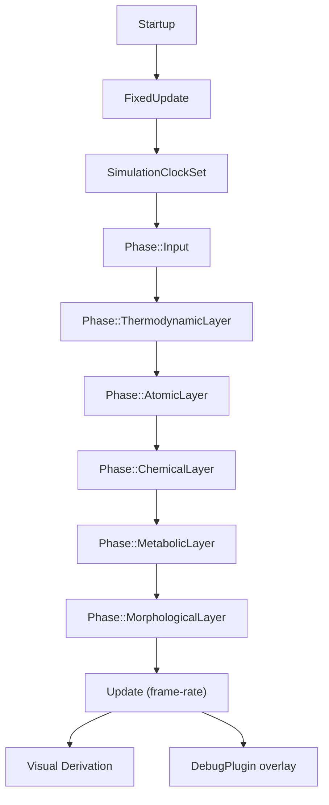

# Blueprint: Plugins y Wiring ECS

Módulos cubiertos: `src/plugins/*` y plugins de `runtime_platform`.
Referencia: `CLAUDE.md`, `src/simulation/pipeline.rs`.

## 1) Propósito y frontera

- Registrar componentes/eventos/resources.
- Definir el orden de sistemas por fase (`FixedUpdate`/`Update`/`Startup`).
- No implementan reglas físicas; orquestan módulos que sí lo hacen.

## 2) Superficie pública (contrato)

### Plugins core

- **`LayersPlugin`**: registro `Reflect` de las **14** capas ortogonales + auxiliares (nutrientes, irradiancia, inferencia, visión/fog, `PerformanceCachePolicy`, etc.) + tipos eco/worldgen.
  - Lista viva: `plugins/layers_plugin.rs` (el comentario interno del archivo dice «10 capas» por histórico; el registro cubre L0–L13 y extensiones).
  - Registra eco types: ZoneClass, TransitionType, BoundaryMarker.
  - Registra worldgen types: WorldArchetype, BoundaryVisual, PendingEnergyVisualRebuild.
- **`SimulationPlugin`**: init de recursos globales + registro de eventos + pipeline por fases.
  - Startup: `init_simulation_bootstrap` → SpatialIndex, PerceptionCache, Scoreboard, bridge config, worldgen setup, terrain config, climate config.
  - Eventos: `init_simulation_bootstrap` registra **15** tipos (lista en `simulation/bootstrap.rs`, incluye `TerrainMutationEvent`). `PathRequestEvent` lo añade `Compat2d3dPlugin` en perfil `full3d`.
  - Calls: `register_simulation_pipeline(app, FixedUpdate)` + `register_visual_derivation_pipeline(app)`.
  - Mapa: `RESONANCE_MAP` → carga `assets/maps/{nombre}.ron` (`map_config`); el spawn de entidades demo sigue centralizado (p. ej. `spawn_demo_level` en `world/demo_level.rs`).
- **`DebugPlugin`**: gizmos, labels, HUD de texto, scoreboard overlay.
  - Opera en `Update` (render schedule, no FixedUpdate).

### Plugins / sistemas runtime (vía `add_runtime_platform_plugins_by_profile`)

- Siempre: `SimulationTickPlugin`.
- Si el perfil habilita input: `InputCapturePlugin`, `ProjectedWillIntent`, y sistemas `project_intent_to_resource_system` / `apply_projected_intent_to_will_system` (en `InputChannelSet::PlatformWill`); en `full3d` además `OxidizedNavigationPlugin`, `PathRequestEvent`, cadena pathfinding + proyección (ver `compat_2d3d/mod.rs`).
- Si `full3d`: `Camera3dPlugin`, `ClickToMovePlugin`, `RenderBridge3dPlugin`.
- Opcional por perfil: `ScenarioIsolationPlugin`, `ObservabilityPlugin`.

## 3) Invariantes y precondiciones

- Pipeline de simulación corre en `FixedUpdate` (dt fijo; configuración en tick/time plugins).
- `LayersPlugin` debe registrarse ANTES de `SimulationPlugin`.
- `Compat2d3dPlugin` + runtime platform plugins ANTES de `SimulationPlugin`.
- Recursos críticos (SpatialIndex, almanac, bridge config, worldgen grid) deben existir antes de correr sistemas consumidores.
- Visual derivation corre en `Update` (frame-rate independiente de simulación).

## 4) Comportamiento runtime

- `SimulationPlugin` encadena fases de forma estricta (`.chain()`) para evitar race conditions.
- `DebugPlugin` opera en `Update` y puede observar/superponer estado sin afectar simulación.
- Worldgen visual systems corren en `Update` (no bloquean FixedUpdate).

## 5) Implementación y trade-offs

- **Valor**: modularidad por plugin, con integración explícita. Orden de registro define semántica.
- **Costo**: alto acoplamiento por orden; cambios locales pueden tener efecto global.
- **Trade-off**: se prioriza orden determinista sobre flexibilidad de ejecución paralela.
- **Split pendiente (Q5)**: `SimulationPlugin` es un mega-wirer. Posible separar en WorldgenPlugin, EcoPlugin, BridgePlugin.

## 6) Fallas y observabilidad

- Riesgo: insertar sistemas debug mutadores fuera de fase prevista.
- Riesgo: pipeline "aparentemente correcto" pero con contrato roto por recurso faltante.
- Mitigación: mantener mapa de dependencias y separar sistemas de observación vs mutación.

## 7) Checklist de atomicidad

- Responsabilidad principal: sí (orquestación).
- Mezcla de dominio: controlada; válida para capa de integración.
- Split recomendado: separar wiring de worldgen, eco, bridge en plugins independientes (sprint Q5).

## 8) Referencias cruzadas

- `CLAUDE.md` — Plugin order, coding rules
- `docs/design/FOLDER_STRUCTURE.md` — Módulo map post-migración
- `docs/sprints/CODE_QUALITY/SPRINT_Q5_PLUGIN_SPLIT.md` — Sprint de split pendiente
