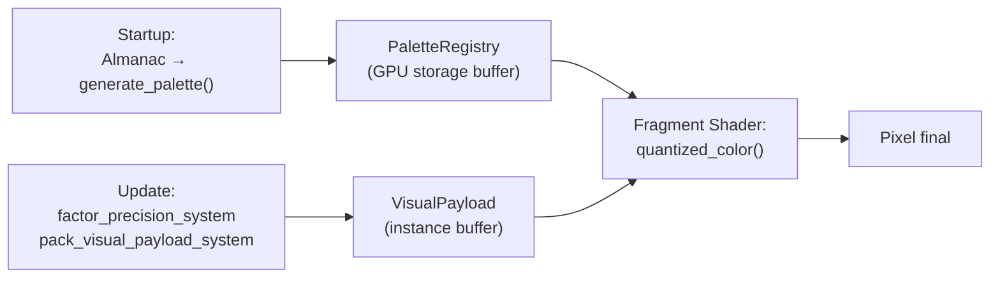

# Blueprint: Motor de Color Cuantizado (`quantized_color`)

Referencia de contrato para el módulo stateless de color cuantizado.
Template base: [`00_contratos_glosario.md`](00_contratos_glosario.md).
Blueprint fuente: [`QUANTIZED_COLOR_ENGINE.md`](../design/QUANTIZED_COLOR_ENGINE.md).

## 1) Propósito y frontera

- **Qué resuelve:** Proyección eficiente de energía → color en GPU, usando cuantización adaptativa por distancia a cámara y paletas pre-computadas en VRAM. Branchless, O(1), determinista.
- **Qué no resuelve:** No calcula energía, no propaga campos, no materializa entidades, no genera geometría. No reemplaza `EnergyVisual` (Sprint 08); lo complementa como ruta de rendering GPU optimizada.

## 2) Superficie pública (contrato)

### Tipos exportados

```rust
/// Payload CPU → GPU por instancia visual.
/// Empaquetado como instance attribute o uniform per-draw.
#[repr(C)]
#[derive(Clone, Copy, Debug, bytemuck::Pod, bytemuck::Zeroable)]
pub struct VisualPayload {
    pub energia_interna: f32,   // Enorm ∈ [0, 1]
    pub factor_precision: f32,  // ρ ∈ (0, 1]
    pub n_max_id: u32,          // índice de paleta en VRAM
    pub _padding: u32,          // alineación 16B
}

/// Bloque de colores pre-computados para un material/elemento.
pub struct PaletteBlock {
    pub id: u32,
    pub n_max: u32,
    pub colors: Vec<[f32; 4]>,  // RGBA linear
}

/// Resource: todas las paletas cargadas.
#[derive(Resource)]
pub struct PaletteRegistry {
    pub palettes: Vec<PaletteBlock>,
    pub gpu_buffer: Option<Handle<ShaderStorageBuffer>>,
}
```

### Funciones puras (sin ECS)

```rust
/// Genera paleta pre-computada desde un ElementDef del Almanac.
/// Reutiliza las funciones de visual_derivation (Sprint 05).
pub fn generate_palette(element: &ElementDef, n_max: u32, almanac: &AlchemicalAlmanac) -> PaletteBlock;

/// Cuantización O(1) — la misma lógica que el shader, para testing CPU.
pub fn quantized_index(enorm: f32, rho: f32, n_max: u32) -> u32;

/// Calcula factor_precision desde distancia a cámara.
pub fn factor_precision(distance: f32, near: f32, far: f32) -> f32;
```

### Sistemas ECS (`Update`)

```rust
/// Calcula VisualPayload.factor_precision para cada entidad visible.
/// Query: Transform + EnergyVisual, Res<CameraFocus>.
/// Escribe: VisualPayload.factor_precision.
pub fn factor_precision_system(...);

/// Empaqueta VisualPayload desde EnergyVisual + factor_precision + Materialized.
/// Query: BaseEnergy + Materialized + EnergyVisual.
/// Escribe: VisualPayload en instance buffer.
pub fn pack_visual_payload_system(...);
```

### Shader WGSL

```wgsl
fn quantized_color(payload: VisualPayload) -> vec4<f32>;
```

### Eventos / Resources leídos/escritos

- **Lee:** `AlchemicalAlmanac` (Startup), `EnergyFieldGrid` (indirectamente via `EnergyVisual`), `Transform`, `BaseEnergy`.
- **Escribe:** `PaletteRegistry` (Startup/Season), instance buffers GPU (Update).
- **No emite eventos.**

## 3) Invariantes y precondiciones

- `energia_interna` clamped a `[0, 1]` antes de empaquetar.
- `factor_precision > 0` siempre (nunca exactamente 0 — mínimo `ρ_min = 0.01`).
- `n_max_id` apunta a una paleta válida cargada en `PaletteRegistry`.
- `PaletteBlock.colors.len() == n_max` — array completo, sin huecos.
- `quantized_index(enorm, rho, n_max) < n_max` siempre — no hay out-of-bounds.
- La cuantización es **monótona**: `enorm_a ≤ enorm_b → idx_a ≤ idx_b`.

## 4) Comportamiento runtime

- **Fase startup:** `palette_generation_system` genera `PaletteBlock` por cada elemento del Almanac. Sube buffer a VRAM.
- **Fase Update:** `factor_precision_system` calcula ρ por entidad. `pack_visual_payload_system` empaqueta el payload. Ambos corren en `Update` (no `FixedUpdate`).
- **Fase Render:** el fragment shader `quantized_color.wgsl` indexa la paleta. Zero interacción con CPU.
- **Orden:** después de `visual_derivation_system` (Sprint 08), antes del render pass.
- **Determinismo:** total — funciones puras, sin RNG, sin estado mutable.
- **Side-effects:** solo escritura a instance buffers GPU (no modifica componentes ECS).
- **Reutilización LOD:** `factor_precision_system` lee `WorldgenPerfSettings` y `WorldgenLodContext` (Sprint 13) para derivar `ρ` desde las bandas Near/Mid/Far ya clasificadas. No recalcula distancias por su cuenta.



## 5) Implementación y trade-offs

- **Valor:** coherencia masiva de caché GPU → miles de polígonos lejanos resuelven al mismo color desde L1. Zero texturas adicionales. Transición continua sin pop-in.
- **Costo:** complejidad del render pipeline (custom material + shader WGSL). Requiere integración con Bevy material pipeline (ExtendedMaterial o custom RenderPipelinePlugin).
- **Trade-off: Precisión vs Velocidad.** Al cuantizar, se pierde micro-variación cromática a distancia. Pero esa variación es **imperceptible** a esa distancia — es ruido visual que desperdicia caché.
- **Trade-off: Nmax fijo vs dinámico.** Nmax fijo por material simplifica la implementación. Nmax dinámico (función de la complejidad visual) ahorraría más VRAM pero agrega complejidad innecesaria para el volumen actual (<120 KB total).
- **Límite conocido:** requiere Bevy 0.15+ con soporte de storage buffers en WGSL. En modo 2D (sprites), el shader cuantizado no aplica — se usa el pipeline existente de Sprint 08.

### Demarcación con capas de rendimiento existentes (Sprint 13)

> Este módulo **reutiliza** `WorldgenPerfSettings` (constantes LOD) y `WorldgenLodContext` (foco de cámara).
> **No duplica** `MaterializationCellCache` (que cachea forma/arquetipo, no color),
> ni `max_visual_derivation_per_frame` (que se mantiene para el path 2D/sprites).

| Sprint 13 (existente) | Sprint 14 (nuevo) | Relación |
|-----------------------|-------------------|----------|
| `MaterializationCellCache` — cachea **qué forma** spawnear | Paletas — cachea **qué colores** posibles tiene un material | Ortogonales: forma ≠ color |
| LOD bands (Near/Mid/Far) — controla **frecuencia de tick** | `factor_precision(ρ)` — controla **resolución cromática** | Complementarios: Sprint 14 lee las bandas de Sprint 13 |
| `max_visual_derivation_per_frame` — presupuesto CPU de `derive_color` | `quantized_index()` — early-out O(1) antes de `derive_color` | Sprint 14 reduce presión sobre el presupuesto existente |

## 6) Fallas y observabilidad

- **Paleta no cargada:** `n_max_id` inválido → fallback a magenta (color de error visible).
- **ρ = 0:** violación de invariante → clamp a `ρ_min` en `factor_precision_system`.
- **Enorm fuera de rango:** clamp defensivo en `pack_visual_payload_system`.
- **Señales:**
  - `PaletteRegistry` expone `total_vram_bytes()` para monitoring.
  - Bevy diagnostic: `QuantizedColorDiagnostics { entities_packed, avg_rho, cache_pressure_estimate }`.

## 7) Checklist de atomicidad

- ¿Una responsabilidad principal? **Sí** — proyección de energía → color via GPU cuantizada.
- ¿Acopla más de un dominio? **No** en el núcleo puro. El empaquetador ECS acopla `layers` con `render` (inevitable para un bridge de rendering).
- ¿Debería dividirse? Naturalmente se divide en 3 sub-módulos:
  1. `palette_gen.rs` — funciones puras de generación de paletas.
  2. `payload.rs` — tipos + empaquetado + factor_precision.
  3. `quantized_color.wgsl` — shader GPU.

## 8) Referencias cruzadas

- [`QUANTIZED_COLOR_ENGINE.md`](../design/QUANTIZED_COLOR_ENGINE.md) — Blueprint fuente
- [`blueprint_v7.md`](blueprint_v7.md) — Sección 5: Derivación visual
- `src/worldgen/visual_derivation.rs`, `src/worldgen/systems/visual.rs`, `src/worldgen/systems/performance.rs` — derivación visual + LOD (sprints V7 05/08/13 cerrados; docs eliminados)
- [`BLUEPRINT_V7/README.md`](../sprints/BLUEPRINT_V7/README.md) — backlog V7 pendiente (06, 07, 14)
- [`TERRAIN_MESHER.md`](../design/TERRAIN_MESHER.md) — Integración con vertex colors de terreno
- [`.cursor/rules/ecs-strict-dod.mdc`](../../.cursor/rules/ecs-strict-dod.mdc) — Reglas DOD
