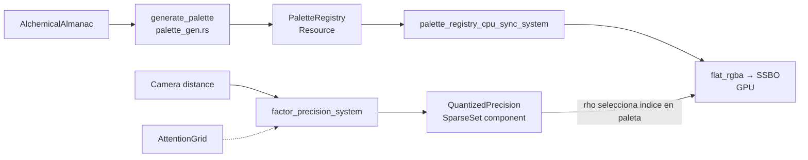

# Blueprint: Rendering (Quantized Color)

**Modulo:** `src/rendering/`
**Rol:** Puente de render — GPU y recursos visuales sin tocar simulacion ni capas L0-L13
**Sub-modulos:** `quantized_color/`, `gpu_cell_field_snapshot/` (feature-gated)

---

## 1. Idea central

El color de cada entidad se deriva de su **frecuencia elemental** via paletas cuantizadas. No hay "sprites" ni "texturas por tipo" — el color es emergente del estado energetico. El sistema opera en `Update` (visual), no en `FixedUpdate` (simulacion).

---

## 2. Pipeline

---

## 3. Tipos clave

| Tipo | Archivo | Rol |
|------|---------|-----|
| `QuantizedColorPlugin` | `plugin.rs` | Registra PaletteRegistry + 3 sistemas en Update |
| `PaletteRegistry` | `registry.rs` | Resource: flat_rgba[], offsets[], slot_element_raw[] |
| `PaletteBlock` | `palette_gen.rs` | n_max colores RGBA lineales por elemento |
| `QuantizedPrecision` | `mod.rs` | Component SparseSet: factor rho [0,1] por entidad |

---

## 4. Generacion de paletas

`generate_palette(element, n_max, almanac)`:

1. Por cada indice `i` en `[0, n_max)`:
   - `t = i / (n_max - 1)` — eje de "energia interna"
   - `purity = t` (0 = apagado/gris, 1 = color almanac pleno)
   - `color = derive_color(frequency_hz, purity, almanac)`
   - `emission = derive_emission(temperature, matter_state)`
   - `opacity = derive_opacity(density, matter_state)`
2. Output: `[f32; 4]` RGBA lineal por entrada
3. Ultima entrada global: magenta fallback (error visual)

---

## 5. LOD por distancia (rho)

`factor_precision_system` calcula rho por entidad:

- **Con AttentionGrid:** `rho = RHO_MIN + (1 - RHO_MIN) * attention`
- **Con camara:** `rho = precision_rho_from_lod_distance(d, NEAR, MID, RHO_MIN)`
- **Sin camara:** `rho = 1.0`

Bandas: Near (alta precision) → Mid → Far (baja precision).
`QuantizedPrecision` es SparseSet — sin thrash de arquetipo.

---

## 6. PaletteRegistry

Resource central con paletas linealizadas:

- `flat_rgba: Vec<[f32; 4]>` — buffer contiguo, listo para SSBO
- `offsets: Vec<u32>` — offset por slot de elemento
- `n_max_per_slot: Vec<u32>` — entradas por elemento
- `meta_by_element_raw: FxHashMap<u32, (offset, n_max)>` — lookup O(1)
- Rebuild automatico si `almanac.content_fingerprint()` cambio

---

## 7. GPU Cell Field Snapshot (feature-gated)

`gpu_cell_field_snapshot` (feature `gpu_cell_field_snapshot`): serializa el `EnergyFieldGrid` a un SSBO para visualizacion directa del campo en GPU. Separado del pipeline de entidades.

---

## 8. Invariantes

1. **Update, no FixedUpdate:** rendering opera en `Update` — no afecta determinismo
2. **Read-only:** el rendering nunca modifica estado de simulacion
3. **Almanac-driven:** paletas se regeneran solo cuando cambia el fingerprint del almanac
4. **SparseSet precision:** `QuantizedPrecision` no afecta tabla de arquetipos
5. **Magenta fallback:** entidades sin paleta valida → magenta visible (error obvio)
