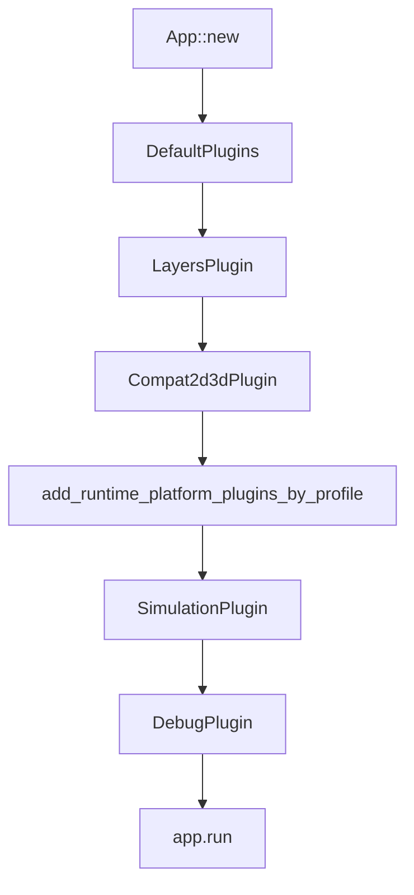

# Blueprint: Runtime Entrypoints

Módulos cubiertos: `src/main.rs`, `src/lib.rs`, `src/events.rs`.
Referencia: `DESIGNING.md`, `docs/design/FOLDER_STRUCTURE.md`.

## 1) Propósito y frontera

- `main.rs`: compone y ordena plugins/runtime.
- `lib.rs`: expone límites públicos del crate (**14** `pub mod` top-level).
- `events.rs`: define contratos de comunicación entre sistemas.
- No resuelven lógica física interna; solo frontera de arranque y contrato transversal.

## 2) Superficie pública (contrato)

- `main.rs`
  - `add_runtime_platform_plugins_by_profile(&mut app)`.
  - Plugins: `LayersPlugin`, `Compat2d3dPlugin`, `SimulationPlugin`, `QuantizedColorPlugin` (`rendering::quantized_color`), `AbilityHudPlugin` + `MinimapPlugin` (`runtime_platform::hud`), `DebugPlugin`.
  - Mapa: `RESONANCE_MAP` → `assets/maps/{nombre}.ron` (`worldgen/map_config.rs`); ej. `default`, `demo_arena`, `proving_grounds`, `flower_demo`.
- `lib.rs`
  - `pub mod blueprint`, `bridge`, `eco`, `events`, `geometry_flow`, `plugins`, `rendering`, `runtime_platform`, `entities`, `layers`, `simulation`, `topology`, `world`, `worldgen` (**14** módulos).
  - **Nota:** No hay alias `v6`; usar `crate::runtime_platform`.
- `events.rs` (fases en doc del código fuente)
  - `AbilitySelectionEvent`, `AbilityCastEvent`
  - `GrimoireProjectileCastPending`, `GrimoireSelfBuffCastPending`
  - `PathRequestEvent` — registrado en `Compat2d3dPlugin` (no en `init_simulation_bootstrap`)
  - `CollisionEvent` — `Phase::AtomicLayer`
  - `PhaseTransitionEvent`, `CatalysisRequest`, `DeltaEnergyCommit`, `CatalysisEvent` — `Phase::ChemicalLayer`
  - `DeathEvent` + `DeathCause`, `StructuralLinkBreakEvent`, `HomeostasisAdaptEvent`
  - `SeasonChangeEvent`, `WorldgenMutationEvent`
  - `TerrainMutationEvent` (`topology`) — registrado en bootstrap junto a los anteriores

## 3) Invariantes y precondiciones

- El orden de plugins de `main.rs` define el pipeline efectivo.
- Los eventos de `events.rs` son contrato estable; cambios requieren migración explícita.
- `lib.rs` fija superficie pública: mover módulos de acá rompe consumidores.
- **No existe** alias `v6` — todo importa desde `crate::runtime_platform`.

## 4) Comportamiento runtime

- La secuencia define precedencias de recursos/events/systems disponibles.
- `events.rs` opera como bus tipado entre `simulation`, `worldgen`, `eco`, `layers`, `debug`.

## 5) Implementación y trade-offs

- **Valor**: wiring explícito, fácil de auditar.
- **Costo**: cualquier reorder accidental de plugins cambia semántica runtime.
- **Trade-off clave**: acoplamiento temporal (orden) para ganar previsibilidad del pipeline.

## 6) Fallas y observabilidad

- Falla típica: plugin agregado fuera de orden → sistema que lee recurso no inicializado.
- Mitigación: mantener documentación de precedencias y validar en `DebugPlugin`.

## 7) Checklist de atomicidad

- Responsabilidad principal por archivo: sí.
- Acoplamiento multi-dominio: sí, pero deliberado en `main.rs` (composición).
- División adicional: no necesaria.

## 8) Referencias cruzadas

- `DESIGNING.md` — Axioma energético
- `docs/design/FOLDER_STRUCTURE.md` — Estructura de carpetas canónica
- `docs/sprints/MIGRATION/` — Sprints M1-M5 completados
