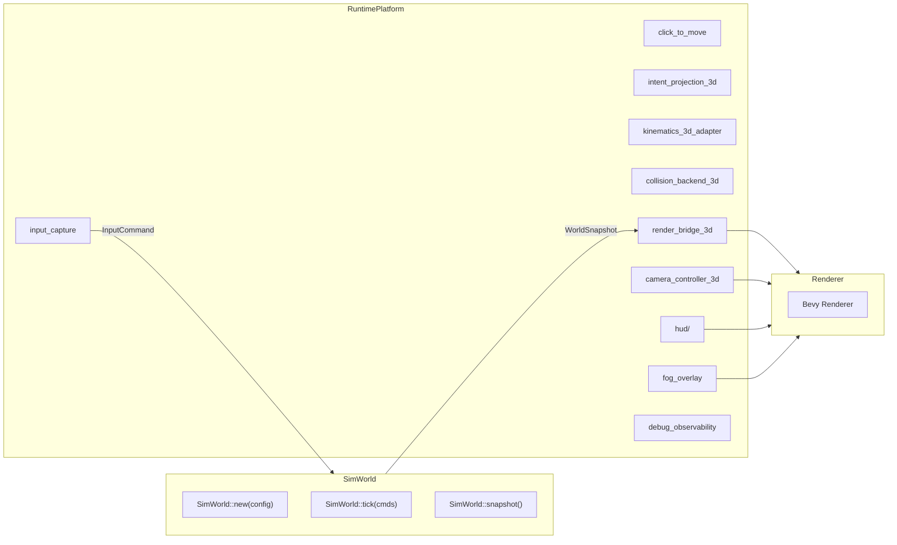
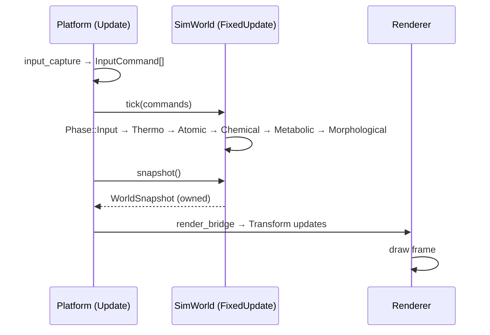

# Blueprint: Runtime Platform (V6)

**Modulo:** `src/runtime_platform/`
**Rol:** Puente entre la simulacion (FixedUpdate) y el renderer/input (Update) — 18 sub-modulos
**Diseno:** `docs/design/SIMULATION_CORE_DECOUPLING.md`

---

## 1. Idea central

La simulacion no sabe que esta siendo observada. El runtime platform adapta coordenadas, captura input, proyecta intenciones, y expone estado visual. Todo lo que NO es simulacion pura vive aqui.

---

## 2. SimWorld boundary



Tres operaciones del SimWorld:
- `new(config)` — Big Bang
- `tick(commands)` — avance atomico, determinista, sin I/O
- `snapshot()` — estado observable (owned, sorted, renderer-ready)

---

## 3. Sub-modulos por dominio

### Input & Intent
| Modulo | Rol |
|--------|-----|
| `input_capture` | Captura raw de teclado/mouse → eventos Bevy |
| `click_to_move` | Click → PathRequestEvent → WillActuator |
| `intent_projection_3d` | Raycast 3D → posicion en plano de simulacion |

### Movimiento & Colision
| Modulo | Rol |
|--------|-----|
| `kinematics_3d_adapter` | Interpola Transform visual desde estado de simulacion |
| `collision_backend_3d` | Backend de colision (Parry) para queries espaciales |
| `parry_nav_collider` | Nav-mesh colliders para pathfinding |
| `spatial_index_backend` | SpatialIndex backend para queries de proximidad |

### Render & Visual
| Modulo | Rol |
|--------|-----|
| `render_bridge_3d` | SimWorld snapshot → visual transforms |
| `camera_controller_3d` | Camara MOBA (orbit, zoom, follow) |
| `fog_overlay` | Fog of war visual overlay |

### HUD
| Modulo | Rol |
|--------|-----|
| `hud/` | Ability bar, minimap, health bars |

### Infrastructure
| Modulo | Rol |
|--------|-----|
| `compat_2d3d` | Abstraccion XY/XZ, `SimWorldTransformParams` |
| `core_math_agnostic` | `sim_plane_pos()`, conversiones 2D/3D agnosticas |
| `simulation_tick` | `SimulationClock` Resource, tick counter |
| `scenario_isolation` | Reset/cleanup entre escenarios |
| `debug_observability` | Gizmos, metricas visuales, inspector |
| `contracts` | Tipos compartidos entre sub-modulos |

---

## 4. Invariantes del SimWorld

| INV | Contrato |
|-----|----------|
| INV-1 | Sin dependencia de rendering — headless posible |
| INV-2 | Single source of truth — todo el estado fisico vive en SimWorld |
| INV-3 | `tick()` no hace I/O externo |
| INV-4 | Determinismo: misma config + inputs → snapshots identicos |
| INV-5 | El renderer nunca escribe de vuelta |
| INV-7 | Conservacion: `total_qe_after <= total_qe_before + epsilon` |
| INV-8 | Clock unico: `TickId` monotono, nunca wall-clock |

---

## 5. Flujo de un tick



---

## 6. EntitySnapshot

```rust
pub struct EntitySnapshot {
    pub id: u64,             // WorldEntityId (strong, persistent)
    pub position: [f32; 2],  // XZ en sim units
    pub qe: f32,
    pub frequency_hz: f32,
    pub radius: f32,
}
```

Entidades sorted by `id` para orden canonico (INV-4).
