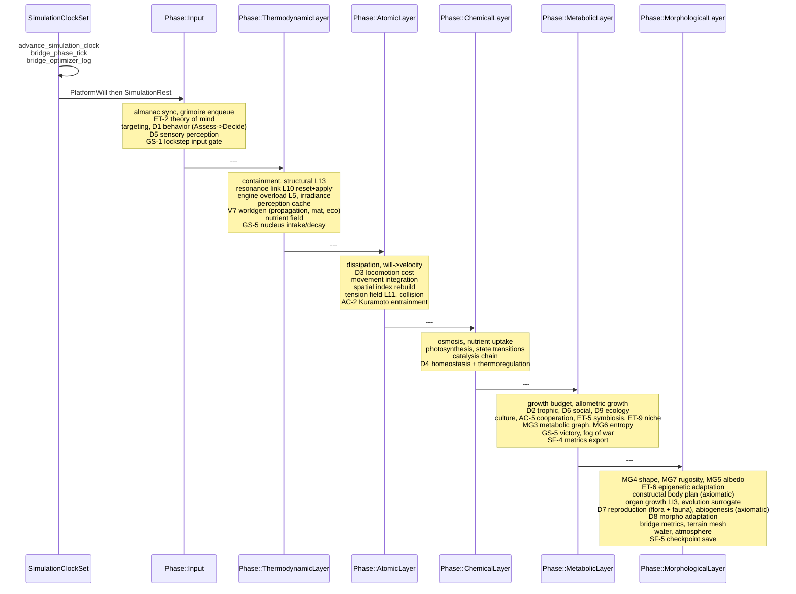
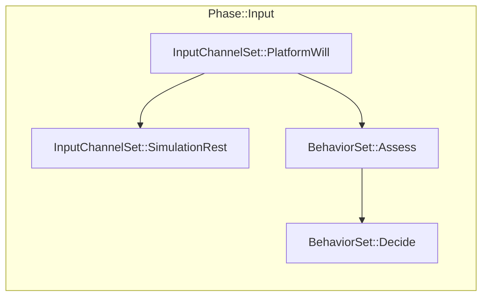

# Blueprint: Pipeline de Simulacion (`simulation/`)

Orquesta toda la logica de gameplay en `FixedUpdate` con timestep fijo.
6 fases encadenadas en `SystemSet`s. Cada sistema pertenece a exactamente una fase.
La fase `ThermodynamicLayer` corre en `Playing` (incluye `Warmup`); las demas solo en `Active`.

## Pipeline completo

## Sub-sets dentro de fases

## Tipos exportados

| Tipo | Archivo | Rol |
|------|---------|-----|
| `Phase` (6 variantes) | `mod.rs` | SystemSet principal del pipeline |
| `InputChannelSet` | `mod.rs` | Orden dentro de Input |
| `BehaviorSet` | `behavior.rs` | Sub-fases D1: Assess, Decide |
| `GameState` | `states.rs` | Loading / Playing |
| `PlayState` | `states.rs` | Warmup / Active / Paused |
| `PlayerControlled` | `player_controlled.rs` | Marker del heroe local |
| `SpellMarker` | `reactions.rs` | Marker de proyectil activo |

## Sistemas clave por fase

### Input
- `platform_will_system` — input de plataforma a `WillActuator`
- `grimoire_enqueue_system` — encola habilidades
- `ability_targeting_system` — resuelve targets
- `behavior_assess_system` / `behavior_decide_system` — D1 IA
- `sensory_perception_system` — D5 campo sensorial
- `lockstep_input_gate_system` — GS-1 netcode determinista

### ThermodynamicLayer
- `containment_system` — relaciones host/contained
- `structural_runtime_system` — spring joints L13
- `resonance_link_system` — buffs/debuffs L10
- `engine_tick_system` — AlchemicalEngine L5
- `irradiance_system` — irradiancia solar
- `perception_cache_system` — PerceptionCache
- V7 worldgen: propagation, materialization, eco boundaries

### AtomicLayer
- `dissipation_system` — perdida de energia por flujo
- `will_to_velocity_system` — L7 intent a L3 velocity
- `locomotion_cost_system` — D3 costo energetico
- `movement_system` — integra posicion
- `update_spatial_index_system` — rebuild SpatialIndex
- `tension_field_system` — L11 fuerzas a distancia
- `collision_system` — colisiones + contacto
- `entrainment_system` — AC-2 Kuramoto sync

### ChemicalLayer
- `osmosis_system` — transferencia osmotica
- `nutrient_uptake_system` — absorcion de nutrientes
- `photosynthesis_system` — luz a qe
- `state_transition_system` — cambios MatterState
- `catalysis_chain_system` — reacciones
- `homeostasis_system` — D4 adaptacion de frecuencia
- `thermoregulation_system` — D4 termorregulacion

### MetabolicLayer
- `growth_budget_system` — presupuesto de crecimiento
- `trophic_system` — D2 depredacion
- `social_communication_system` — D6 manadas
- `ecology_dynamics_system` — D9 dinamica ecologica
- `cooperation_system` — AC-5 cooperacion emergente
- `victory_check_system` — GS-5 condicion de victoria
- `fog_of_war_system` — niebla de guerra
- `metrics_batch_system` — SF-4 metricas

### MorphologicalLayer
- `shape_optimization_system` — MG4 forma optima
- `rugosity_system` — MG7 rugosidad superficial
- `albedo_inference_system` — MG5 albedo
- `organ_lifecycle_system` — LI3 organos
- `evolution_surrogate_system` — mutacion/seleccion
- `reproduction_system` — D7 reproduccion
- `abiogenesis_system` — generacion espontanea
- `morpho_adaptation_system` — D8 adaptacion
- `checkpoint_save_system` — SF-5 guardado

## Dependencias

- `crate::layers` — lee/escribe las 14 capas
- `crate::blueprint::equations` — matematica pura
- `crate::blueprint::constants` — tuning
- `crate::world` — SpatialIndex, FogOfWarGrid, PerceptionCache
- `crate::worldgen` — V7 worldgen systems
- `crate::events` — contratos de eventos

## Invariantes

- Todo sistema de gameplay en `FixedUpdate`, nunca en `Update` (salvo derivacion visual)
- Todo sistema asignado a exactamente un `Phase::*`
- Producers `.before()` o `.chain()` con consumers — nunca eventos sin orden
- Determinismo: mismo input, mismo output (requisito netcode GS-1)
- `SpatialIndex` actualizado antes de queries de vecindad
