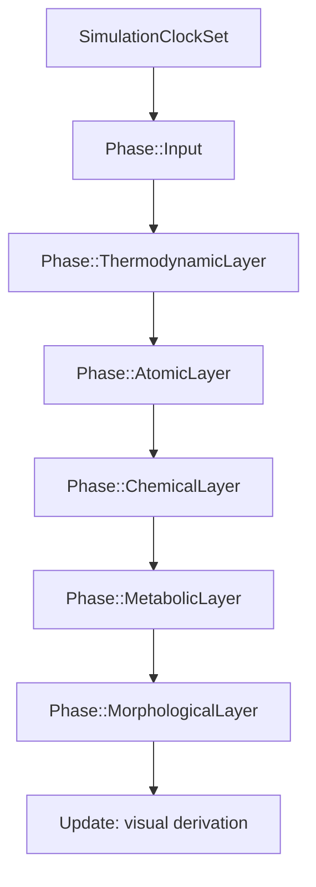

# Blueprint: Pipeline de Simulación (`simulation`)

Módulos cubiertos: `src/simulation/*`.
Referencia: `DESIGNING.md`, `CLAUDE.md`, `src/simulation/pipeline.rs`.

## 1) Propósito y frontera

- Implementar evolución temporal del mundo alquímico por fases en `FixedUpdate` (paso fijo; ver `Time<Fixed>` / plugins de tick).
- Consumir/escribir componentes de `layers`, recursos de `world`, `worldgen`, `eco`, `bridge`, y eventos globales.
- No define bootstrap general de app (eso vive en `plugins`/`main`).

## 2) Superficie pública (contrato)

### Phase enum (`SystemSet`)

Definido en `simulation/mod.rs` (comentario interno: «5 capas strict» = **cinco** capas físicas **después** de `Input`):

```rust
SimulationClockSet
  → Phase::Input
  → Phase::ThermodynamicLayer
  → Phase::AtomicLayer
  → Phase::ChemicalLayer
  → Phase::MetabolicLayer
  → Phase::MorphologicalLayer
```

Encadenados con `.chain()` en `register_simulation_pipeline` (`simulation/pipeline.rs`). Los nombres legacy **PrePhysics / Physics / Reactions / PostPhysics** ya no existen en el enum.

### InputChannelSet (sub-ordering dentro de Input)

```rust
InputChannelSet::PlatformWill    // runtime_platform escribe WillActuator primero
InputChannelSet::SimulationRest  // grimoire cast, element sync, worldgen prephysics
```

### Sistemas por fase

**SimulationClockSet** (antes de todas las fases):
- `advance_simulation_clock_system` — incrementa frame counter
- `bridge_phase_tick` — avanza fase del bridge optimizer

**Phase::Input**
- `almanac_hot_reload_system`
- Cadena `ensure_element_id` → `derive_frequency_from_element_id` → `sync_element_id_from_frequency`
- `grimoire_cast_intent_system` → `ability_point_target_pick_system` (misma cadena, `SimulationRest`)
- Registro vía `register_prephysics_worldgen_through_delta` **no** añade sistemas en `Input`; el worldgen pesado vive en `ThermodynamicLayer`.

**Phase::ThermodynamicLayer**
- Cabeza: `channeling_grimoire_emit_system` → `grimoire_cast_resolve_system` (solo `PlayState::Active`)
- `update_spatial_index_system` (después de cast resolve; en todo `Playing`)
- Cadena worldgen: presupuestos/LOD, estaciones, núcleos, `terrain_mutation_system`, propagación, `eco_boundaries_system`, materialización delta, `flush_pending_energy_visual_rebuild_system`, etc. (`worldgen/systems/prephysics.rs`)
- Subcadena sim (después del flush visual): `terrain_config_loader` → `climate_*` (antes de containment)
- `attention_convergence_system` (`sensory`)
- Cadena: `containment_system` → `structural_constraint_system` → `contained_thermal_transfer_system` → overlays L10 → injectors → `irradiance_update_system` → `perception_system`

**Phase::AtomicLayer**
- `physics::register_physics_phase_systems()` — colisión, movimiento, disipación, drag, etc.

**Phase::ChemicalLayer**
- `reactions::register_reactions_phase_systems()` — catálisis, transiciones de fase, homeostasis, efectos de hechizo

**Phase::MetabolicLayer**
- `fog_of_war_provider_system` → `fog_visibility_mask_system` → `worldgen_nucleus_death_notify_system` → `faction_identity_system` (`register_postphysics_nucleus_death_before_faction`)
- `growth_budget_system` — **antes** de `faction_identity_system` (orden en `pipeline.rs`)

**Phase::MorphologicalLayer**
- `cleanup_orphan_growth_intent_system` → `growth_intent_inference_system` → `allometric_growth_system`
- `bridge_metrics_collect_system` — **después** de `faction_identity_system`

**Update (no FixedUpdate)**
- `register_visual_derivation_pipeline` — derivación visual worldgen + `shape_color_inference_system`, `growth_morphology_system`, etc.

### Módulos (resumen; el árbol real es más amplio)

Además de los núcleos listados arriba existen, entre otros: `ability_targeting`, `allometric_growth`, `atomic`, `fog_of_war`, `grimoire_enqueue`, `growth_budget`, `inference_growth`, `nutrient_uptake`, `osmosis`, `pathfinding/`, `photosynthesis`, `player_controlled`, `sensory`, tests (`eco_e5_simulation_tests`, `event_ordering_tests`, `regression`, `verify_wave_gate`). Ver `simulation/mod.rs` para `pub mod` completos.

## 3) Invariantes y precondiciones

- `delta_secs > 0` para integración física estable.
- Cast válido requiere energía suficiente en `AlchemicalEngine` (L5).
- **No cooldown timers.** La disponibilidad de cast se computa como `buffer >= cost`.
- Orden determinista en scan de catálisis.
- `SpatialIndex` actualizado antes de sistemas de vecindad/contacto.
- Overlays L10: `reset_resonance_overlay_system` al inicio de la cadena termodinámica local; `resonance_link_system` antes de motor/fotosíntesis/percepción (`pipeline.rs`).
- Bridge optimizer: fase Warmup vs Active según worldgen (`BridgeConfig` / métricas en `MorphologicalLayer`).

## 4) Comportamiento runtime



- Flujo crítico: intención y sync de elementos → mundo/campo (worldgen + eco + containment + motor) → física atómica → química/reacciones → fog/muerte/facción/presupuesto de crecimiento → inferencia y crecimiento alométrico + métricas bridge.
- Worldgen (propagación, materialización, terreno) vive en `ThermodynamicLayer` junto a cast resolve e índice espacial (`prephysics.rs`).
- Bridge optimizer: tick de fase en `SimulationClockSet`; métricas al final de `MorphologicalLayer`.

## 5) Implementación y trade-offs

- **Valor**: separación por fase reduce race conditions semánticas. Determinismo en `FixedUpdate` con dt fijo.
- **Costo**: mayor disciplina de orden y dependencias explícitas. Agregar un sistema requiere elegir fase y posición.
- **Trade-off**: menos flexibilidad dinámica, más previsibilidad del runtime.
- **Bridge optimizer**: reduce ~80% de computación de ecuaciones via cache cuantizado. Trade-off: precisión (bandas discretas) vs velocidad.

## 6) Fallas y observabilidad

- **Ambigüedad resuelta:** `ContainedIn` opera como single-host (host dominante en thermal transfer).
- **Riesgo mitigado:** `will_input_system` legacy reemplazado por V6 projection como fuente única de intención.
- **Riesgo activo:** density alta en demos puede sesgar validaciones de performance.
- **Señales:** DebugPlugin (gizmos, labels), bridge metrics (cache hit rate), worldgen state (Warming/Propagating/Ready).

## 7) Checklist de atomicidad

- Responsabilidad principal: sí (evolución de simulación).
- Acoplamiento: alto, pero controlado por fase.
- Split aplicado: worldgen systems extraídos a `worldgen/systems/` (migración M2). Eco system extraído a `eco/systems.rs` (M3).
- Split futuro: separar catalysis/reactions si crece complejidad de recetas.

## 8) Referencias cruzadas

- `DESIGNING.md` — Axioma energético, ciclo de vida
- `CLAUDE.md` — Coding rules, pipeline spec
- `docs/design/GAMEDEV_IMPLEMENTATION.md` — Invariantes energéticos para MOBA patterns
- `docs/sprints/MIGRATION/` — M2 (worldgen extract), M3 (eco extract)
- `docs/sprints/GAMEDEV_PATTERNS/SPRINT_G9_EVENT_ORDERING.md` — Event ordering explícito
