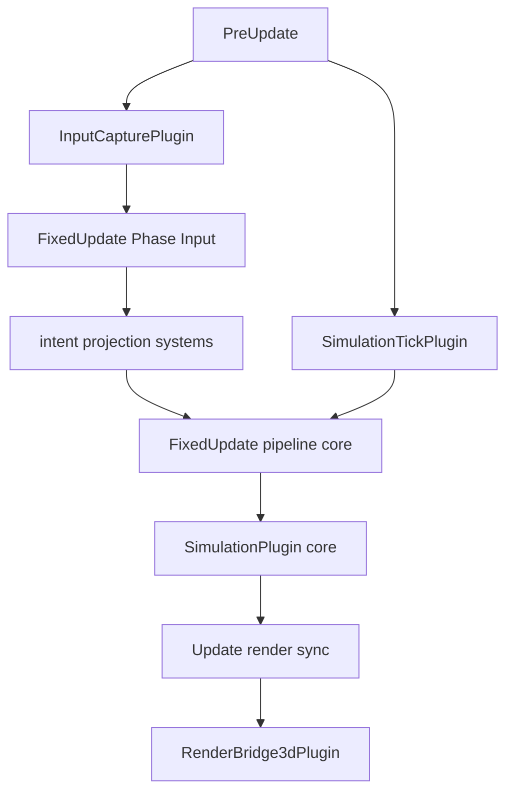

# Blueprint: Runtime Platform y Compatibilidad 2D/3D (`runtime_platform`)

Módulos cubiertos: `src/runtime_platform/*` y namespace público `runtime_platform`.
Referencias: `docs/design/V6.md` y sprints V6 en `docs/sprints/BLUEPRINT_V6/`.

## 1) Propósito y frontera

- Introducir runtime V6 modular (tick, input, proyección 3D, bridge de render, observabilidad).
- Mantener compatibilidad progresiva con stack legacy 2D.
- No reemplaza de golpe el core de simulación; lo envuelve y adapta por perfil.

## 2) Superficie pública (contrato)

- Compat/wiring: `Compat2d3dPlugin`, `RenderCompatProfile`, `add_compat_plugins_by_profile` (entrada pública: `add_runtime_platform_plugins_by_profile`).
- Tick: `SimulationClock`, `SimulationElapsed`, `V6RuntimeConfig`, `SimulationTickPlugin`.
- Input: `InputCapturePlugin` (+ `IntentBuffer` si aplica al perfil).
- Proyección: `ProjectedWillIntent` + sistemas `project_intent_to_resource_system` / `apply_projected_intent_to_will_system` (no hay plugin con prefijo `V6*` para esto).
- Cámara/render: `CameraBasisForSim`, `Camera3dPlugin`, `RenderBridge3dPlugin`, etc.
- Escenarios/debug: `ScenarioIsolationPlugin`, `ObservabilityPlugin`.
- Contratos: `runtime_platform/contracts/*`.

## 3) Invariantes y precondiciones

- Perfiles de compat definen fuente de verdad del input (legacy vs V6 projection).
- Tick V6 debe publicar `SimulationElapsed` válido antes de sistemas que lo consumen.
- Tipos de contrato en `v6/contracts` son punto único de verdad; no duplicar tipos equivalentes.

## 4) Comportamiento runtime

- V6 agrega un plano de contratos y adaptadores sin romper de inmediato el core legacy.

## 5) Implementación y trade-offs

- **Valor**: migración incremental 2D->3D con contratos explícitos.
- **Costo**: período híbrido con doble semántica (visual 3D + lógica 2D parcial).
- **Trade-off**: menor riesgo de ruptura total vs mayor complejidad temporal de compat.

## 6) Fallas y observabilidad

- Riesgo: doble input path si perfil no está claro.
- Riesgo: backend espacial/colisión 3D parcial (stubs) genera falsa sensación de cobertura.
- Mitigación: documentación por perfil + métricas `V6FrameMetrics` + escenarios aislados.

## 7) Checklist de atomicidad

- Responsabilidad principal: sí (plataforma de transición y contratos V6).
- Acoplamiento: alto con `plugins` y `simulation` por diseño.
- Split sugerido: mantener `contracts` estrictamente separados de backends concretos.

## 8) Referencias cruzadas

- `docs/design/V6.md`
- `docs/sprints/BLUEPRINT_V6/README.md` (sprints V6 individuales eliminados al cerrar el track)

## 9) Frontera click-to-move (subproyecto)

- Núcleo **stateless** en `src/runtime_platform/click_to_move/core.rs`:
  - funciones puras de proyección y decisión de intención.
  - HoFs para desacoplar adapter de plataforma (`cursor -> ray`) y storage (`map_target_state_with`).
- Shell Bevy mínima en `src/runtime_platform/click_to_move/mod.rs`:
  - solo wiring ECS (`Resources`, `Query`, `Commands`).
  - sin lógica de negocio física.

Responsabilidad definida:

- `core.rs`: reglas de navegación (qué target/intent corresponde).
- `mod.rs`: integración con runtime Bevy (cómo leer input/cámara y dibujar marcador).

## 10) Módulos en `runtime_platform/mod.rs` (17 `pub mod`)

`camera_controller_3d`, `click_to_move`, `collision_backend_3d`, `compat_2d3d`, `contracts`, `core_math_agnostic`, `debug_observability`, `fog_overlay`, `hud`, `input_capture`, `intent_projection_3d`, `kinematics_3d_adapter`, `parry_nav_collider`, `render_bridge_3d`, `scenario_isolation`, `simulation_tick`, `spatial_index_backend`.

## 11) Cambio de nomenclatura

- Módulo público: `runtime_platform` (sin alias `v6` en `lib.rs`).
- Regla: imports desde `crate::runtime_platform` / `resonance::runtime_platform`.
