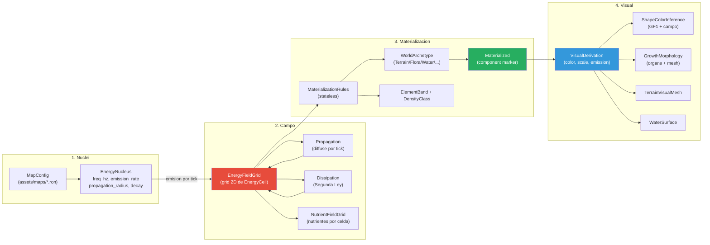
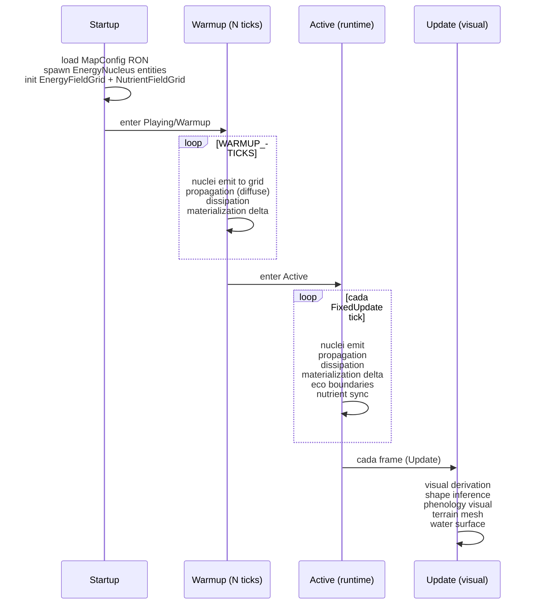

# Blueprint V7: Worldgen por Composicion Energetica (`worldgen/`)

Si todo es energia, todo lo que VES es una proyeccion de la energia.
Nucleos de energia se propagan por el espacio, la materia se materializa por reglas stateless,
y el aspecto visual emerge de la composicion energetica. Distintos mapas = distintos nucleos.

## Pipeline V7



## Ciclo de vida del campo



## Tipos principales

| Tipo | Archivo | Rol |
|------|---------|-----|
| `EnergyNucleus` | nucleus.rs | Fuente: freq, emission, radius, decay |
| `PropagationDecay` | nucleus.rs | InverseSquare / InverseLinear / Flat / Exponential |
| `EnergyFieldGrid` | field_grid.rs | Resource: grid 2D de celdas de energia |
| `EnergyCell` | contracts.rs | Celda: qe total, FrequencyContribution[] |
| `FrequencyContribution` | contracts.rs | freq_hz + intensity por contribucion |
| `Materialized` | contracts.rs | Marker: celda ya materializo entidad |
| `MaterializationResult` | contracts.rs | Resultado: archetype + properties |
| `WorldArchetype` | archetypes.rs | Terrain / Flora / Water / Crystal / ... |
| `ElementBand` | archetypes.rs | Banda elemental dominante |
| `DensityClass` | archetypes.rs | Low / Medium / High |
| `NutrientFieldGrid` | nutrient_field.rs | Grid paralelo de nutrientes |
| `NutrientCell` | nutrient_field.rs | Nutriente disponible + regeneracion |
| `PropagationMode` | propagation_mode.rs | Diffuse / Directional |
| `MapConfig` | map_config.rs | Config de mapa desde RON |
| `CellFieldSnapshot` | cell_field_snapshot.rs | Snapshot de celda para GPU/cache |
| `CellFieldSnapshotCache` | cell_field_snapshot.rs | Cache de snapshots |

## Modulos internos

```
worldgen/
+-- nucleus.rs              -- EnergyNucleus, PropagationDecay
+-- field_grid.rs           -- EnergyFieldGrid (Resource)
+-- contracts.rs            -- EnergyCell, Materialized, visual params
+-- archetypes.rs           -- WorldArchetype, ElementBand, DensityClass
+-- propagation.rs          -- diffusion + dominant frequency resolve
+-- propagation_mode.rs     -- PropagationMode, diffuse system
+-- materialization_rules.rs -- reglas stateless de materializacion
+-- nutrient_field.rs       -- NutrientFieldGrid, bias por frecuencia
+-- map_config.rs           -- MapConfig, load from RON/env
+-- organ_inference.rs      -- attachment points, organ mesh
+-- shape_inference.rs      -- ShapeInferred, GF1 integration
+-- visual_derivation.rs    -- color, scale, emission, opacity
+-- cell_field_snapshot.rs  -- snapshot cache + GPU layout
+-- field_visual_sample.rs  -- muestreo visual por posicion
+-- lod.rs                  -- LOD por distancia
+-- constants.rs            -- FIELD_CELL_SIZE, thresholds
+-- systems/
    +-- startup.rs          -- init grid, spawn nuclei
    +-- prephysics.rs       -- per-tick: propagation, materialization delta
    +-- materialization.rs  -- NucleusFreqTrack, SeasonTransition
    +-- terrain_visual_mesh.rs -- mesh de terreno
    +-- water_surface.rs    -- mesh de agua
    +-- visual.rs           -- derivacion visual (Update)
    +-- phenology_visual.rs -- fenologia estacional
    +-- performance.rs      -- budgets, LOD, cache stats
    +-- materialization_delta.rs -- delta incremental
```

## Dependencias

- `crate::blueprint::equations` — field_color, entity_shape, inferred_world_geometry
- `crate::blueprint::constants` — FIELD_CELL_SIZE, thresholds, morphogenesis
- `crate::layers` — BaseEnergy, SpatialVolume, OscillatorySignature, AmbientPressure
- `crate::eco` — eco_boundaries para clasificacion de zonas
- `crate::topology` — heightmap, drainage para terreno

## Invariantes

- `EnergyFieldGrid` dimensionado en startup, inmutable en tamano despues
- Propagacion conserva energia global (suma de celdas estable modulo dissipation)
- Materializacion stateless: misma celda + misma energia = mismo resultado
- Warmup completo antes de `PlayState::Active`
- Visual derivation en `Update`, no en `FixedUpdate`
- `NutrientFieldGrid` alineado 1:1 con `EnergyFieldGrid`
