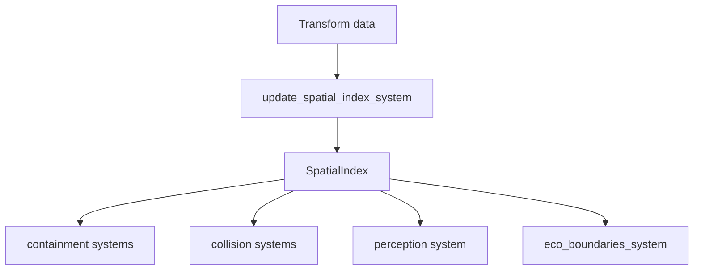

# Blueprint: Mundo y Recursos Espaciales (`world`)

Módulos cubiertos: `src/world/*`.
Referencia: `CLAUDE.md`, `docs/sprints/DEMO_PROVING_GROUNDS.md`.

## 1) Propósito y frontera

- Mantener recursos globales del mundo (`SpatialIndex`, `PerceptionCache`, `Scoreboard`).
- Definir setup de escenas demo (varios mapas).
- No implementa ecuaciones de reacción/física fina (eso está en `simulation`/`blueprint`).

## 2) Superficie pública (contrato)

### Recursos

- `SpatialIndex` — grid 2D para queries de proximidad. Usado por containment, collision, perception.
- `PerceptionCache` — cache de observación por entidad (señal energética: `qe × vis(freq) / dist²`).
- `Scoreboard` — métricas de partida (puntuación por facción).

### Sistemas

- `update_spatial_index_system` — reconstruye SpatialIndex cada tick.

### Mapas y demos

Los escenarios se eligen con **`RESONANCE_MAP`** → archivo **`assets/maps/{nombre}.ron`** (`worldgen/map_config.rs`). Ejemplos en repo: `default.ron`, `demo_arena.ron`, `proving_grounds.ron`, `flower_demo.ron`, `demo_floor.ron`, etc.

El spawn de entidades “demo” actual pasa por **`spawn_demo_level`** / **`spawn_demo_level_startup_system`** (`demo_level.rs`): sandbox **Single-Plant** (semilla botánica + parámetros de crecimiento), no funciones separadas `spawn_demo_arena` / `spawn_proving_grounds` en `world/`.

### Módulos (estado real `world/mod.rs`)

```
world/
├── mod.rs              → re-exports públicos
├── demo_level.rs       → spawn_demo_level, startup, telemetría semilla
├── demo_clouds.rs      → nubes demo, movimiento
├── fog_of_war.rs       → grilla fog alineada al campo de energía
├── grimoire_presets.rs → presets de grimorio (contenido demo)
├── marker.rs           → Scoreboard
├── perception.rs       → PerceptionCache
└── space.rs            → SpatialIndex, update_spatial_index_*
```

## 3) Invariantes y precondiciones

- Índice espacial debe reconstruirse antes de consultas de vecindad.
- La granularidad de celdas del índice condiciona precisión vs costo.
- Escenas demo no deben romper invariantes de capas al spawnear entidades.
- Un mapa `.ron` ambicioso (p. ej. `proving_grounds.ron`) puede ejercitar más capas/materialización; la verdad está en el contenido del mapa + arquetipos worldgen, no en un `spawn_*` dedicado en `world/`.

## 4) Comportamiento runtime



- `SpatialIndex` funciona como contrato compartido entre subsistemas de proximidad.
- `PerceptionCache` se recalcula en la fase termodinámica del pipeline (`perception_system`, `Phase::ThermodynamicLayer`).

## 5) Implementación y trade-offs

- **Valor**: centralizar recursos reduce duplicación de queries espaciales.
- **Costo**: índice 2D actual no expresa completamente escenarios 3D (heights, terrain layers).
- **Trade-off**: throughput simple/estable hoy vs fidelidad espacial 3D completa.
- **Mejora futura**: SpatialIndex 3D o heightmap-aware si pathfinding (G5) lo requiere.

## 6) Fallas y observabilidad

- Riesgo: mismatch entre mundo demo y perfiles de escenarios.
- Riesgo: densidad alta en demos puede sesgar validaciones de performance.
- Mitigación: escenarios aislados y métricas por perfil; mapas `.ron` grandes como referencia de stress.

## 7) Checklist de atomicidad

- Responsabilidad principal: sí (estado global del mundo).
- Acoplamiento: moderado con `simulation` y `entities`.
- Split aplicado: recursos globales + `demo_level` / nubes / fog / presets en módulos dedicados; variantes de escena = archivos `assets/maps/*.ron`.

## 8) Referencias cruzadas

- `CLAUDE.md` — Comandos de ejecución por mapa
- `docs/sprints/DEMO_PROVING_GROUNDS.md` — Diseño de la demo de 14 capas
- `docs/sprints/GAMEDEV_PATTERNS/README.md` — G12 fog implementado (`FogOfWarGrid`, `simulation/fog_of_war.rs`)
