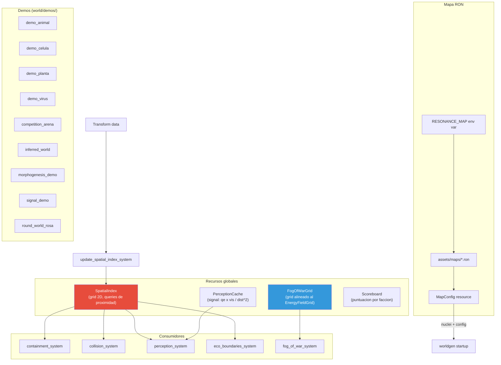

# Blueprint: Mundo y Recursos Espaciales (`world/`)

Recursos globales del mundo: indice espacial, cache de percepcion, fog of war, scoreboard.
Define setup de escenas demo y seleccion de mapas RON.
No implementa ecuaciones — eso vive en `simulation/` y `blueprint/`.

## Arquitectura interna

## Tipos exportados

| Tipo | Archivo | Rol |
|------|---------|-----|
| `SpatialIndex` | space.rs | Grid 2D para queries de proximidad |
| `SpatialEntry` | space.rs | Entrada: entity + position + radius |
| `PerceptionCache` | perception.rs | Cache de observacion por entidad |
| `FogOfWarGrid` | fog_of_war.rs | Grid de visibilidad por equipo |
| `Scoreboard` | marker.rs | Metricas de partida por faccion |
| `DemoMetricsHud` | demos/demo_metrics.rs | HUD de metricas para demos |

## Mapas disponibles (`assets/maps/`)

| Mapa | Proposito |
|------|-----------|
| `demo_minimal` | Sandbox minimo |
| `demo_floor` | Terreno plano base |
| `demo_celula` | Una celula aislada |
| `demo_virus` | Virus vs host |
| `demo_planta` | Planta con crecimiento |
| `demo_animal` | Animal con D1 behavior |
| `demo_river_plateau` | Terreno con rio y meseta |
| `demo_strata` | Capas geologicas |
| `four_flowers` | 4 nuclei Terra-band, grid 32x32 |
| `competition_arena` | Arena de competencia EC |
| `inferred_world` | Mundo inferido IWG |
| `layer_ladder` | Escalera termodinamica |
| `proving_grounds` | Stress test: todas las capas |
| `signal_latency_demo` | Latencia de senal |

Seleccion: `RESONANCE_MAP=nombre cargo run` carga `assets/maps/{nombre}.ron`.

## Demos (`world/demos/`)

| Demo | Slug | Que valida |
|------|------|------------|
| `demo_celula` | `demo_celula` | Metabolismo basico, homeostasis |
| `demo_planta` | `demo_planta` | Fotosintesis, crecimiento, organos |
| `demo_animal` | `demo_animal` | D1 behavior, trophic, locomotion |
| `demo_virus` | `demo_virus` | Parasitismo, drenaje de qe |
| `competition_arena` | `competition_arena` | Pools, competitors, EC dynamics |
| `inferred_world` | `inferred_world` | IWG: body plan, terrain, water |
| `morphogenesis_demo` | `morphogenesis_demo` | MG1-7: forma, rugosity, albedo |
| `signal_demo` | `signal_demo` | Signal propagation latency |
| `round_world_rosa` | `round_world_rosa` | Rosa con mundo redondo |

## Dependencias

- `crate::layers` — componentes para spawn de demos
- `crate::entities` — funciones `spawn_*`
- `crate::worldgen` — EnergyFieldGrid para alinear fog grid
- `bevy::prelude` — Resource, Transform

## Invariantes

- `SpatialIndex` reconstruido antes de queries de vecindad
- `FogOfWarGrid` alineado a la dimension del `EnergyFieldGrid`
- Escenas demo no violan invariantes de capas al spawnear
- `PerceptionCache` recalculado en `Phase::ThermodynamicLayer`
