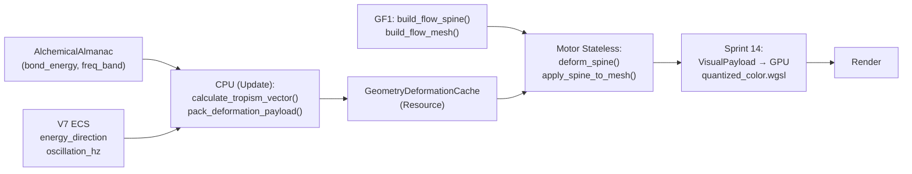

# BLUEPRINT — Motor de Deformación Termodinámica por Tensores de Energía

> **Posición en el stack:**
> Terreno (Topología) → Campo Energético (V7) → Geometría Procedural (GF1: spine/mesh base) → **Deformación por Tensores** (este Blueprint) → Motor de Color Cuantizado (Sprint 14) → Rendering

```text
Una entidad existe en un plano vacío.
Es su contacto con los campos de energía del contexto lo que define su tendencia de forma.
La forma no es un asset. Es la solución de equilibrio entre tensores que compiten.
```

---

## 1. El Problema que Resuelve

GF1 (`src/geometry_flow/`) entrega un spine + mesh base (tubo) a partir de un `GeometryInfluence` (sprint doc eliminado; ver `docs/sprints/GEOMETRY_FLOW/README.md`).
Ese mesh es **rígido**: la forma no responde al contexto cambiante (luz, gravedad, resistencia del material).

Este motor toma ese mesh y aplica una **deformación continua** basada en los tensores de energía que actúan sobre la entidad. El resultado:

- Una rosa define sus valores `bond_energy`, `conductivity`, `visibility` en el Almanac.
- Inyectás `Lux` desde el noreste y `Aqua` desde la raíz.
- El motor deforma la geometría: el tallo se orienta al noreste, los pétalos se abren, el color cambia (via Sprint 14).
- No hay keyframes. No hay animaciones. Solo tensores.

---

## 2. Física del Modelo: Tensores en Competencia

### 2.1 Los tensores que actúan sobre cada vértice de un segmento del spine

```text
T_total = T_energia + T_gravedad + T_resistencia

T_energia:    Vector de empuje del campo energético dominante en la celda.
              Dirección: hacia la fuente de energía más intensa (ej: vector al sol para Lux).
              Magnitud: (energia_absorbida / bond_energy).clamp(0, 1) — la Plasticidad ρ.

T_gravedad:   Vec3::NEG_Y * masa_efectiva.
              masa_efectiva = qe * MASS_QE_SCALE — la energía misma ES la masa aquí.
              Más energía → más masa → más curvatura por gravedad.

T_resistencia: Vec3 opuesto a la deformación acumulada.
              Magnitud: bond_energy * deformation_magnitude.
              Es el tensor que hace que un árbol joven vuelva a crecer recto si deja de soplar el viento.
```

### 2.2 La ecuación de deformación (función pura por segmento)

```rust
/// Calcula el delta de orientación del segmento `i` del spine.
/// Pure function. No ECS. No estado.
pub fn deformation_delta(
    segment_tangent: Vec3,   // Orientación actual del segmento
    t_energy: Vec3,          // Tensor de energía (dirección + magnitud = plasticidad)
    t_gravity: Vec3,         // Tensor gravitacional (masa_efectiva * -Y)
    bond_energy: f32,        // Resistencia del material (del Almanac)
) -> Vec3 {
    let total_force = t_energy + t_gravity;
    let plasticity = (total_force.length() / bond_energy).clamp(0.0, 1.0);
    
    // El delta es la diferencia angular ponderada por plasticidad.
    // Sin branch: la plasticidad domina la cantidad de giro.
    let target_direction = (segment_tangent + total_force.normalize_or_zero()).normalize_or_zero();
    target_direction - segment_tangent * plasticity
}
```

### 2.3 El Girasol y la Rosa: Ejemplos Físicos

**Girasol (alta absorción de Lux, bajo bond_energy en el tallo joven):**
- `T_energia` apunta fuerte hacia el sol. `bond_energy` es bajo (tallo blando).
- Plasticidad alta → el delta es grande → el tallo gira significativamente hacia el sol.
- Verde radiante porque `Enorm` alto → índice alto en la paleta de Lux (Sprint 14).

**Roble adulto (alta absorción de Lux, alto bond_energy en tronco viejo):**
- `T_energia` sigue hacia el sol. `bond_energy` es altísimo (madera densa).
- Plasticidad baja → el delta es mínimo → tronco casi recto.
- Las ramas jóvenes (menor `bond_energy` → mayor plasticidad) sí se doblan.
- Descrito solo por sus parámetros en el Almanac.

**Rama que crece lateral desde el tronco:**
- Su tangente inicial apunta horizontal (sale del tronco perpendicular).
- `T_gravedad` tira hacia abajo.
- `bond_energy` moderado → plasticidad media.
- Resultado: la rama se curva parabolicamente hacia abajo según su masa crece.
- Sin gravedad (inyectás `T_gravedad = Vec3::ZERO`): la rama crecería en la misma dirección que el tronco padre.

---

## 3. La Caché por Rangos de Oscilación de Onda

### 3.1 El Principio Físico

La forma de una entidad NO cambia frame a frame. Estadísticamente, los tensores de energía oscilan en torno a un **equilibrio**. La frecuencia de onda de ese equilibrio (`OscillatorySignature.frequency_hz`) determina qué tan rápido cambia la forma.

Un árbol a 80 Hz de `Lux` absorbida tiene una oscilación interna de forma extremadamente lenta (horas de simulación). Un hongo con `Aqua` a 200 Hz tiene respuesta más rápida.

### 3.2 Los Rangos de Caché

```
Rango = Banda de deformación. Definida por una fracción de la onda de oscilación.

RangoActual {
    tensor_min: Vec3,   // Límite inferior del tensor promedio
    tensor_max: Vec3,   // Límite superior
    deformed_spine: Vec<SpineNode>,  // Spine pre-deformado para este rango
    fingerprint: u64,   // Hash del rango + parámetros de entrada
}
```

**Regla de cache hit / miss:**
```
Si el tensor_actual cae dentro de [tensor_min, tensor_max]:
    → CACHE HIT: reutilizar deformed_spine. No recalcular.

Si cae fuera (miss):
    → Recalcular deformed_spine.
    → Hacer SLIDE del rango: tensor_min = tensor_actual * 0.9, tensor_max = tensor_actual * 1.1.
    → El miss EMPUJA el rango hacia el nuevo valor.
      (Esto implementa el principio de que los rangos cambian por degradación lenta,
       y el 90% de frames no salen del rango durante muchos ticks)
```

### 3.3 Por qué el Miss Empuja al Extremo Opuesto

Un miss no significa un error. Significa que la onda evolucionó.
Si el tensor actual supera `tensor_max`, se asume que el equilibrio migró hacia arriba y el rango
se desliza para capturar el nuevo equilibrio. El miss actúa como señal de cambio de estado del material.

El rango degradado lentamente refleja envejecimiento: un árbol viejo tiene rangos más estrechos
(menos plasticidad, menor varianza tensorial) que un brote joven.

### 3.4 Estructura en Memoria (SoA, cache-friendly)

```rust
/// Resource: caché de deformación por entidad.
/// Indexado por el índice lineal de celda (igual que EnergyFieldGrid).
#[derive(Resource, Default)]
pub struct GeometryDeformationCache {
    pub ranges: Vec<Option<DeformationRange>>,  // parallel array al grid
}

pub struct DeformationRange {
    pub fingerprint: u64,
    pub tensor_min: Vec3,
    pub tensor_max: Vec3,
    pub deformed_spine: Vec<SpineNode>,
    pub range_width_factor: f32,  // Qué tan ancho es el rango. Decrece con bond_energy alto (material rígido).
}
```

---

## 4. Contrato de Entrada: `DeformationPayload`

Lo calcula la CPU (ECS) y se lo pasa al motor stateless.

```rust
#[derive(Clone, Debug)]
pub struct DeformationPayload {
    pub base_spine: Vec<SpineNode>,       // El spine crudo del GF1
    pub bond_energy: f32,                  // Resistencia del material (Almanac)
    pub energy_direction: Vec3,            // Dirección del tensor de energía dominante
    pub energy_magnitude: f32,             // Magnitud (energia_absorbida / bond_energy)
    pub gravity_scale: f32,                // Factor de gravedad (default 1.0; 0.0 = sin gravedad)
    pub oscillation_hz: f32,               // Frecuencia de oscilación (OscillatorySignature)
}
```

---

## 5. API Stateless del Motor

```rust
/// Calcula el spine deformado. Función pura. No ECS. No estado.
/// Usa la caché externamente si el llamador lo decide.
pub fn deform_spine(payload: &DeformationPayload) -> Vec<SpineNode>;

/// Aplica el spine deformado a la malla base para producir posiciones de vértices finales.
/// Operación O(V) donde V = vértices del tubo.
pub fn apply_spine_to_mesh(base_mesh: &Mesh, deformed_spine: &[SpineNode]) -> Vec<[f32; 3]>;

/// Calcula el fingerprint del payload para gestión de caché.
pub fn deformation_fingerprint(payload: &DeformationPayload) -> u64;
```

---

## 6. Integración con el Stack Existente

### Posición en el pipeline por entidad



### Demarcación con sistemas existentes

| Sistema existente | Sprint 15 (este) | Relación |
|-------------------|-----------------|----------|
| `EnergyFieldGrid` (V7) | Lee `energy_direction` y `qe` de la celda | Sprint 15 **lee**, no escribe |
| `GF1 build_flow_spine` | Entrega el spine base sin deformar | Sprint 15 toma el spine de GF1 como entrada |
| `TerrainField` (Topología) | Determina `T_gravedad` efectivo (pendiente modula la gravedad efectiva) | Sprint 15 lee `slope` opcionalmente |
| `MaterializationCellCache` | Cachea arquetipo de la celda | Ortogonal: cachea forma de celda, no deformación de entidad |
| `WorldgenPerfSettings` / LOD bands | Controla frecuencia de tick de materialización | Sprint 15 usa `oscillation_hz` de la entidad, no del grid LOD |
| Motor de Color Cuantizado (Sprint 14) | Pinta el mesh resultante | El mesh deformado por Sprint 15 es lo que Sprint 14 colorea |

---

## 7. Posición Filosófica: Por Qué Esto es Coherente con «Todo es Energía»

### La forma como gradiente "congelado"

La forma de una planta no es una decisión de diseño del artista. Es el gradiente de menor resistencia
al flujo de energía, "fotografiado" en el tiempo.

Un girasol mira al sol porque en ese vector el flujo de Lux encontró menos resistencia que en el vector
perpendicular durante toda su vida. El tronco del roble es vertical porque el gradiente vertical de Aqua
(agua desde la raíz hacia arriba) es el tensor dominante de su historia.

En *Resonance*, no hay modelos 3D de "girasol" ni de "roble". Hay:
- Un `bond_energy` diferente en el Almanac para los materiales `Flora/Aqua/Lux`.
- Un tensor de `Lux` que el Almanac condiciona según `electronegativity` (capacidad de absorción).
- Un vector de `T_gravedad` constante.

La forma **emerge** de esos tres números. El motor solo resuelve la ecuación.

---

## 8. Referencias

- [`TERRAIN_MESHER.md`](TERRAIN_MESHER.md) — mesh de terreno stateless
- [`TOPOLOGY.md`](TOPOLOGY.md) — sustrato físico, `TerrainField`
- [`QUANTIZED_COLOR_ENGINE.md`](QUANTIZED_COLOR_ENGINE.md) — coloreado GPU de la malla resultante
- [`docs/sprints/GEOMETRY_FLOW/README.md`](../sprints/GEOMETRY_FLOW/README.md) — GF1 cerrado en código (spine y mesh base)
- [`docs/arquitectura/blueprint_quantized_color.md`](../arquitectura/blueprint_quantized_color.md) — contrato Sprint 14
- [`.cursor/rules/ecs-strict-dod.mdc`](../../.cursor/rules/ecs-strict-dod.mdc) — reglas DoD
