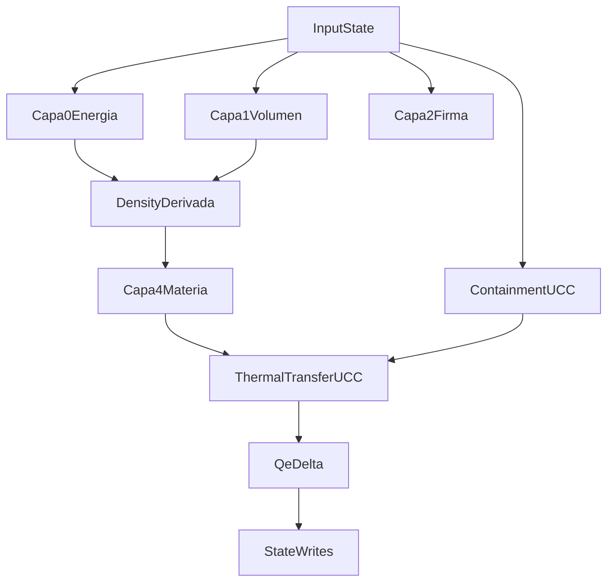
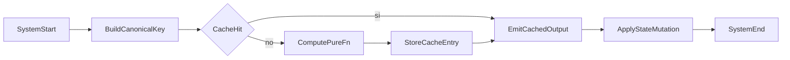
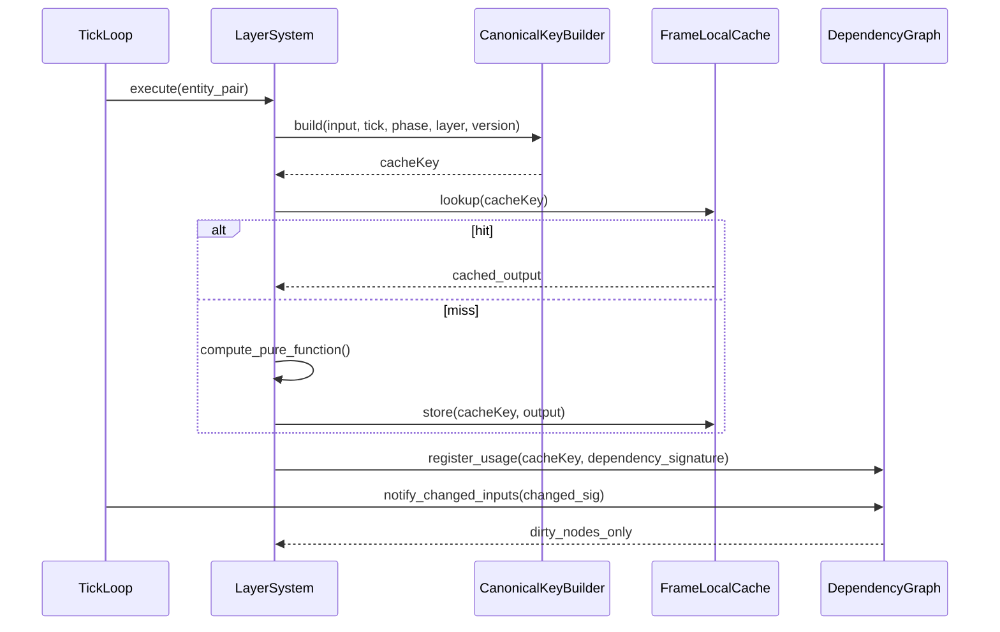
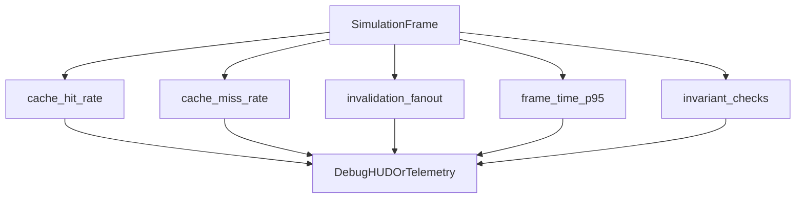

# BLUEPRINT V5 — Optimizacion Determinista Bit-Exacta

---

## 1. Objetivo de V5

V5 no cambia la fisica ni la ontologia de V3/V4. V5 agrega una capa de optimizacion para evitar recomputacion redundante en el pipeline ECS.

Regla central:

```
Mismo input canonico + mismo tick + mismo orden de sistema = mismo output bit a bit
```

Si el input no cambia, no se recalcula. Si cambia parcialmente, se recalcula solo el subgrafo afectado.

---

## 2. Herencia obligatoria de V3/V4 (+ Sprint 09)

V5 hereda sin excepciones:

- Motor agnostico de semantica (sin `if Fire`, sin branching por nombre de elemento).
- Pipeline estricto `Entrada -> FisicaPre -> FisicaCore -> Reacciones -> FisicaPost`.
- Ecuaciones puras centralizadas (single source of truth).
- `AlchemicalAlmanac` como cold data read-only en runtime.
- Invariantes de energia y disipacion (segunda ley intacta).
- Containment emergente (no seteable por gameplay).
- Extension ortogonal de capas Sprint 09 (C11/C12/C13) sin branching por "tipo especial".

Referencias base:

- `docs/design/BLUEPRINT.md`
- `docs/design/V3.md`
- `docs/design/V4.md`
- `docs/design/V4.md` — Sprint 09 (C11/C12/C13); el doc de sprint se eliminó

---

## 2.1 Canon de capas vigente (incluye C11/C12/C13)

La ontologia de runtime vigente en V5 considera:

- Capa 0 a Capa 10 segun `BLUEPRINT.md`/V3/V4.
- Capa 11: **Campo de Tension** (fuerza a distancia).
- Capa 12: **Homeostasis** (adaptacion frecuencial con costo energetico).
- Capa 13: **Enlaces Estructurales** (resorte, transferencia, ruptura).

Contratos operativos ya implementados:

- **C11**: acelera `FlowVector.velocity` por termino gravitatorio (`qe`) + acople magneto-oscilatorio (`interference`).
- **C12**: ajusta `OscillatorySignature.frequency_hz` con drenaje de `BaseEnergy.qe` solo si alcanza presupuesto.
- **C13**: aplica restriccion de distancia entre nodos enlazados y rompe de forma determinista al superar `break_stress`.

Source of truth runtime:

- Componentes: `src/layers/tension_field.rs`, `src/layers/homeostasis.rs`, `src/layers/structural_link.rs`
- Ecuaciones puras: `src/blueprint/equations.rs`
- Sistemas: `src/simulation/structural_runtime.rs`
- Pipeline: `src/plugins/simulation_plugin.rs`

Regla V5: estas capas nuevas tambien deben cumplir determinismo e invariantes bajo la politica de cache/invalidacion (sin duplicar formulas fuera de `equations.rs`).

---

## 3. Problema que V5 resuelve

Hoy existen tramos del pipeline donde la misma funcion pura se evalua multiples veces con la misma entrada efectiva (ejemplo: dos entidades con mismas condiciones termodinamicas dentro del mismo host y canal).

Costo actual:

- CPU desperdiciada en hot-path por calculos repetidos.
- Frame-time mas inestable bajo carga.
- Escalado peor que lineal en escenarios densos.

Objetivo V5:

- Reducir calculo repetido con memoization determinista.
- Reducir superficie de recomputacion con invalidacion selectiva.
- Mantener exactitud bit a bit.

---

## 4. Unidad de computo cacheable (UCC)

Una UCC es la minima operacion de simulacion que puede cachearse sin romper causalidad:

```
UCC = (LayerSystem, CanonicalInput) -> CanonicalOutput
```

Requisitos:

1. Funcion pura (sin side effects).
2. Salida totalmente determinada por entrada + tick + fase.
3. Sin leer estado mutable global fuera de su firma.

Ejemplos iniciales de UCC candidatas:

- `thermal_transfer(contact, host, entity, distance, overlap, dt)`
- `circle_intersection_area(r1, r2, distance)`
- segmentos puros de interferencia/catalisis que ya viven en ecuaciones.

No cachear:

- Sistemas con mutacion directa no factorizada a funcion pura.
- Operaciones con dependencia de orden no explicitada.
- Paths con IO/eventos no deterministas.

---

## 5. Contrato de key canonica bit-exacta

### 5.1 Definicion

Toda UCC se indexa por:

```
CacheKey = hash_stable(version_tag, tick, phase, layer_id, input_bytes_canonicos)
```

Donde:

- `version_tag`: invalida cache al cambiar ecuacion/constantes.
- `tick`: evita reutilizacion cruzada incorrecta.
- `phase`: evita mezclar outputs de fases distintas.
- `layer_id`: separa dominios de ecuacion.
- `input_bytes_canonicos`: serializacion canonica estable.

### 5.2 Canonicalizacion de floats

Para determinismo bit-exacto:

1. No usar comparaciones aproximadas para key.
2. Canonicalizar `-0.0` a `+0.0`.
3. Rechazar/normalizar `NaN` antes de hashear (policy explicita).
4. Hashear bytes IEEE-754 canonicamente serializados en endian fijo.

### 5.3 Hash determinista

Prohibido usar hashers con seed aleatorio por proceso para keys persistentes o compartidas.

Regla:

```
Hasher de cache debe ser estable entre procesos/maquinas.
```

Motivo: hash aleatorio por proceso rompe replay/cache cross-run.

### 5.4 Alcance de cache

Dos niveles:

- `FrameLocalCache`: vive solo en el tick actual (maxima seguridad).
- `StableWindowCache`: ventana corta de ticks para UCC seguras con input igual.

Default V5: empezar con `FrameLocalCache` para minimizar riesgo y luego extender por profiling.

---

## 6. Grafo de dependencias e invalidacion selectiva

V5 modela dependencias de salida por capa como DAG (por tick).



Regla de invalidacion:

```
Si cambia un nodo input, invalidar solo descendientes alcanzables.
```

Ejemplo:

- Cambio en `distance` invalida `thermal_transfer`.
- No invalida calculos de interferencia no dependientes de distancia.

Implementacion conceptual:

1. Registrar para cada UCC su `dependency_signature`.
2. Construir bitset de dependencias por tick/fase.
3. Al detectar delta en input, marcar dirty solo en subgrafo alcanzable.

Trade-off:

- Ganancia: menos recomputacion.
- Costo: bookkeeping de dependencia.

Decision Yanagi:

- Preferir DAG simple + bitsets por capa.
- Rechazar motor de reglas hiper-generico que agregue complejidad incidental.

---

## 7. Integracion con pipeline actual (sin romper calidad)

### 7.1 Flujo operativo



### 7.2 Restricciones de integracion

- No mover orden de `SystemSet`.
- No duplicar ecuaciones en otros modulos.
- No mutar `AlchemicalAlmanac` en runtime de simulacion.
- No introducir paralelismo que altere orden de reducciones float.

### 7.3 Caso de uso explicito (dos bolas de fuego)

Si dos entidades tienen el mismo vector de entrada para `thermal_transfer` en el mismo tick/fase:

1. Primera ejecucion: miss -> compute -> store.
2. Segunda ejecucion: hit -> reuse output.

Resultado: mismo output fisico, menos costo CPU.

---

## 8. Anti-patrones prohibidos en V5

1. Cache global sin scoping por tick/fase.
2. Key con campos incompletos (falsos hits).
3. Hasher no estable por proceso.
4. Recalculo total por cualquier cambio minimo.
5. Reducir en paralelo sin orden estable en caminos bit-exactos.
6. Mezclar logica de optimizacion con semantica de gameplay.

---

## 9. Protocolo de validacion V5

### 9.1 Determinismo bit-exacto

Test obligatorio:

1. Ejecutar misma escena N veces (N >= 30) con mismo seed/input.
2. Comparar hash de estado completo por tick.
3. Debe coincidir 100%.

### 9.2 Correctitud fisica

Verificar que optimizacion no altera:

- Invariantes de energia (`qe >= 0`, no `NaN/Inf`).
- Orden de severidad termica por canal (`Surface > Immersed > Radiated` cuando aplica).
- Tendencia disipativa global.

### 9.3 Performance

Metricas minimas:

- `cache_hit_rate_total`
- `cache_hit_rate_por_capa`
- `recompute_cost_ms`
- `invalidation_fanout_promedio`
- `frame_time_p50/p95/p99`

### 9.4 Escenarios de benchmark

Incluir minimo:

1. Escena base de regresion V4.
2. Escena densa con multiples hosts/contenidos.
3. Caso "dos bolas de fuego mismas condiciones".
4. Carga alta (>= 320 contenidos) para stress de invalidacion.

---

## 10. Fases de adopcion recomendadas

### Fase A — Cimiento seguro

- Introducir `FrameLocalCache` solo en UCC puras triviales.
- Medir hit-rate real.
- Sin persistencia cross-tick.

### Fase B — Invalidacion incremental

- Activar DAG + dirty propagation por subgrafo.
- Mantener fallback completo tras feature flag.

### Fase C — Ventana estable

- Habilitar `StableWindowCache` solo en UCC con evidencia de repeticion.
- Gate por tests bit-exactos + benchmark.

---

## 11. Riesgos y mitigaciones

| Riesgo | Impacto | Mitigacion |
|---|---|---|
| Stale cache por key incompleta | Alto | Contrato estricto de key + tests de colision logica |
| Drift numerico por orden variable | Alto | Orden de reduccion fijo y pipeline estricto |
| Complejidad incidental | Medio | Limitar V5 a UCC puras con ROI medido |
| Uso de memoria excesivo | Medio | TTL por tick/ventana y limites por capa |
| Debug dificil | Medio | Telemetria por hit/miss/dirty fanout |

---

## 12. Justificacion tecnica externa

La direccion de V5 esta alineada con practica real:

- En ECS, optimizar grafo/dependencias y evitar trabajo redundante en scheduler reduce costo continuo de ejecucion ([bevyengine/bevy#2220](https://github.com/bevyengine/bevy/issues/2220)).
- En Rust/simulacion reproducible, la repetibilidad exige controlar hash/order/seed y evitar fuentes de no determinismo entre corridas ([Repeatable and resumable simulations in Rust](https://richard.dallaway.com/repeatable-and-resumable-simulations-in-rust)).
- Para cache persistente cross-proceso, hash no determinista por proceso rompe lectura consistente de keys ([chroma-core/chroma#3809](https://github.com/chroma-core/chroma/pull/3809)).

V5 adopta estas lecciones sin sacrificar la filosofia de Resonance.

---

## 13. Checklist de aceptacion V5

- [ ] Cero cambios en ecuaciones base de fisica (solo envoltorio de cache).
- [ ] Cero branching por semantica de elemento/tipo.
- [ ] Reproduccion bit-exacta validada en N corridas.
- [ ] Mejora medible de frame-time y/o costo de sistemas objetivo.
- [ ] Documentacion de keys, invalidacion y fallback en codigo.

---

## 14. Resumen ejecutivo

V5 no redefine el mundo; redefine el costo de calcularlo.

La propuesta: cache determinista + invalidacion selectiva por dependencias, aplicada sobre funciones puras y bajo contrato estricto de key canonica.

Si se implementa con disciplina, ganamos throughput y estabilidad sin perder exactitud fisica ni determinismo bit-exacto.

---

## 15. Ejemplos de implementacion (Rust)

### 15.1 Key canonica + serializacion estable

```rust
use std::hash::{Hash, Hasher};

#[derive(Clone, Copy, Debug, PartialEq, Eq, Hash)]
pub enum SimulationPhase {
    Entrada,
    FisicaPre,
    FisicaCore,
    Reacciones,
    FisicaPost,
}

#[derive(Clone, Copy, Debug, PartialEq, Eq, Hash)]
pub enum LayerId {
    Containment,
    ThermalTransfer,
    Interference,
}

#[derive(Clone, Copy, Debug)]
pub struct CanonF32(pub f32);

impl CanonF32 {
    #[inline]
    pub fn bits(self) -> u32 {
        // Normaliza -0.0 a +0.0 para evitar keys distintas semanticamente iguales.
        let mut bits = self.0.to_bits();
        if bits == (-0.0f32).to_bits() {
            bits = 0.0f32.to_bits();
        }
        bits
    }
}

#[derive(Clone, Copy, Debug, PartialEq, Eq, Hash)]
pub struct CacheKey {
    pub version_tag: u32,
    pub tick: u32,
    pub phase: SimulationPhase,
    pub layer: LayerId,
    pub input_hash: u64,
}

#[derive(Clone, Copy, Debug)]
pub struct ThermalInput {
    pub contact: u8,
    pub host_delta_qe: CanonF32,
    pub host_viscosity: CanonF32,
    pub host_conductivity: CanonF32,
    pub entity_conductivity: CanonF32,
    pub distance: CanonF32,
    pub overlap_area: CanonF32,
    pub dt: CanonF32,
}

impl ThermalInput {
    pub fn stable_hash(self) -> u64 {
        let mut h = twox_hash::XxHash64::with_seed(0); // seed fija = determinismo cross-proceso
        self.contact.hash(&mut h);
        self.host_delta_qe.bits().hash(&mut h);
        self.host_viscosity.bits().hash(&mut h);
        self.host_conductivity.bits().hash(&mut h);
        self.entity_conductivity.bits().hash(&mut h);
        self.distance.bits().hash(&mut h);
        self.overlap_area.bits().hash(&mut h);
        self.dt.bits().hash(&mut h);
        h.finish()
    }
}
```

### 15.2 Cache por frame + fallback puro

```rust
use bevy::prelude::*;
use rustc_hash::FxHashMap;

#[derive(Resource, Default)]
pub struct FrameLocalCache {
    pub thermal: FxHashMap<CacheKey, f32>,
    pub hits: u64,
    pub misses: u64,
}

pub fn thermal_transfer_cached(
    key: CacheKey,
    input: ThermalInput,
    cache: &mut FrameLocalCache,
) -> f32 {
    if let Some(v) = cache.thermal.get(&key) {
        cache.hits += 1;
        return *v;
    }

    cache.misses += 1;
    let out = crate::blueprint::equations::thermal_transfer(
        input.contact,
        input.host_delta_qe.0,
        input.host_viscosity.0,
        input.host_conductivity.0,
        input.entity_conductivity.0,
        input.distance.0,
        input.overlap_area.0,
        input.dt.0,
    );
    cache.thermal.insert(key, out);
    out
}

pub fn begin_tick_clear_cache(mut cache: ResMut<FrameLocalCache>) {
    cache.thermal.clear();
    cache.hits = 0;
    cache.misses = 0;
}
```

### 15.3 Invalidacion selectiva por firma de dependencia

```rust
bitflags::bitflags! {
    #[derive(Clone, Copy, Debug, PartialEq, Eq, Hash)]
    pub struct DepSig: u16 {
        const QE = 1 << 0;
        const RADIUS = 1 << 1;
        const FREQ = 1 << 2;
        const PHASE = 1 << 3;
        const DISTANCE = 1 << 4;
        const OVERLAP = 1 << 5;
        const VISCOSITY = 1 << 6;
        const CONDUCTIVITY = 1 << 7;
    }
}

#[derive(Clone, Copy, Debug)]
pub struct UccNode {
    pub id: u32,
    pub depends_on: DepSig,
    pub outputs: DepSig,
}

pub fn should_recompute(node: UccNode, changed: DepSig) -> bool {
    !(node.depends_on & changed).is_empty()
}
```

---

## 16. Diagramas operativos V5

### 16.1 Secuencia de frame con cache e invalidacion



### 16.2 Mapa de observabilidad minimo (telemetria)



---

## 17. Mini sprint de aterrizaje (implementable)

1. Crear `FrameLocalCache` como `Resource` en plugin de simulacion.
2. Envolver `thermal_transfer()` en `thermal_transfer_cached()` (sin tocar ecuacion base).
3. Agregar `DepSig` para `contained_thermal_transfer_system`.
4. Medir `hit/miss` + `frame_time` en escena de "dos bolas de fuego".
5. Habilitar flag `v5_cache_enabled` para fallback inmediato.

---

## 18. Estado real de implementacion (auditoria)

Estado actual del repo al validar V5:

- V5 documental: si (blueprint y sprints definidos).
- V5 runtime: no completo aun.
- No existen todavia en runtime:
  - `FrameLocalCache` operativo en sistemas,
  - `CacheKey` canónica aplicada a UCC reales,
  - invalidación incremental (`DepSig`) conectada al pipeline,
  - tick fijo determinista como fuente única de tiempo.

Para habilitar adopcion gradual sin romper arquitectura, se agrega una capa operativa de politica V5 en `src/layers/performance_cache.rs`:

- `PerformanceCachePolicy`
- `CacheScope`

Esta capa no altera física por sí sola; declara contrato por entidad para que los sistemas V5 (cache/invalidation) puedan activarse de forma controlada.

