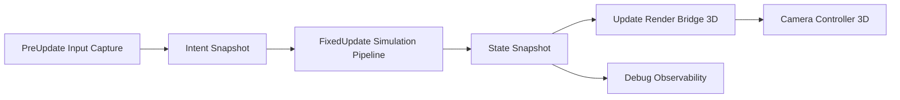
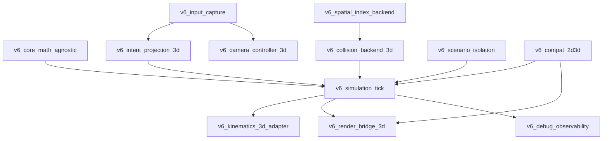
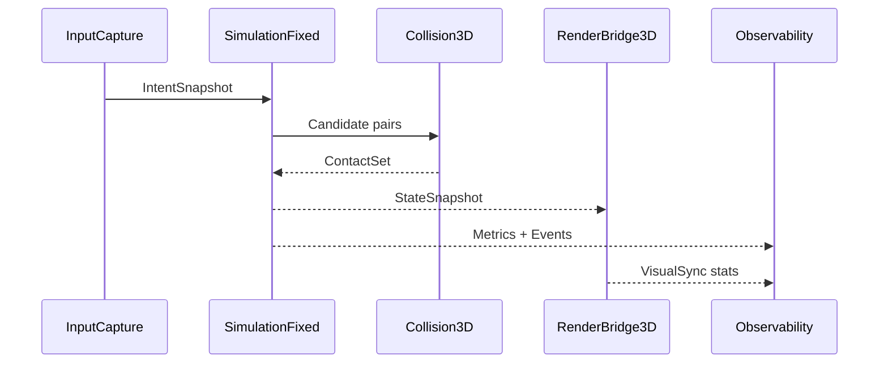

# BLUEPRINT V6 - Plataforma 3D Stateless para Resonance

---

## 1. Objetivo de V6

V6 define la arquitectura para evolucionar Resonance desde simulacion 2D a experiencia 3D controlable, sin romper:

- Determinismo operativo del pipeline.
- Filosofia ortogonal por capas de `BLUEPRINT.md`.
- Ecuaciones puras como unica fuente matematica.

Regla V6:

```text
La simulacion decide el estado; el render 3D solo lo representa.
```

---

## 2. Herencia obligatoria (V3/V4/V5)

V6 hereda sin excepciones:

- Pipeline: `Input -> PrePhysics -> Physics -> Reactions -> PostPhysics`
- Ecuaciones puras en `src/blueprint/equations.rs`
- Arquitectura por capas ortogonales (incluye C11/C12/C13)
- Sin branching semantico por elemento/tipo especial
- Criterio de optimizacion determinista de V5

V6 agrega solo infraestructura 3D y contratos modulares.

---

## 3. Principios de diseno (estandar industria + Yanagi)

1. **Stateless-first**: la logica de negocio va en funciones puras o sistemas sin estado local persistente.
2. **Stateful-minimal**: estado solo en recursos explicitos (index, cache, snapshots, runtime config).
3. **Separacion dura**:
   - Simulacion en `FixedUpdate`.
   - Presentacion, camara y UX en `Update`.
4. **Contratos explicitos por modulo** (entradas, salidas, ownership, side effects).
5. **Run conditions y sets** para controlar costo y orden.
6. **Observabilidad first-class** para validar regresiones.

Trade-off central:

- Ganas robustez, testabilidad y escalabilidad.
- Pagas con mas wiring de modulos y disciplina de contratos.

---

## 4. Gap actual del codebase

Estado actual observado:

- Movimiento, world index y colision sobre `Vec2`.
- Render de debug en `gizmos.circle_2d`.
- Camara `Camera2d`.
- Input acoplado al plano 2D.

Conclusión:

El motor matematico esta bien encaminado. El gap a 3D es principalmente de infraestructura de representacion, input espacial y backend de colisiones/index.

---

## 5. Tabla de modulos V6 (numerada)

| # | Modulo | Tipo | Responsabilidad | Entradas | Salidas |
|---|---|---|---|---|---|
| 01 | `v6_core_math_agnostic` | Stateless | Adaptadores matematicos neutrales (2D/3D) | `Vec2/Vec3`, escala, dt | valores canonicos |
| 02 | `v6_input_capture` | Stateful minimo | Captura input de frame y genera snapshot | `ButtonInput`, mouse | `IntentSnapshot` |
| 03 | `v6_intent_projection_3d` | Stateless | Mapea intencion a plano 3D jugable | `IntentSnapshot`, base camara | `WillIntent3D` |
| 04 | `v6_simulation_tick` | Stateless orchestration | Ejecuta pipeline en `FixedUpdate` | `WillIntent3D`, estado ECS | `StateDelta` |
| 05 | `v6_kinematics_3d_adapter` | Stateless | Convierte flujo a desplazamiento 3D | `FlowVector`, `dt` | `TransformDelta3D` |
| 06 | `v6_spatial_index_backend` | Stateful | Indice espacial agnostico (2D/3D) | `Pose`, `radius` | candidatos de contacto |
| 07 | `v6_collision_backend_3d` | Stateless | Narrowphase y contactos 3D | pares candidatos | `CollisionContactSet` |
| 08 | `v6_render_bridge_3d` | Stateful visual | Proyeccion estado->entidades visuales PBR | snapshot simulacion | `Transform/Mesh/Material` |
| 09 | `v6_camera_controller_3d` | Stateful visual | Camara chase/orbital desacoplada | target + input | transform de camara |
| 10 | `v6_debug_observability` | Stateless + telemetry | HUD/metricas/alertas de invariantes | eventos + estado | logs + panel debug |
| 11 | `v6_scenario_isolation` | Stateful runtime | Carga escenarios aislados reproducibles | scenario id | world spawn set |
| 12 | `v6_compat_2d3d` | Stateless | Compatibilidad progresiva de modulos legacy | recursos legacy | wrappers migracion |

---

## 6. Contratos por modulo

### 6.1 Contrato base comun

Todo modulo V6 define:

- `Inputs`: datos necesarios, sin lecturas ocultas.
- `Outputs`: resultado explicito.
- `Writes`: que componentes/recursos puede mutar.
- `NoWrite`: zonas prohibidas.
- `Determinism`: condiciones de reproducibilidad.

### 6.2 Contratos clave

#### Modulo 04 - `v6_simulation_tick`

- Inputs: `IntentBuffer`, componentes capas, eventos de frame.
- Outputs: mutaciones de estado + eventos.
- Writes: solo capas y eventos permitidos por fase.
- NoWrite: assets de render, camara, UI.
- Determinism: orden de sets fijo y tiempo fijo.

#### Modulo 08 - `v6_render_bridge_3d`

- Inputs: snapshot de estado post-simulacion.
- Outputs: actualizacion visual.
- Writes: `Transform`, `Visibility`, componentes de render.
- NoWrite: `BaseEnergy`, `FlowVector`, `MatterCoherence`, etc.
- Determinism: no aplica bit-exact; debe ser visualmente consistente.

#### Modulo 06/07 - espacial y colision

- Inputs: poses canonicas + radios/volumen.
- Outputs: pares/contacts ordenados de forma estable.
- Writes: recursos internos del backend.
- NoWrite: capas de gameplay.
- Determinism: orden de pares estable por `Entity` para evitar drift.

---

## 7. Dependencias por modulo

| Modulo | Depende de | No debe depender de |
|---|---|---|
| `v6_core_math_agnostic` | `glam`, `blueprint/equations` | `bevy_render`, UI |
| `v6_input_capture` | `bevy_input`, estado app | fisica/collision internals |
| `v6_intent_projection_3d` | input + camera basis | world spawn, PBR assets |
| `v6_simulation_tick` | capas, eventos, equations | mesh/material/camera |
| `v6_kinematics_3d_adapter` | core math, capa 3 | audio/UI |
| `v6_spatial_index_backend` | world transform snapshots | gameplay semantico |
| `v6_collision_backend_3d` | spatial backend, math | UI/camera |
| `v6_render_bridge_3d` | snapshot simulacion, PBR | logica de dano/catálisis |
| `v6_camera_controller_3d` | target transform, input | ecuaciones fisicas |
| `v6_debug_observability` | telemetry + events | escritura de gameplay core |
| `v6_scenario_isolation` | spawners/arquetipos | render internals |
| `v6_compat_2d3d` | adapters legacy | decisiones de gameplay |

---

## 8. Integracion con Bevy (recomendada)

### 8.1 Schedules

- `PreUpdate`: `v6_input_capture`
- `FixedUpdate`: `v6_simulation_tick` (fases existentes)
- `Update`: `v6_render_bridge_3d`, `v6_camera_controller_3d`, debug UI

### 8.2 Time stepping

- Simulacion con `Time<Fixed>` configurable.
- Render con tiempo de frame (`Time<Virtual>`).

### 8.3 Orden

- Mantener chain de fases actuales.
- Readers de eventos siempre despues de writers.

---

## 9. Diagramas de arquitectura

### 9.1 Vista macro



### 9.2 Dependencias de modulos



### 9.3 Secuencia de frame



---

## 10. Estructura de carpetas objetivo

```text
src/
  v6/
    core_math_agnostic/
    input_capture/
    intent_projection_3d/
    simulation_tick/
    kinematics_3d_adapter/
    spatial_index_backend/
    collision_backend_3d/
    render_bridge_3d/
    camera_controller_3d/
    debug_observability/
    scenario_isolation/
    compat_2d3d/
```

Cada modulo expone:

- `mod.rs`
- `contracts.rs`
- `systems.rs`
- `tests.rs`

---

## 11. Plan por fases (roadmap)

### Fase 1 - Cimiento de contratos

- Crear arbol `src/v6`.
- Definir `IntentSnapshot`, `StateSnapshot`, `CollisionContact`.
- Enchufar schedule `FixedUpdate` sin cambiar gameplay.

### Fase 2 - Slice 3D minimo

- `render_bridge_3d` con entidades base.
- `camera_controller_3d`.
- `intent_projection_3d` + movimiento en XZ.

### Fase 3 - Fisica espacial 3D

- Backend espacial agnostico.
- Colision 3D con orden estable.
- Compatibilidad de sistemas existentes.

### Fase 4 - Aislamiento y hardening

- Escenarios aislados de benchmark.
- Telemetria completa.
- Cierre de regresiones deterministas.

---

## 12. Criterios de aceptacion (DoD)

- [ ] Simulacion corre en `FixedUpdate` y render en `Update`.
- [ ] Ningun modulo visual escribe capas de simulacion.
- [ ] Contratos por modulo documentados y testeados.
- [ ] Escenario 3D controlable (una entidad) estable.
- [ ] Regresion fisica contra escenarios base dentro de tolerancia definida.
- [ ] Instrumentacion de performance (`p50/p95/p99`) activa.

---

## 13. Riesgos y mitigaciones

| Riesgo | Impacto | Mitigacion |
|---|---|---|
| Migracion big-bang 2D->3D | Alto | `v6_compat_2d3d` + rollout incremental |
| Acople simulacion-render | Alto | Contratos `NoWrite` y revisiones de modulo |
| Drift numerico por orden no estable | Alto | orden canonico de pares/contactos |
| Complejidad accidental | Medio | modulos pequenos, stateless-first |
| Pobre observabilidad | Medio | telemetry obligatoria desde Fase 1 |

---

## 14. Mejores practicas Bevy aplicadas

- Plugins por unidad funcional (modulos V6).
- Configuracion por recursos y no por hardcode de plugin.
- Orden explicito de eventos writer->reader.
- Uso de `FixedUpdate` para simulacion.
- Sistemas de `Update` acotados por run conditions.

---

## 15. Resumen ejecutivo

V6 no es "hacer todo 3D".  
V6 es formalizar una plataforma modular para que 3D sea una capa controlada encima de una simulacion robusta.

Si se respeta esta arquitectura:

- Se llega a control 3D rapido sin deuda explosiva.
- Se preserva la filosofia de Resonance.
- Se habilita evolucion futura a gameplay tipo MOBA sin reescritura total.

---

## 16. Sprints por modulo (multi-dev / paralelo)

Plan de ejecucion desacoplado: un sprint por modulo, ondas de paralelismo y contratos congelados en Sprint 01.

Ver: [`docs/sprints/BLUEPRINT_V6/README.md`](../sprints/BLUEPRINT_V6/README.md)

