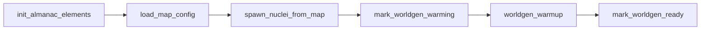
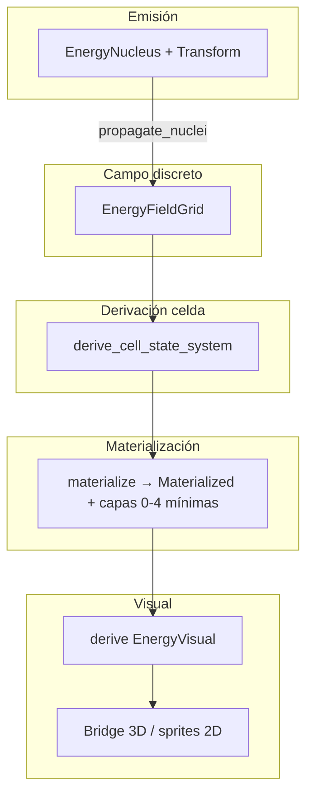

# Flujo de la demo Resonance (validación integrada)

Documento de **secuencia** y **capas**: qué sistema corre cuándo, qué datos fluyen y **qué ves** en pantalla. Complementa [BLUEPRINT.md](../design/BLUEPRINT.md) (ecuaciones) y el skill de ECS del repo. Composición plano + ríos + bordes lógicos: [PLANE_COMPOSITION.md](./PLANE_COMPOSITION.md).

## Mapa mínimo (solo mover al héroe): `demo_minimal`

- Archivo: `assets/maps/demo_minimal.ron`
- Arranque: `RESONANCE_MAP=demo_minimal cargo run`
- Grid **10×10**, celda **2**, origen **(-10,-10)** → mundo **20×20** unidades; **un** núcleo Terra sin `ambient_pressure` (menos lógica de contención que `demo_floor`); **warmup 12 ticks** para entrar rápido a `WorldgenState::Ready`.
- Movimiento: en **`full3d`** (default del binario) **WASD** pasa por `IntentBuffer` → `project_intent` (base de cámara) → `WillActuator`; también podés usar **click-to-move** si está activo el plugin. En **`legacy2d`**, `will_input_system` lee teclado directo.

## Mapa recomendado: `demo_floor`

- Archivo: `assets/maps/demo_floor.ron`
- Arranque: `RESONANCE_MAP=demo_floor cargo run`
- Contenido: grid **24×24**, celda **2**, origen **(-24,-24)** → mundo ~**48×48** unidades; **un solo núcleo** `terra_demo_day` (Terra **~75 Hz**), **sin** `seasons` → **solo “día”** estático (no hay ciclo exterior día/noche todavía).
- Si `seed` está definido, `resolve_nuclei_for_spawn` aplica **jitter** determinista a posición y emisión: las coords efectivas **no** coinciden exactamente con el RON; `validate_map_config` valida las posiciones **del archivo** antes del jitter.
- **Presión (Capa 6)**: `ambient_pressure` en el RON ahora spawnea `AmbientPressure` + `SpatialVolume` (radio = `propagation_radius`) en el **mismo** entity que `EnergyNucleus`. El héroe, al moverse dentro de ese radio, queda enlazado vía `containment_system` (`ContainedIn`).

`default.ron` sigue siendo el mapa por defecto (tres fuentes: Terra / Aqua / Ignis) para pruebas más ricas.

## Mapa `demo_strata` (suelo vs atmósfera en un solo grid)

- Archivo: `assets/maps/demo_strata.ron` — `RESONANCE_MAP=demo_strata cargo run`
- Grid **40×40**, dos núcleos redondos (esferas 3D en el origen de cada uno tras `WorldgenState::Ready`):
  - **Sur** `terra_suelo` (~75 Hz): energía “de pasto/tierra” (banda Terra en almanac → marrones/verdes vía materialización + `EnergyVisual`).
  - **Norte** `ventus_atmosfera` (~700 Hz): energía tipo “cielo / gas” (banda Ventus → tonos claros).
- El **campo** sigue siendo **un** `EnergyFieldGrid` 2D: la “atmósfera” no es un segundo grid, sino la **mitad norte** dominada por Ventus + **losa muy transparente** (`V6AtmosphereSlab`, material `Blend` + `unlit` + alpha bajo) como metáfora visual encima del escenario — no un “techo” opaco.
- La **losa 3D** escala al tamaño del grid en `full3d` (ver `ground_extent_xz` en `scenario_isolation`).

## Mapa `flower_demo` (flor procedural GF1)

- Archivo: `assets/maps/flower_demo.ron` — `RESONANCE_MAP=flower_demo cargo run`
- Grid **24×24**, celda **2**, origen **(-24,-24)**; **dos** núcleos (`terra_flower_bed`, `lux_soft`); warmup **20 ticks**.
- Escena: héroe `PlantAssassin` apartado; en **(4,4)** mundo XZ un **tallo** + **6 pétalos** + **3 sépalos** (`geometry_flow`) y **pistilo** esférico (`src/world/flower_demo.rs`). La cámara MOBA enfoca el ancla de la flor.

---

## Dos “pisos” (no confundir)

| Qué es | Origen | ¿Lee el campo energético? | Rol |
|--------|--------|---------------------------|-----|
| **Losa 3D** (`V6GroundPlane`) | `scenario_isolation` → `ensure_v6_ground_plane_system` | **No** | Ancla visual: **cubo** al ancho del grid en `full3d` (suelo oscuro); no samplea el campo. |
| **Mosaico coloreado** | Worldgen V7: celdas `Materialized` + `EnergyVisual` | **Sí** | Cada celda refleja **qe**, **frecuencia dominante**, estado derivado y almanac → **gradiente Terra** (y mezclas si hay más núcleos). |

La **losa 3D solo existe** si el perfil activa `ScenarioIsolationPlugin` (**`full3d`** en el binario por defecto). Con `legacy2d` no hay cubo; el mosaico puede verse en sprites 2D según perfil.

Un “piso real” con **una sola malla** cuyo color sea función del grid implicaría samplear `EnergyFieldGrid` en CPU/GPU (no está en esta demo); hoy la **lectura del campo** pasa por **celdas materializadas**.

### `RenderBridge3dPlugin` vs mosaico

El bridge solo sincroniza entidades con **`V6RuntimeEntity`** (`capture_v6_visual_snapshot_system`). El spawn demo del héroe y las celdas materializadas **no** insertan ese tag hoy: el color del campo en 3D viene sobre todo de **sprites/meshes de celdas** (`worldgen/systems/materialization` / `worldgen/systems/visual`), no del snapshot del bridge.

---

## Orden de arranque (Startup)

Secuencia **en cadena** (`SimulationPlugin`):

| Orden | Sistema / recurso | Escribe | Notas |
|------|-------------------|---------|--------|
| 1 | `init_almanac_elements_system` | Estado almanac | Antes del mapa. |
| 2 | `load_map_config_startup_system` | `MapConfig`, `EnergyFieldGrid`, `WorldgenWarmupConfig` | Tamaño/origen del grid = mapa activo (`RESONANCE_MAP` o `default`). |
| 3 | `spawn_nuclei_from_map_config_system` | Entities `EnergyNucleus` + `Transform` + opcional `SpatialVolume` + `AmbientPressure` | Núcleos = **fuentes del campo**. |
| 4 | `mark_worldgen_warming_system` | `WorldgenState::Warming` | Transición de estado. |
| 5 | `worldgen_warmup_system` | Celdas del grid, materialización inicial | N ticks + materialización completa. |
| 6 | `mark_worldgen_ready_system` | `WorldgenState::Ready` | Desde aquí corre **FixedUpdate** de gameplay. |

**Plugins / orden en `main`:** `add_runtime_platform_plugins_by_profile` (luz + cubo vía `ScenarioIsolationPlugin` en full3d) puede registrarse **antes** que `SimulationPlugin`; no bloquea el warmup.

**Héroe demo:** `spawn_demo_level_startup_system` está registrado en **`DebugPlugin`**, en Startup **después** de `mark_worldgen_ready_system`; fija `CameraRigTarget` cuando el perfil es 3D. `CameraRigTarget` se inicializa en `DebugPlugin` para que **`legacy2d` no panickee** al pedir el recurso.

### Núcleo + índice espacial + debug

Los núcleos con `ambient_pressure` llevan **`SpatialVolume`**: entran al **`SpatialIndex`** (broadphase). `collision_interference_system` **excluye** pares donde alguna entidad tenga `AmbientPressure`; la interferencia onda-a-onda no aplica al host-bioma. Los **gizmos** 2D dibujan todo `Transform + SpatialVolume` (el núcleo puede verse como círculo grande en el origen si no tiene `ElementId`).

---

## Pipeline por frame (FixedUpdate, con `WorldgenState::Ready`)

Resumen del flujo de datos del **campo → color**:

- **Snapshot celular (EPI1):** en `Phase::ThermodynamicLayer`, **después** de `materialization_delta_system` y `flush_pending_energy_visual_rebuild_system`, `cell_field_snapshot_sync_system` rellena `CellFieldSnapshotCache` (lectura O(1) para shape inference / GPU opcional; no reemplaza la derivación de `EnergyVisual`).
- **Propagación**: cada núcleo reparte **qe/s** según decaimiento (`InverseSquare`, etc.) y **budget** por tick.
- **Disipación**: el campo pierde energía en el tiempo (segundo principio / fricción de grid).
- **Estado celda**: frecuencia dominante, pureza, firma para reglas de materialización.
- **Materialización**: crea/actualiza entidades de celda con componentes de capas (energía, volumen, onda, materia…).
- **Derivación visual**: `EnergyVisual` (color, escala, opacidad) desde almanac + interferencia.
- **Runtime 3D** (`full3d`): nodos mesh hijos o sync según perfil; **gizmos** de debug filtran `Materialized` para no tapar el mosaico.

### Física e índice (tick fijo)

Los nombres legacy **PrePhysics / Physics** no existen en el enum: en código son `Phase::ThermodynamicLayer`, `Phase::AtomicLayer`, etc. (`simulation/mod.rs`).

En **`Phase::ThermodynamicLayer`**, tras la resolución de grimoire/cast (si aplica), corre `update_spatial_index_system` (`worldgen/systems/prephysics.rs`). Tras **integrar posición** (`movement_integrate_transform_system`) en **`Phase::AtomicLayer`**, corre **`update_spatial_index_after_move_system`** (`simulation/physics.rs`) antes de `tension_field_system` y `collision_interference_system`.

### Entrada: orden plataforma → simulación

Dentro de `Phase::Input`, los sistemas en **`InputChannelSet::PlatformWill`** (proyección 3D / `will_input_system`) corren **antes** que los de **`InputChannelSet::SimulationRest`** (almanac, capa 2, grimoire, …).

### Convención de ejes (contrato `SimWorldTransformParams`)

El recurso **`SimWorldTransformParams`** (derivado de `RenderCompatProfile`) fija el **plano de la sim** frente al mundo Bevy:

- **`use_xz_ground == false` (legacy):** posición sim en **XY** del `Transform` (`Z = 0`); integración suma `flow` en **X e Y**.
- **`use_xz_ground == true` (full 3D / suelo XZ):** el **plano horizontal** de gameplay es **XZ**; **`standing_y`** es la altura del personaje sobre el suelo. La integración aplica `flow.velocity` como delta en **X y Z**; **Y** queda anclada a `standing_y` en spawn/builder.

Funciones y sistemas que proyectan posición 3D → Vec2 de sim usan **`sim_plane_pos`** (`core_math_agnostic`): con suelo XZ toma **(x, z)**; en legacy **truncate (x, y)**. Mismo criterio en índice espacial, contención, worldgen, LOD, catálisis (`reactions`), gizmos de debug y snapshot del **render bridge 3D** (`vec2_to_xz(sim_plane_pos(...))`).

Así el héroe y el click-to-move comparten el mismo plano que la losa **XZ** cuando el perfil activa visual 3D.

**Suelo “real” vs demo:** el cubo `V6GroundPlane` no es un collider de Bevy; el pipeline de sim no hace raycast al mesh. Para el jugador (`PlayerControlled`) en `full3d`, `player_demo_walk_constraint_system` (fase Physics, tras integrar velocidad) **fija `Transform.translation.y` a `standing_y`** y **clampea el plano sim** al rectángulo del `EnergyFieldGrid` (con margen del `SpatialVolume.radius`), así no “flotas” fuera del mosaico ni perdés altura si otro sistema tocara Y. Colisión onda-a-onda / cuerpos rígidos completos sería otro sprint.

---

## Capas en escena (demo mínima)

| Capa | Componente | Dónde aparece en la demo |
|------|------------|---------------------------|
| 0 | `BaseEnergy` | Héroe, celdas materializadas |
| 1 | `SpatialVolume` | Héroe, núcleo (radio = propagación) si hay `ambient_pressure` |
| 2 | `OscillatorySignature` | Héroe, celdas |
| 3 | `FlowVector` | Héroe (velocidad integrada en el **plano de sim**: XY si `use_xz_ground == false`, XZ si `full3d`; ver `SimWorldTransformParams` / `movement_integrate_transform_system`) |
| 6 | `AmbientPressure` | Núcleo Terra demo si el mapa define `ambient_pressure` |
| 7 | `WillActuator` | Héroe (`PlayerControlled`) |
| — | `EnergyNucleus` | Solo entidades emisoras worldgen (no son “mob” jugable) |

---

## Día / noche (alcance actual)

- **Implementado ahora**: un solo estado luminoso y estable → **sin** `SeasonPreset` de noche ni segundo núcleo “exterior”.
- **Próximo paso de diseño**: segundo emisor de baja frecuencia / `seasons` con `NucleusDelta` para modular emisión o `frequency_hz` sin romper determinismo (ver `worldgen/systems/materialization.rs`).

---

## Checklist “¿qué estoy viendo?”

1. **Suelo oscuro (cubo)** → `V6GroundPlane` (escenario), no el almanac.
2. **Pastillas/celdas de color** → campo + materialización + `EnergyVisual`.
3. **Héroe** → misma entidad que la sim; cámara 3D sigue su `GlobalTransform`.
4. **Al acercarte al origen del núcleo Terra** → mayor densidad de campo en celdas cercanas (marrón / banda Terra en derivación visual).
5. **Dentro del radio del núcleo con presión** → `ContainedIn` puede enlazar al host núcleo (canal según geometría); efectos posteriores usan `AmbientPressure` del host en ecuaciones de contacto.

---

## Referencias de código

- **CI / contrato mapas (sin ventana):** `cargo test --test demo_flow_maps` — parse + `validate_map_config` + invariantes de `demo_minimal` / `demo_floor` / `demo_strata` vs este doc.
- Mapa y validación: `src/worldgen/map_config.rs`
- Spawn núcleos + presión: `src/worldgen/systems/startup.rs`
- Propagación / disipación: `src/worldgen/systems/propagation.rs` (funciones puras: `src/worldgen/propagation.rs`)
- Materialización runtime: `src/worldgen/systems/materialization.rs`
- Color celda: `src/worldgen/systems/visual.rs`, `src/worldgen/visual_derivation.rs`
- Piso cubo: `src/runtime_platform/scenario_isolation/mod.rs`
- Héroe demo: `src/world/demo_level.rs`
